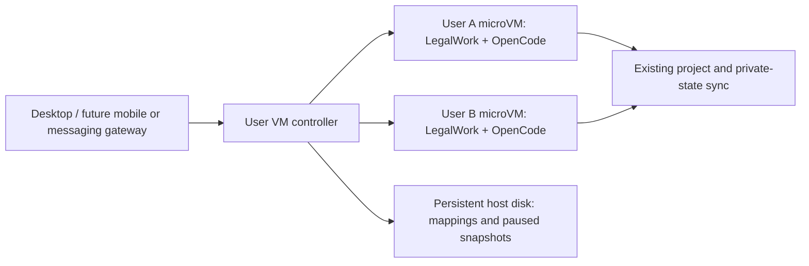

# LegalWork user microVMs on Google Cloud

The development deployment uses [E2B Embed](https://e2b.dev/resources/introducing-e2b-embed), the official single-host package, on Google Cloud in Frankfurt. One N4 host runs separate Firecracker microVMs for users. The LegalWork server and its existing project sync run inside each user's microVM. Browser Use Cloud can be connected separately when its account/API key is provisioned; this deployment does not create that account or migrate personal credentials.

## Resources

| Resource | Configuration |
| --- | --- |
| Google Cloud project | `groovy-shore-499120-f9` (existing configured project, billing enabled) |
| Zone | `europe-west3-a` |
| Managed instance group | `legalwork-e2b`, one `n4-standard-8` host, 8 vCPU / 32 GiB |
| User template | `legalwork-sync-v1`, 2 vCPU / 4 GiB per microVM |
| Host boot disk | 50 GiB Hyperdisk Balanced, replaceable |
| Host data disk | 200 GiB Hyperdisk Balanced, stateful, `autoDelete: NEVER` |
| Disk backups | Daily, seven-day retention, stored in Frankfurt |
| Network | Dedicated VPC/subnet; SSH through IAP and Google health probes only |
| Host identity | Dedicated service account with no project IAM grants |

The host has an external IP for outbound package/image downloads. E2B APIs, dashboard, internal control ports and LegalWork controller are not open to public ingress. Operators reach them through IAP. User network rules deny private IPv4 networks and GCP metadata addresses. A public application gateway and end-user identity integration belong to the entry-point layer; this development controller listens on host loopback.

The data disk retains Docker databases/generated infrastructure keys, E2B templates and paused snapshots, and the controller's SQLite user mapping. Repairing the host reattaches that disk and reconstructs the disposable boot disk. A host failure destroys the memory of running microVMs: only completed pause snapshots survive. Active workers still need recovery from the existing cloud checkpoint. The controller fails closed on failed ownership or resume checks and requires operator recovery rather than creating a second execution owner.

Disk backups are crash-consistent, not a substitute for the LegalWork quiesced checkpoint. This is a single host in one zone, not a multi-zone production deployment. Four 4 GiB microVMs fit the 16 GiB hugepage reservation; leave CPU/control-plane headroom and measure actual workloads before admitting that concurrency.

## Runtime and lifecycle

Embed is pinned to `e2b-dev/runtime` commit `79fcdf59b093eddda444a76932a4d140850b71c6`; the upstream Compose file and environment manifest are checked against SHA-256 on first installation. Their release images/binaries are pinned by the manifest. The SDK is pinned to `2.53.1`, OpenCode to `v1.18.35` and Bun to `1.3.14`, with published SHA-256 checksums. LegalWork runs as a bundled JavaScript entry point under Linux Bun; native Linux modules are built with pnpm's frozen lockfile in an amd64 Docker image pinned by digest. This avoids embedding macOS native libraries in a cross-compiled server executable.

The current template is headless. [E2B Desktop](https://github.com/e2b-dev/desktop) supplies an open-source Linux/Xfce template and an SDK built on the same Sandbox API. A later desktop template can combine those packages with LegalWork, then expose its authenticated screen stream through the entry-point gateway. The managed-cloud `desktop` alias is not automatically installed in Embed: build the upstream desktop template in this runtime first. Neither Desktop nor Browser Use Cloud is connected by this deployment.



The controller stores separate sandbox IDs and generated worker tokens per user. Concurrent lifecycle requests for a user are serialized. Proxied HTTP/SSE requests prevent pause until their response closes. For an activated synced worker, pause waits for `/cloud-sync/checkpoint`; busy engines stay running. Wake restores the snapshot, calls `/cloud-sync/resume`, and checks `status.canExecute` and the executor role before routing. Failed provider pause releases the execution barrier. The scheduler wakes paused workers for the `nextRunAt` captured at checkpoint and pauses idle workers after ten minutes; provider timeouts are renewed every thirty seconds. Changes to schedules made while a VM is asleep need an external wake or subsequent schedule notification.

New worker snapshots already contain binaries, native libraries and bundled tools. `/data` inside a user VM is that VM's private filesystem, captured by E2B snapshots. It is not a shared host directory. Resume retains cached files, databases and transfer bases. Replacement restores private state and downloads requested projects through existing sync; it does not copy every project at each wake. See [cloud-assistant-sync.md](cloud-assistant-sync.md) for the storage protocol and lease contract.

## Reproduce and operate

Use pnpm and the existing gcloud login. Commands are run from the LegalWork repository root. The scripts accept `GCP_PROJECT`, `GCP_ZONE`, and `E2B_HOST_GROUP`; they never alter shared gcloud defaults.

```sh
infra/e2b/provision.sh
infra/e2b/prepare-template.sh
infra/e2b/tunnel.sh
```

Provisioning is repeatable and preserves the data disk. Existing hosts are upgraded explicitly: changing the group's instance template does not immediately replace them. Pause all users before an intentional host replacement, then use the MIG's recreate operation. Never resize this stateful group to zero as a cost-saving shutdown: it preserves disks but does not automatically reassociate removed user state when a new member is created. Scaling to multiple hosts needs placement/routing work first.

Copy the generated Embed team key to a mode-0600 operator file through IAP without printing it. It lives at `/var/lib/docker/volumes/e2b_seed-state/_data/team-api-key`; the controller admin token lives at `/data/controller/admin-token`. These are newly generated infrastructure keys, separate from desktop/provider credentials. Do not read the `ready` container logs into shared logs because they print the team key.

```sh
export E2B_API_URL=http://127.0.0.1:3000
export E2B_SANDBOX_URL=http://127.0.0.1:3002
export E2B_API_KEY_FILE=/secure/path/e2b-api-key
export LEGALWORK_TEMPLATE_ASSETS="$PWD/tmp/e2b-template"
pnpm --filter @legalwork/cloud-vm template
infra/e2b/deploy-controller.sh
```

The deployment script compiles and copies the controller through IAP, installs its systemd service and preserves existing operator configuration on upgrades. The startup script restores the service after host replacement. The controller token and database stay on the data disk. Replacing the boot disk also replaces SSH host keys while GCP can preserve the instance ID; after verifying the intentional replacement, remove that instance's stale entry from `~/.ssh/google_compute_known_hosts` and reconnect through IAP.

The operator API uses the controller's bearer token:

- `POST /users/:id/provision`: create a development worker; returns its private worker URL and client token once.
- `POST /users/:id/pause` and `/wake`: operate that user's existing microVM.
- `GET /users/:id/status`: sandbox ID, state, sync activation and next scheduled wake; omits secrets.
- `POST /users/:id/activate`: enable routing for an externally configured executor, validating ownership/readiness first.

Connect a development worker using `http://localhost:8788/users/:id/worker` and its own client token. The proxy rejects another user's token and strips provider/host routing headers. Lifecycle endpoints cannot be called through the user proxy. Preserve the controller's database; losing its mapping is not equivalent to losing a disposable application cache.

## Before real-user handoff

Development provisioning is explicitly enabled with `ALLOW_UNSYNCED_DEVELOPMENT_WORKERS=1`. Those workers have fresh empty state and no personal/model/connector credentials. They prove the infrastructure; they do not execute the copied personal assistant yet.

Deploy the companion platform migration `0031_personal_sync_purpose` and project routes, establish the target's Eigenwelt/model connection in the later credentials step, and perform the offline desktop seed. Install the executor profile at `/data/worker-sync.json`, restart the worker, then activate it through the controller. Disable development provisioning when user connection provisioning exists. Apply the checkpoint retention work documented in the sync implementation before a long-running production rollout. Desktop-only integrations still need their headless/cloud equivalents; Linux does not supply macOS application automation.

## Validation

Unit tests cover duplicate provision fencing, persisted user mappings, checkpoint/pause ordering, ownership loss, busy checkpoints, pause rollback, streamed requests, scheduled wakes and concurrent timeout renewal/pause. The live smoke script checks two distinct microVMs, authenticated LegalWork/workspace APIs, cross-user token rejection, private files, native PNG rendering, blocked GCP metadata access and pause/resume persistence. It leaves test workers paused and saves its operator-only record at a mode-0600 path for host-replacement verification.

```sh
pnpm --filter @legalwork/cloud-vm typecheck
pnpm --filter @legalwork/cloud-vm test
CONTROLLER_TOKEN_FILE=/secure/path/controller-token pnpm --filter @legalwork/cloud-vm smoke
# Pause all workers and intentionally replace the MIG host before this check.
CONTROLLER_TOKEN_FILE=/secure/path/controller-token pnpm --filter @legalwork/cloud-vm smoke:recovery
```

Live verification on 2026-10-09 passed with template ID `lkuaz6mve4jvdz3vw578`, build ID `f21941d7-e7a7-4c5d-8718-7084353f3911`, and MIG template `legalwork-e2b-v3`. Both test users remain paused. Measurements include the IAP tunnel and authenticated LegalWork readiness:

| Operation | Measured time |
| --- | --- |
| Create a fresh LegalWork worker | 5.35 / 5.45 seconds |
| Pause a development worker | 0.14 seconds |
| Resume on the warm host | 0.96 seconds |
| Resume after host boot-disk replacement | 2.18 / 2.68 seconds |

The replacement retained data disk `legalwork-e2b-gn6f-1`, controller mappings, infrastructure keys, paused snapshots and Alice's private test file. The new boot disk was created at 09:17 UTC; the host and controller recovered automatically. This test uses empty development workers, not real-user assistant state or model/connector credentials. These timings are samples, not a latency guarantee or a measurement of credentialed assistant execution.

The host's fixed compute/storage cost continues while user microVMs are paused. Google credits can cover eligible Google charges; their remaining balance was not verified here. E2B Embed adds no managed E2B Pro subscription. Browser Use Cloud and model calls would be separate usage charges once connected.
