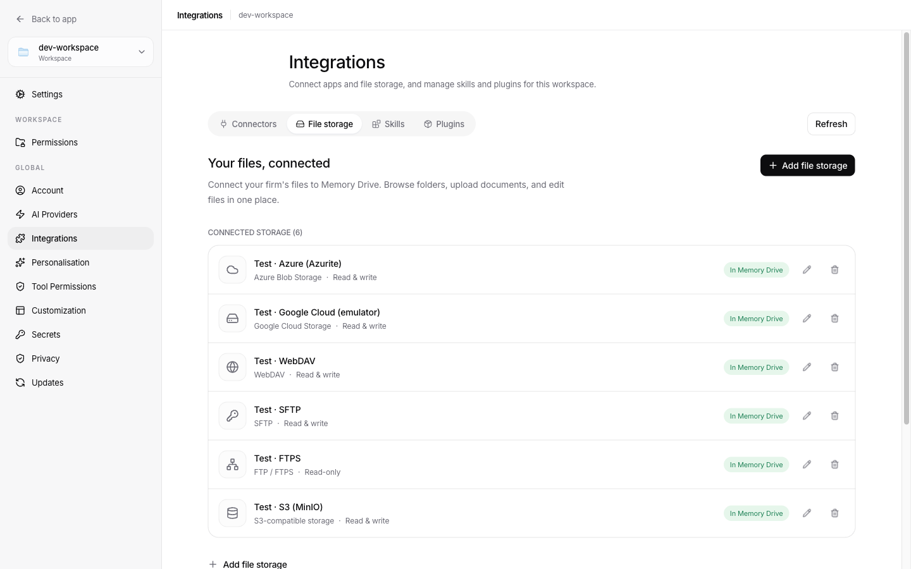
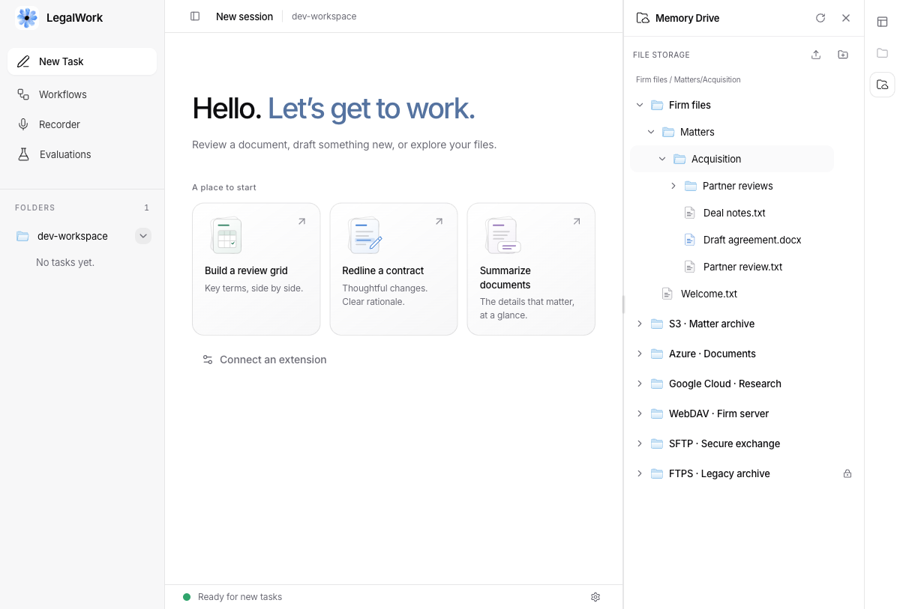
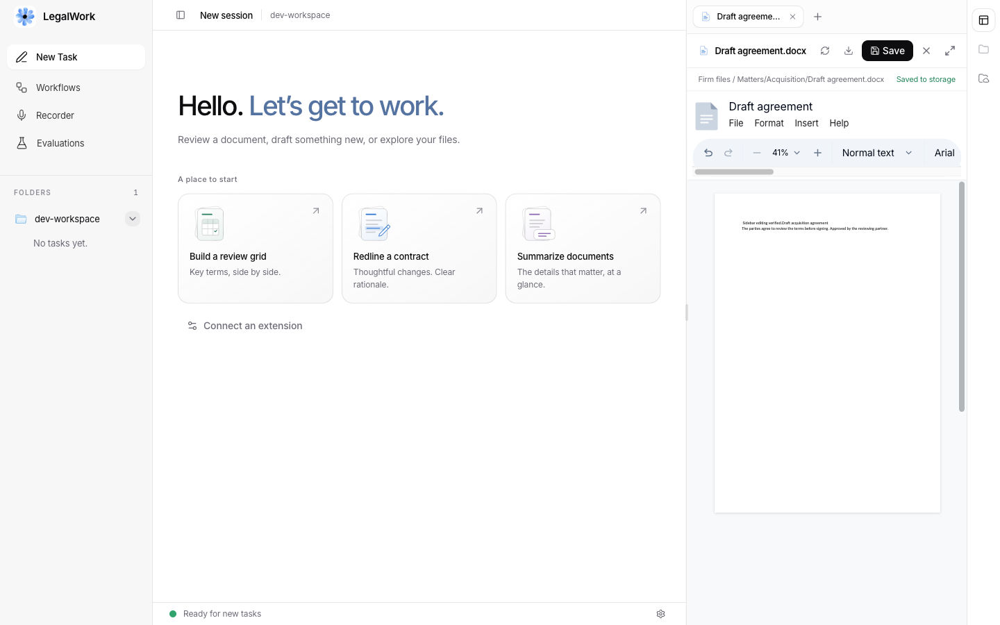

# Connected file storage

Settings → Integrations → **File storage** manages workspace-specific storage
connections. Each enabled connection appears as a named root in Memory Drive.
The settings page provides provider cards, add/edit forms, a read-only connection
test, read/write access, pause/resume, and disconnect. Disconnecting removes the
configuration only; it does not delete source files.

## Providers

| Type | Configuration and authentication | Directory behavior |
| --- | --- | --- |
| WebDAV | HTTP(S) endpoint, optional username/password. Works with standards-compliant WebDAV file servers. | Depth-one PROPFIND; never recursively traverses the share. |
| S3-compatible | Bucket, region, optional endpoint/prefix/path-style, access key + secret and optional session token; alternatively server AWS credentials. | ListObjectsV2 with `/` delimiter and continuation tokens. Covers AWS S3 and compatible APIs such as MinIO. |
| Azure Blob Storage | Account, container, optional endpoint/prefix, account key or container SAS. | Hierarchical blob listing with continuation tokens. |
| Google Cloud Storage | Bucket, project, prefix, optional service-account JSON; otherwise server application-default credentials. Custom endpoint for emulators. | Objects list with delimiter and page tokens. |
| SFTP | Host, port, username, absolute root, mandatory SHA256 host fingerprint; password or SSH private key with optional passphrase. | Direct children over SSH. Existing-file replacement uses the OpenSSH POSIX rename extension. |
| FTP / FTPS | Host, port, login, root, explicit TLS (default), implicit TLS, or plain FTP. | Direct FTP directory listing. Certificate validation remains enabled for FTPS. |

Cloud roots target existing buckets/containers. Folder creation uses zero-byte
directory markers. Account-based Drive/Dropbox/OneDrive connectors remain in the
existing Connectors tab. Local folders and OS-mounted SMB/NFS shares are not
providers in this tab. Older local-folder connection records are ignored and
removed on the next settings write; their source files are untouched.

When using Bun, FTPS requires a server built/run with **Bun 1.4.2+**. The desktop's
Node runtime is also supported. Bun 1.3.9 intermittently
truncated successful TLS directory transfers in reference-service tests. The
same client passed 2,000 consecutive listings on Bun 1.4.2; release builds now
use that version, and older servers return an explicit FTPS runtime error.

## Memory Drive behavior

Root metadata comes from the local configuration store without touching any
provider. Expanding a folder fetches that folder only. S3, Azure and GCS use
provider pagination; WebDAV, SFTP and FTP return a direct-directory
listing and paginate it into 100-item UI pages. A provider failure is shown on
the affected folder with Retry, and does not block other roots.

Select a writable folder to upload multiple files, drop files onto it, or create
a child folder. New uploads reject existing names. Open a file in the existing document sidebar to preview,
download, replace, or edit it. Connected files use the same document tabs,
resizable pane, expand control, and unsaved-change protection as workspace files. Text files use a text editor; DOCX, XLSX and PPTX
reuse the app's existing Office editors and save back to the connected source.
PDF, image, audio and video files have previews. Other formats can be downloaded
or replaced. Office-format fidelity follows the existing editors' capabilities.

Transfers are limited to **50 MiB per file**, enforced in the UI and server.
The sidebar's existing LegalMemory search searches indexed LegalMemory sources;
these direct storage connections are browsed lazily and are not automatically
indexed or copied into a workspace. Writes affect the source immediately.

Every edit includes the version read when opening the file. S3/Azure use ETags,
GCS uses generations, and WebDAV requires a strong ETag for editing and also
checks a content hash to catch implementations that reuse ETags for rapid edits. A WebDAV
server without one remains browsable and supports new-file uploads.
SFTP and FTP saves compare content hashes before replacement. SFTP/FTP
stage replacements before renaming, and this server serializes mutations of
each connected path. SFTP servers lacking POSIX rename preserve the original
and reject replacement rather than truncating it. File-server protocols cannot
provide atomic compare-and-swap against external writers; an external change
between the final hash check and rename can still race. Cloud preconditions
provide stronger concurrency guarantees. Conflicts retain the editor's draft,
which can be downloaded before reloading. Closing or reloading a dirty editor
requires an explicit discard.

## Ownership and credentials

Only a host/owner can list or manage connection settings. Workspace viewers can
browse/download; collaborators can upload/edit when both the server and the
connection permit writes. Provider permissions also apply. Configuration is
workspace-scoped and kept outside the workspace in `file-storage.json` next to
the server configuration, or at `LEGALWORK_STORAGE_STORE` when set.

The store uses atomic writes and mode `0600`. Credentials are stored on the
server as plaintext protected by filesystem permissions, not in browser
storage or workspace exports. API responses expose only the names of configured
secret fields; omitted secrets are preserved on edit, and explicit empty strings
clear them. Provider errors are sanitized to avoid returning credentials or
signed URLs. Protect the server account and use narrowly scoped provider
credentials. Connection testing lists a root and never writes a probe file;
success confirms read access, not write permission.

## API

All routes are under `/workspace/:id/storage` and use the existing LegalWork
authentication and role model.

| Method/path | Purpose |
| --- | --- |
| `GET /` | Owner: redacted connection settings |
| `POST /`, `PUT /:storageId` | Owner: add/update a connection |
| `POST /test?connectionId=…` | Owner: test submitted settings, retaining existing secrets when omitted |
| `DELETE /:storageId` | Owner: disconnect |
| `GET /roots` | Enabled root metadata, no provider access |
| `GET /:storageId/capabilities` | Read/write access and supported native search modes |
| `GET /:storageId/search?mode=…&query=…&path=…&cursor=…` | Scoped native search with provider pagination or truncation |
| `GET /:storageId/children?path=…&cursor=…` | One folder page, optional continuation cursor |
| `GET /:storageId/file?path=…` | Base64 content, content type, version and writable flag |
| `POST /:storageId/file` | New upload: `{path, dataBase64, contentType}` |
| `PUT /:storageId/file` | Edit: same body plus required `version` |
| `POST /:storageId/folders` | Create a folder: `{path}` |

Paths are relative to the connection root; empty path denotes the root for
listing only. Absolute paths, traversal, empty segments, backslashes and control
characters are rejected. Upload/edit operations are audited using the existing
workspace audit system.

## Agent access

The bundled agent uses one tool set across all providers and multiple connections:

| Tool | Purpose |
| --- | --- |
| `storage_list_connections` | Discover enabled connections in the task's workspace; returns `connection_id`, name, type and write access without scanning files |
| `storage_get_capabilities` | Discover a connection's supported operations and native search modes |
| `storage_list_folder` | Read one folder page; pass its cursor to continue |
| `storage_search` | Search selected `connection_ids`; each source returns its own results, cursor or error |
| `storage_read_file` | Read bounded UTF-8 text or download a document into the workspace for existing document tools |
| `storage_write_file` | Create from text/a workspace file, or replace using the version returned by a read |
| `storage_create_folder` | Create a folder within a writable connection |

Every file result retains its connection ID and root-relative path. Identical
filenames in different connections remain distinct. Binary files are downloaded
to `.legalwork/storage-downloads/`; editing this copy does not update the source
until `storage_write_file` succeeds. Read-only connections and viewer permissions
apply to agent writes just as they do to the sidebar. Provider credentials are
never included in tool results.

| Provider | Native search exposed |
| --- | --- |
| S3-compatible, Azure Blob | `path_prefix`: case-sensitive start of a relative object path, with continuation pages |
| Google Cloud Storage | `path_prefix`, plus literal filename `name` matching via `matchGlob`, with continuation pages |
| WebDAV | `name` and/or `content` when discovered through RFC 5323; optional operators are probed if schema discovery is unavailable |
| SFTP, FTP/FTPS | No standard search; browse folders |

Search respects the configured connection root and optional folder scope. It
does not build a LegalMemory index, extract matter/entity metadata, perform RAG,
or silently crawl folders. WebDAV content search follows the connected system's
semantics. WebDAV has no standard continuation cursor: partial or capped results
are marked `truncated`, and the agent must narrow the query. An unavailable or
unsupported source is an explicit per-connection error, never an empty success.

## References and verification

The adapters follow the providers' reference APIs and use their maintained SDKs:

- [S3 ListObjectsV2](https://docs.aws.amazon.com/AmazonS3/latest/API/API_ListObjectsV2.html)
- [Azure Blob hierarchical listing](https://learn.microsoft.com/en-us/azure/storage/blobs/storage-blobs-list-javascript)
- [GCS objects.list](https://docs.cloud.google.com/storage/docs/json_api/v1/objects/list)
- [WebDAV RFC 4918](https://www.rfc-editor.org/rfc/rfc4918.html) and [webdav-client](https://github.com/perry-mitchell/webdav-client)
- [WebDAV SEARCH RFC 5323](https://www.rfc-editor.org/rfc/rfc5323.html)
- [ssh2-sftp-client](https://github.com/theophilusx/ssh2-sftp-client)
- [basic-ftp](https://github.com/patrickjuchli/basic-ftp)

See [reference fixture setup](../scripts/storage-fixtures/README.md) for MinIO,
Azurite, fake-gcs-server, WsgiDAV, AsyncSSH and FTP/FTPS servers, integration
tests, an isolated dev app with seeded documents, and their backing data locations.
The dev app makes actual protocol requests to running reference services: MinIO,
WsgiDAV, AsyncSSH, and pyftpdlib. Azure and GCS tests use Azurite and
fake-gcs-server emulators, not live cloud accounts. This verifies protocol behavior
against those implementations; live-cloud credentials, IAM policies, and deployment
behavior still require testing with the target account. The normal API test suite
also uses controlled HTTP fixtures for edge cases such as weak ETags and oversized
files. WebDAV SEARCH discovery, native query construction and partial results
use HTTP contract fixtures; WsgiDAV does not implement SEARCH. Agent tests cover
multiple sources, per-source failures/cursors and workspace path confinement.
The live reference tests also run agent create/read/edit/download/save-back flows
over all seven protocol variants. These test fixtures are separate from the dev
app connections.

Validation on Bun 1.4.2 (September 9–10, 2026):

| Check | Result |
| --- | --- |
| `pnpm --filter legalwork-server test` | 591 passed; 16 optional tests skipped |
| `pnpm --filter @legalwork/app test` | 410 passed |
| `pnpm --filter @legalwork/desktop test` | 101 passed; 1 skipped |
| Reference fixtures with `LEGALWORK_STORAGE_INTEGRATION=1` | 16 passed, covering six provider types and both FTP/FTPS |
| WebDAV SEARCH and agent contract tests | 10 passed; multiple sources, partial failures, cursors, scoped queries and document save-back |
| Server/app typechecks, app `test:i18n`, and `node scripts/i18n-audit.mjs --ci` | Passed |
| `pnpm test:e2e` | Passed with an isolated workspace and OpenCode sidecar |
| Server `build`, `build:bin`, and `pnpm build:ui` | Passed; existing UI chunk-size warnings remain |
| Built Node modules with TypeScript stripping disabled | Imported successfully; all six adapters listed/read fixture files |
| Built storage plugin + running OpenCode engine | All seven tools registered with argument schemas; packaged Node plugin queried six fixture connections and searched multiple sources |
| Compiled server HTTP smoke test | All six roots listed/read successfully |

Browser verification covered adding/testing/editing settings while retaining
hidden credentials, lazy nested folder requests, sidebar upload and folder
creation, text and DOCX saves verified in the source files, stale-write
conflicts retaining drafts, unsaved-change confirmation, and read-only FTPS. Sidebar regression checks cover opening storage tabs outside
a chat, source isolation, tab deduplication, transcript refreshes, and cancellation
of tab close/switch with an unsaved draft. Text and DOCX edits were also saved
from the sidebar and verified in the original files.
## Screenshots

The reference workspace contains six connections, explicitly named **Test**. The settings page manages
connections and permissions; Memory Drive loads folders as they are opened.

Additional screenshots and a browser recording are saved locally under
`output/playwright/`.
