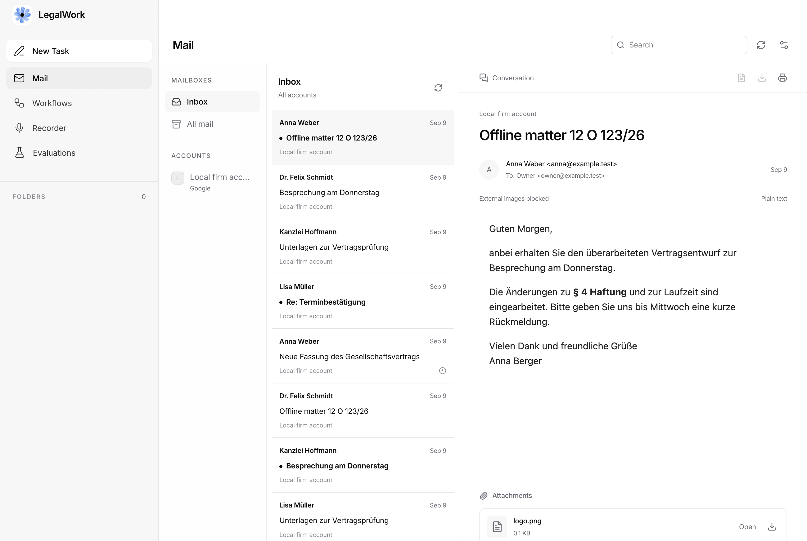
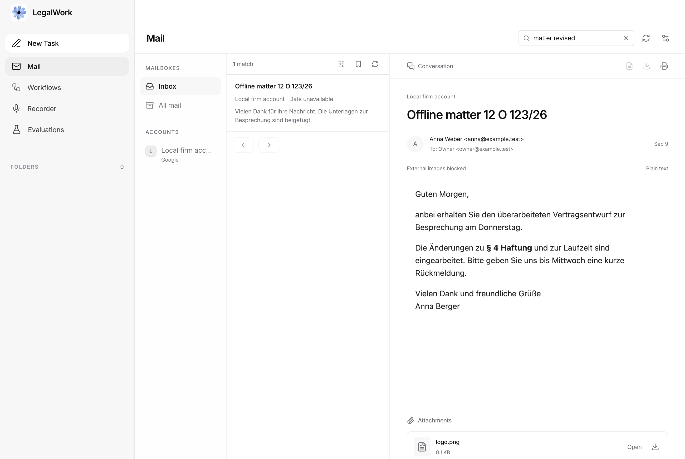

# Mail development checkpoint — 9 September 2026

Working branch: `feat/local-mail-client`, based on `dev` at `336270d65`. Follow and review the work in [draft PR #130](https://github.com/eigenweltlabs/legalwork/pull/130). This is an end-of-day development checkpoint, not a complete mail client or a release candidate. All three assigned agents finished; their accepted changes are integrated. No further agents are working overnight.

## Accepted today

- Encrypted local message, MIME and attachment storage, schema migrations and resumable synchronization through the supervised mail worker. Current schema: 16.
- Gmail full/history synchronization, Graph full/delta synchronization, and strict-TLS IMAP full/incremental synchronization. IMAP offline mutations include run ownership and ambiguous-outcome handling.
- Offline Inbox, account folders, threads, isolated HTML, plain text, source/export/print and explicit incomplete-content states. Mail stays inside the shared app shell, above Workflows, with dense rows and compact icon actions.
- One toolbar search shows results in the message list while preserving the reader. Structured/phrase filters, keyboard navigation, encrypted saved searches, attachment provenance and cancellation are included.
- Stored attachments open in the existing right-hand file pane. PDF, raster images and text are read-only; DOCX uses an explicitly labelled text projection. Preview sources are ephemeral and retired on access/reference changes. Explicit Save remains available.
- Provider connections live in Settings → Mail Accounts. Google, personal Outlook, configured Microsoft organization, iCloud and manual IMAP setup reuse the trusted local host. Repeated host announcements preserve active sign-in; replaced hosts and leaving Settings cancel pending setup.
- Mail opens automatically through OS key storage. Electron retains the real OS home and checks the default keychain before native access; no reset/repair workflow is offered.

Latest integration commits: `ffa04b71b`, `2acfab25d`, `198d64872`, `d385fa69b` (reader/search/shared preview), `82549fa21` (Settings), and `192fd0056` (search acceptance copy). Every implementation commit carries its Linear ticket ID.

## Verification at this checkpoint

Run from `apps/app`:

```sh
pnpm exec bun test tests/mail-reader-render.test.ts tests/mail-attachment-render.test.ts tests/mail-preview-source.test.ts tests/mail-accounts-settings.test.ts tests/mail-onboarding.test.ts
pnpm exec bun test tests/mail-search-render.test.ts
pnpm exec tsc --noEmit --project tsconfig.json
```

Results: 7 tests / 51 Bun assertions passed in the first command, and 1 search renderer test / 3 Bun assertions passed in the second, in addition to assertions inside the isolated Electron processes. App typecheck passed. The search probe initially expected the previous incomplete-content wording; it was aligned with the current copy and passed. These are focused hidden-renderer checks, not the complete Electron application suite.

Earlier integrated checks today passed for encrypted saved-query storage (2 tests), personal Graph account/reconnect handling (2), IMAP incremental reconciliation and mutations (11), and app/server TypeScript. See the linked feature documents and PR for the older checkpoint results; they do not qualify the final branch on other platforms.

The lead verified the running Electron app's shared sidebar, Mail/Workflows navigation, Settings account page, and stored text attachment appearing in the existing right-hand viewer. The regular dev profile was restored and its existing session sidebar and session navigation checked. No full suite, package rebuild or platform CI was run for this final UI checkpoint.

Synthetic UI evidence from the isolated Electron fixture (no user mail or session content):





## Dev app and session preservation

The running app uses the regular macOS development profile, `~/Library/Application Support/com.eigenweltlabs.legalwork.dev`, and Vite on port 5173. Read-only inspection found the original OpenCode database intact: 112 sessions, 1,009 messages and 3,789 parts. The missing history was caused by launching the mail preview with a different `LEGALWORK_ELECTRON_USERDATA`, not by a migration or deletion.

OpenCode's regular development database remains under that profile at `legalwork-dev-data/xdg/data/opencode/opencode.db`. Synthetic mail remains in the separate `output/mail-preview/profile` under the parent workspace. No session database was copied, replaced, reset or deleted. Production retains its explicit configured OpenCode database path.

Use the normal repository `pnpm dev:electron` command when restarting. Leave `LEGALWORK_ELECTRON_USERDATA` unset for the regular profile; do not reuse the synthetic preview override. The existing Vite/Electron processes remain running at handoff. Private OAuth configuration stays outside Git; see [registration setup](registration-setup.md) for environment configuration. Live provider conformance is not established by the synthetic acceptance suite or a successful account connection.

## Resume priorities and remaining gates

1. Finish compose/reply/forward, durable drafts, verified sender identities and the durable outbox as end-to-end features (EIG-142/143/145/146). Mail currently reads and searches; these user-facing sending workflows remain unfinished.
2. Complete mailbox/bulk actions (EIG-144), matter filing (EIG-148), scoped agent tools (EIG-149), and remaining core-release import/retention/lifecycle work. Existing storage primitives do not by themselves close those product tickets.
3. Complete live provider setup/conformance (EIG-120/135/153), shared Microsoft mailbox support and Proton Bridge qualification. Yahoo/Fastmail/generic-host and live send/draft support are not certified.
4. Measure large-mailbox search/storage (EIG-141), then finish security review and final macOS arm64/x64 and Windows x64 qualification (EIG-126/152/154). Run only feature-specific tests until all tickets reach final integration; then run the full app/platform suites once.

EIG-139 and EIG-140 are ready to close for their accepted reader/search scope. EIG-120, EIG-126, EIG-135 and EIG-152 remain in progress with explicit external or final-integration gates. The PR remains a draft and must not be merged or released at this checkpoint.
