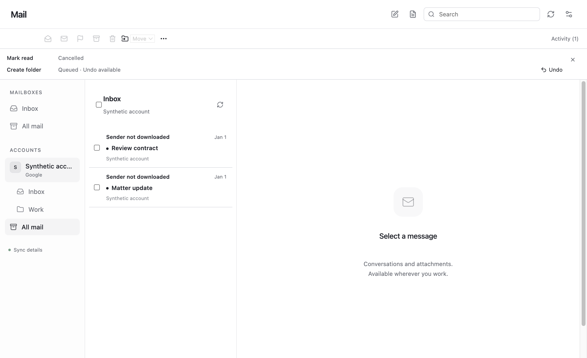

# Mailbox actions (EIG-144)

Mail's compact toolbar acts on the selected message or checked rows. Read/unread,
flags, archive, trash, spam, Inbox, folders/labels and deliberate permanent deletion
queue independent durable actions. Activity shows partial failures, conflicts and
uncertain writes. Undo cancels only before the dispatch boundary; a lost provider
response is never automatically retried as a fresh write.

Gmail label changes preserve many-label membership. Graph moves use immutable IDs
and the explicitly bound primary or shared mailbox. Shared writes require both the
provider scope and declared administrator permission. IMAP special actions resolve
SPECIAL-USE folders and use MOVE or a UIDPLUS-safe fallback; unsupported targets or
unsafe deletion never dispatch. Folder deletion rejects system folders and nonempty
Graph/IMAP folders. Removed folders/labels leave retained raw originals intact.

Read and flag indicators update optimistically while an action is pending. A failed
or cancelled action restores the observed state. Remote observations refresh the
list through the existing account event cursor even when message counts do not
change. Folder names and membership refresh through normal provider reconciliation.

## Limits

- Gmail permanent deletion requires the full-mail scope. The development client
  requests gmail.modify; permanent deletion reports unavailable instead of silently
  broadening consent. Trash remains supported.
- Provider preflight checks catch observed conflicts; Gmail and Graph do not offer
  an atomic compare-and-swap for every supported action. Changes during a request
  remain subject to provider semantics and are verified afterward.
- Explicitly paused accounts keep queued actions pending until resumed. Interrupted
  dispatches require review; they are never treated as safe automatic retries.
- Live account mutation certification remains in final EIG-173. These checks use
  synthetic data and do not send or modify the user's real messages.

## Focused validation

From the repository root:

```
pnpm exec node apps/server/scripts/mail-acceptance.mjs --suite providers/http-actions
pnpm exec node apps/server/scripts/mail-acceptance.mjs --suite providers/http-action-runner
pnpm exec node apps/server/scripts/mail-acceptance.mjs --suite providers/imap-incremental --test-name-pattern 'polling reconciles|actual TLS flags|special archive'
pnpm exec node apps/server/scripts/mail-acceptance.mjs --suite runtime/connection-sync
pnpm exec bun test apps/app/tests/mail-actions.test.ts apps/app/tests/mail-shared-identities.test.ts
```

Native tests exercise encrypted storage, restart recovery, credential/lease fencing,
per-message bulk outcomes, UID-scoped changes over a real local TLS IMAP server and
OAuth callback → worker wake → mutation → incremental observation. The renderer
fixture covers bulk selection, partial failure, optimistic rollback, undo, explicit
permanent-delete cancellation and creating a folder.


