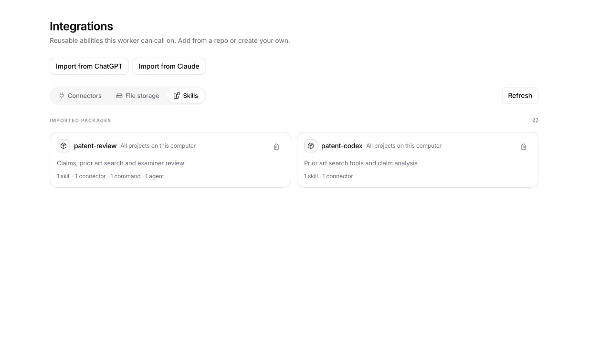

# Import ChatGPT and Claude plugins

On **Extensions**, choose **Import from ChatGPT** or **Import from Claude**. Import a complete folder or ZIP, or select a discovered installation. Preview every detected component and compatibility notice before importing. A folder or archive containing multiple plugin manifests lets you choose the package to import. Import each package individually.

Choose **All projects on this computer** (default for local workers) or **This project only**. Folder paths refer to the worker's filesystem; browser clients can upload a folder or ZIP instead. Discovery and reading worker folders require owner access. Global installation/removal also requires owner access. Project ZIP imports accept collaborator access and respect custom-plugin, skill and connector policies.

## Supported formats

- ChatGPT/Codex compatibility packages: `.codex-plugin/plugin.json`, plugin-relative `skills` paths, `.mcp.json` (or manifest-declared MCP files/configuration), and `.app.json` metadata.
- OpenAI portable packages: root `plugin.json` and `mcp.json`, `skills/`, `extensions.com.openai`. Portable identity stays canonical. An inline OpenAI extension replaces the legacy `.codex-plugin/plugin.json` overlay.
- Claude packages: `.claude-plugin/plugin.json`, or manifest-free standard folders. Default and additional skill directories; command/agent files and directories; inline command definitions. Default `.mcp.json` merges before manifest-declared MCP files, inline maps and arrays, with later server definitions overriding earlier ones.
- Standalone `SKILL.md` folders and skill collections, including archives with an extra enclosing folder.

Skills, agents, commands and MCP servers are registered with names scoped to the source provider/package and installation scope; project connector names also include the target project. The original source folder is retained under `.opencode/imported-plugins/<package-namespace>/` (or the global OpenCode configuration directory). Binary files, shared scripts, reference material, manifests and other assets are preserved; skill resources are also projected next to their active `SKILL.md`. Source files are never rewritten. Generated `.git` and `node_modules` directories and OS metadata are excluded. Install script dependencies separately when needed.

Active instructions retain skill metadata, translate agent/command metadata for OpenCode, resolve `CLAUDE_PLUGIN_ROOT`, `CODEX_PLUGIN_ROOT`, portable `PLUGIN_ROOT`, `CLAUDE_SKILL_DIR` and `CLAUDE_PROJECT_DIR`, and include a mapping of imported component names. Local MCP executable paths and packaged relative script arguments resolve to the preserved bundle. Source executable bits are retained for folder imports and Unix ZIPs. The bundle includes a `LEGALWORK-IMPORT*.json` compatibility report.

## Features requiring adaptation

Importing the complete source does not reproduce another platform's runtime. The preview explicitly reports these differences:

- ChatGPT registered app IDs and provider-managed authorizations require reconnecting in LegalWork. Account tokens are not read or transferred.
- OAuth client IDs and scopes can be mapped. Endpoint overrides, confidential-client registration and API-key setup require configuring the connector in LegalWork.
- Unresolved environment/user-configuration variables, working-directory requirements and authentication helpers import the connector disabled. A templated/empty remote URL gets a disabled placeholder endpoint; the original configuration remains in the bundle. No environment credentials are read during import. Environment-default syntax uses its declared fallback.
- Claude/OpenAI hooks, LSP configuration, settings, output styles, experimental components, platform workflows and package dependencies are retained but are not automatically activated.
- Model aliases such as `sonnet` and `opus`, platform-specific permission/invocation metadata, dynamic context injection and session/data-directory variables require reviewing/adapting in LegalWork. Fully qualified OpenCode models are retained; foreign permission metadata does not grant permissions.
- An onboarding skill is available as a normal imported skill; setup does not run automatically.

Discovery checks the documented personal/project skill locations, plugin caches, `CODEX_HOME`/`CLAUDE_CONFIG_DIR`, Claude's `installed_plugins.json`, and OpenAI local/repository marketplace source paths. Cloud-only packages must first be exported or downloaded. The importer does not crawl accounts or arbitrary home folders.

## Updates and limits

Reimporting the same provider/package name replaces the installed package in the selected scope; the preview announces this. Complete package directories are replaced so deleted resources and connectors are pruned. On installation failure, the previous package directories, import record and package-owned connectors are restored. Uninstall removes the retained bundle, active components and registered MCP entries. Global package cards and removal dialogs state that they affect all projects.

Installation requires the digest from the reviewed preview. Source, scope or target changes require another preview. Package names are hashed into namespaces to avoid overwriting other packages. Existing unowned destination files cause a conflict. Folder/ZIP inputs reject traversal, linked files/directories, duplicate archive paths (including case collisions), encrypted/multi-volume/ZIP64 archives and excessive sizes. Limits: 64 MB of source/expanded ZIP data, 5,000 source files, 128 MB/10,000 installed resource files, folder nesting up to 24 levels.

## Format references (reviewed October 2026)

- [OpenAI plugin build guide](https://developers.openai.com/plugins/build/plugins): compatibility/portable manifests, root-relative paths, local marketplaces, MCP authentication and onboarding.
- [OpenAI skills guide](https://developers.openai.com/plugins/build/skills): skills and supporting resources.
- [Agent Plugins manifest schema](https://agent-plugins.org/schemas/1.0.0/plugin.schema.json) and [MCP schema](https://agent-plugins.org/schemas/1.0.0/mcp.schema.json).
- [Claude plugin manifest reference](https://code.claude.com/docs/en/plugins-reference): optional manifests, component paths, inline definitions, merge precedence and local installation layout.
- [Claude skills reference](https://code.claude.com/docs/en/skills): standard/extended frontmatter, resource directories and runtime substitutions.
- [Claude MCP reference](https://code.claude.com/docs/en/mcp): configuration formats, environment expansion, OAuth and helper differences.

## Validation

Browser verification used disposable patent-workflow fixtures: discover a Claude installation, review/import it, upload a ChatGPT ZIP, review/import it, and verify both package cards. No real MCP service was connected.

`pnpm --filter legalwork-server exec bun test src/plugin-imports.test.ts src/cloud-plugins.test.ts src/claude-plugin-bundle.e2e.test.ts src/runtime-opencode-config-store.test.ts src/validators.test.ts` exercises both providers, wrapped ZIP/folder imports, source assets and executable files, names/metadata, MCP precedence and exact arguments/environment/header values, global/project scope, cross-project removal, updates, rollback, source digests, ownership and malformed/oversized inputs.

`pnpm --filter @legalwork/app test`, app/server `typecheck`, app `test:i18n`, and app/server builds cover the UI and integration. Native Windows folder selection and real third-party MCP OAuth flows require platform/credential testing separately.
