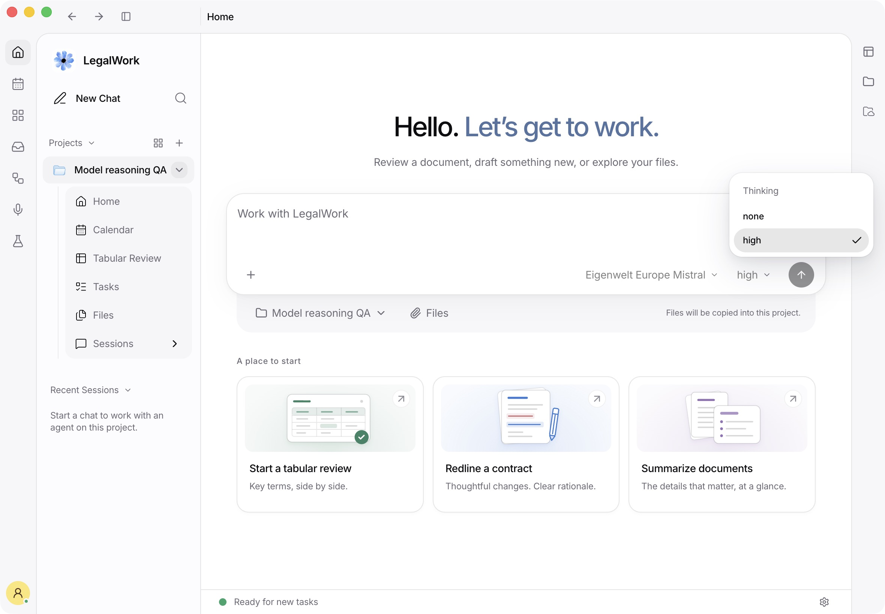
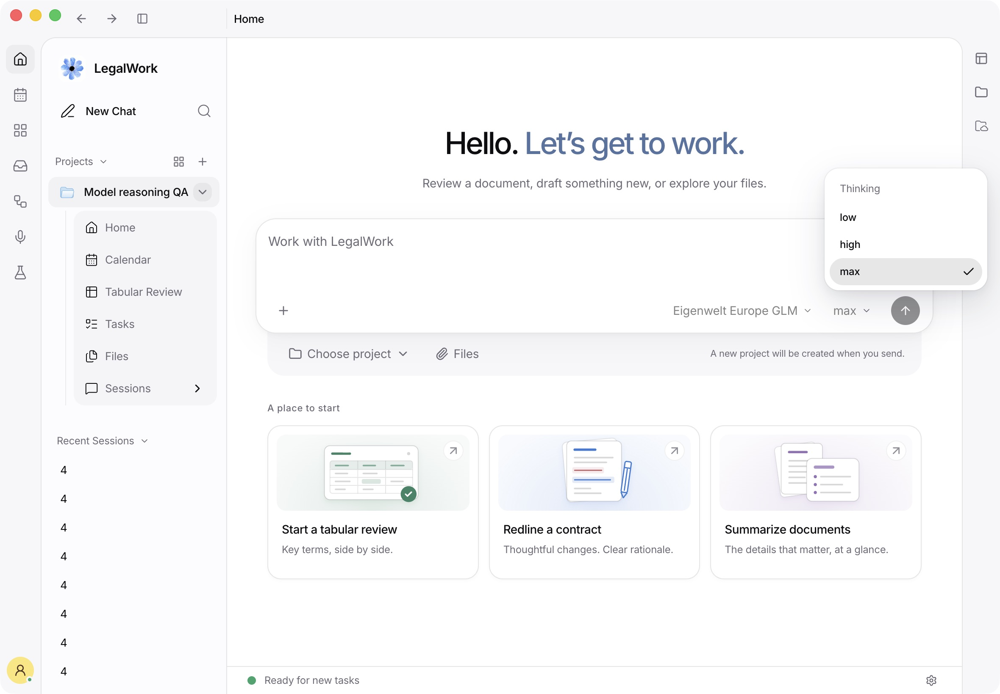
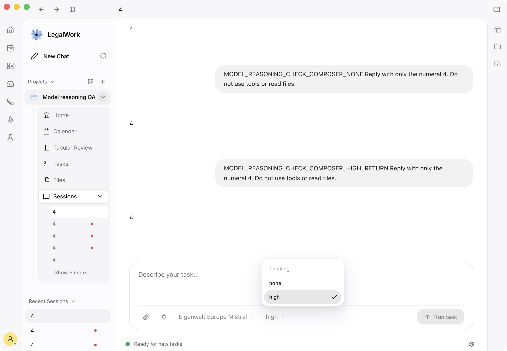

# Reasoning verification

The reasoning smoke test exercises the pinned OpenCode engine, rather than
mocking LegalWork's configuration builder. The fixture contains every Eigenwelt
EU/US route exported by the model API. It checks discovery, every enabled variant,
provider and engine defaults, unsupported saved choices, streaming, and a completed
read-tool round trip on every model. It verifies the effort on both sides of each
tool call. These checks establish protocol compatibility, not reasoning quality.

For an isolated engine with synthetic responses:

```sh
OPENCODE_BIN=/path/to/pinned/opencode pnpm --filter legalwork-server test:reasoning
```

Supply `MODEL_API_TEST_BASE_URL` and `MODEL_API_TEST_KEY` through the environment
to use a live gateway instead. Do not put credentials in command arguments or
commit them.

## Actual Electron and model API development servers

Use a disposable Electron profile, workspace, runtime database and paid-account
fixture. Run the normal `pnpm dev:electron` command and the model API's Next.js dev
server. Point `OPENCODE_MODELS_URL` at the dev server's
`/api/public/model-catalog` base URL and `EIGENWELT_PLATFORM_URL` at that server.
The paid manifest must come from its actual `/api/public/models` response.

Place a loopback recorder between the manifest's gateway URL and a local gateway
configured with the real regional providers. Record only this JSON array shape:

```json
[{"model":"Eigenwelt Europe Mistral","effort":"high","stream":true,"nonce":"MODEL_REASONING_CHECK_...","status":200}]
```

Extract `nonce` from the latest user message beginning with `MODEL_REASONING_`.
Exclude OpenCode's separate title-generator requests. Use `null` for an absent
effort. Never record authorization headers, full requests, prompts or tool outputs.

Run the same matrix against Electron's existing managed engine through its
authenticated LegalWork server proxy:

```sh
MODEL_REASONING_ENGINE_URL=http://127.0.0.1:PORT/workspace/WORKSPACE_ID/opencode \
MODEL_REASONING_WORKSPACE=/path/to/disposable/workspace \
MODEL_REASONING_CAPTURE_REPORT=/path/to/requests.json \
MODEL_REASONING_REPORT=/path/to/results.json \
bun apps/server/scripts/reasoning-smoke.ts /path/to/dev-manifest-models.json
```

Provide the disposable server's bearer token as `MODEL_REASONING_ENGINE_KEY`
through the environment. Leave the Electron window idle while the matrix runs;
test normal composer interactions separately.

Verify Mistral `none/high` and GLM `low/high/max` in the real composer. The
Mistral dropdown must start with `high` selected and contain exactly two entries;
GLM must start with `max` selected and contain exactly three entries. There is no
additional Provider default entry. An unset variant uses the model's standard
`options.reasoningEffort`; that effort is sent explicitly. Select a different
effort and then return to the original choice, checking the recorded requests.
Turn online catalog updates off in the disposable profile's Privacy settings and
verify paid models and explicit controls still work. Restore the switch afterward.

The October 7, 2026 run used Electron 43.7.5, OpenCode 1.18.29, the embedded
LegalWork server, Next.js 16.2.10 and a local LiteLLM 1.91.1 gateway. Existing regional
provider credentials were read in memory. Gemini used the existing paid gateway's
Google service identity because local application-default credentials had expired.
The local paid-account fixture does not test the production OAuth sign-in exchange.
Prompts and file contents were synthetic; production configuration was unchanged.

The latest native-default update passed the complete 15-model matrix: 113
checks in the actual Electron setup with a synthetic upstream, and 113 checks
in the isolated engine. Each model also verifies that the dropdown marks its
configured native default, contains no extra default item, and keeps the variant
override unset until an explicit choice. All matrix requests are checked for the
expected effort, streaming and HTTP 200, including both read-tool rounds.
The normal Electron composer separately sent GLM `max`, then `low`, then `max`
after returning to its original choice; all three synthetic requests streamed
and returned HTTP 200. Fresh-launch screenshots verify Mistral `high` and GLM
`max` with no additional default entry.

Live verification of this update passed 33 checks across five complete routes:
EU DeepSeek, Gemini, GLM and Mistral, plus US Gemini. OpenRouter EU and US still
return HTTP 402, "Insufficient credits." Fireworks returned HTTP 401,
"Unauthorized," for US DeepSeek and US GLM; separate synthetic requests to the
production paid gateway reproduced both errors. This prevents completing the
live matrix on the other ten routes. Credentials and production configuration
were not changed. These upstream failures are separate from synthetic protocol
verification; do not claim that all routes passed live.

Before the default-display update, live verification passed 65 distinct checks,
including nine complete routes, and the seven non-OpenRouter routes passed with
online catalog updates disabled. The hosted public catalog was fetched through
the Next.js dev server after restoring the disposable profile's Privacy switch.
The new default values are published in the paid manifest's standard OpenCode
options, independently of public catalog updates.

Screenshots from the actual Electron app:





## Direct production gateway verification

A second October 7 run connected the actual Electron dev app and Model API
Next.js dev server directly to the existing paid production gateway through a
loopback recorder. The manifest came from the dev server using production
`/model/info`, rather than the proposed gateway configuration fixture. Production
has 15 model names and 19 deployments. Each model name was attempted separately
so one provider failure did not prevent testing the remaining models. Gemini's
individual fallback deployments were not forced.

All prompts and read-tool files were synthetic. The existing credential stayed
in memory; no keys, budgets, routes or deployments changed. Only title generation
used synthetic responses. Every matrix completion and read-tool request went to
the real production gateway.

Five routes completed all 31 checks available under the current production
configuration, including streaming, exact effort forwarding, displayed defaults,
unsupported saved choices and completed read-tool round trips. Eight OpenRouter
routes failed their first completion with HTTP 402, "Insufficient credits." Both
Fireworks routes failed with HTTP 401, "Unauthorized." Their remaining variant
and tool checks could not run. A separate GPT Sol request limited to 1,024 output
tokens also returned the same HTTP 402; reducing the requested output allowance
did not resolve the credit error.

| Model | Selectable native efforts in the dev manifest | Production result |
| --- | --- | --- |
| Eigenwelt Europe Claude Opus | low, medium, high, xhigh, max | HTTP 402 — insufficient OpenRouter credits |
| Eigenwelt Europe Claude Sonnet | low, medium, high, xhigh, max | HTTP 402 — insufficient OpenRouter credits |
| Eigenwelt Europe DeepSeek | high, none | 7 passed |
| Eigenwelt Europe Gemini | low, medium, high | 6 passed |
| Eigenwelt Europe GLM | Provider default only | 5 passed |
| Eigenwelt Europe GPT Luna | low, medium, high, none, xhigh, max | HTTP 402 — insufficient OpenRouter credits |
| Eigenwelt Europe GPT Sol | low, medium, high, xhigh, max | HTTP 402 — insufficient OpenRouter credits |
| Eigenwelt Europe Mistral | high, none | 7 passed |
| Eigenwelt US Claude Opus | low, medium, high, xhigh, max | HTTP 402 — insufficient OpenRouter credits |
| Eigenwelt US Claude Sonnet | low, medium, high, xhigh, max | HTTP 402 — insufficient OpenRouter credits |
| Eigenwelt US DeepSeek | low, high, max | HTTP 401 — Fireworks unauthorized |
| Eigenwelt US Gemini | low, medium, high | 6 passed |
| Eigenwelt US GLM | low, high, max | HTTP 401 — Fireworks unauthorized |
| Eigenwelt US GPT Luna | low, medium, high, none, xhigh, max | HTTP 402 — insufficient OpenRouter credits |
| Eigenwelt US GPT Sol | low, medium, high, xhigh, max | HTTP 402 — insufficient OpenRouter credits |

EU GLM currently lacks `allowed_openai_params: ["reasoning_effort"]` on its
production route. The API correctly publishes no effort controls or explicit
effort default for that route. Its five passing checks cover the current provider
default and read tools, not the proposed `low/high/max` controls. Those controls
already passed against the separately configured local gateway, but require the
focused production route update after Model API #80 is merged.

The normal Electron composer additionally sent three real Mistral requests:
initial `high`, selected `none`, then restored `high`. Each sent the exact chosen
effort, streamed with HTTP 200, and displayed the expected answer `4`. The native
dropdown contained exactly `none/high`, with no extra Provider default item.



## CI follow-up after updating `dev` (2026-10-07)

The new macOS browser workflow test inspected a detached browser view before the host had loaded or the panel had received bounds. Initialize and show the disposable host and its 900×700 panel before opening the fixture; assert the actual view bounds. Capture the successful form before other tabs replace it, wait for painted animation frames and reject an empty screenshot. Keep every existing control, batch, accessibility, download and permission assertion. This only changes the test harness.

Verification on the updated branch:

- `LEGALWORK_BROWSER_TEST_SCREENSHOT=/private/tmp/legalwork-pr222-browser-workflow.png pnpm --filter @legalwork/desktop test:browser-workflow`: passed, followed by three consecutive passing runs with screenshot capture. Inspected the screenshot: Alice, Review complete, East and Saved Alice in East.
- `pnpm --filter @legalwork/desktop test`: 197 passed, 2 skipped.
- `pnpm --filter @legalwork/app test`: 906 passed.
- `pnpm --filter @legalwork/app typecheck`, `pnpm --filter @legalwork/desktop typecheck:electron`, `pnpm --filter legalwork-server build`: passed.
- `pnpm --filter @legalwork/desktop test:preview-security`: passed.
- `pnpm --filter legalwork-server exec bun test src/eigenwelt-paid-manifest.test.ts src/eigenwelt-workspace-reload.test.ts src/provider-model-catalog.test.ts src/provider-model-discovery.test.ts src/custom-provider-model-refresh.test.ts src/runtime-opencode-config-store.provider-patch.test.ts`: 37 passed.
