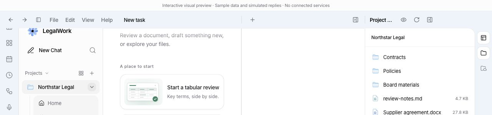
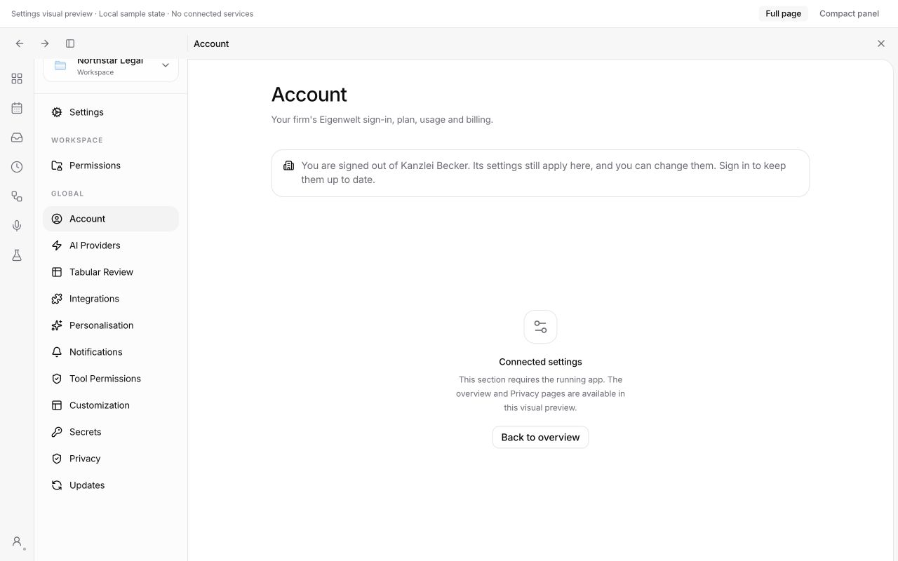

# Account banner and Windows panel headers

The signed-out firm-settings banner keeps its message on Account and shows its navigation button on other settings pages. Viewer, Files and Memory Drive use a panel-collapse icon for closing the pane.

Windows panel headings span the same width as the workspace panes below. The last heading reserves the native caption-control area, using Electron's title-bar geometry. Fullscreen removes that reservation. Very narrow Files/Drive headings keep the collapse action and omit the auxiliary toolbar actions.

## Verification

- `pnpm --filter @legalwork/app test`: 925 passed, 0 failed.
- `pnpm --filter @legalwork/app typecheck`: passed.
- `pnpm --filter @legalwork/app build`: passed, with the existing large-chunk warning.
- `git diff --check`: passed.
- Browser checks used the real SessionPage and SettingsShell development fixtures. Windows platform styles were enabled in a temporary fixture, which was removed after verification.
- Account retains the banner text and hides its navigation button. Privacy and the settings overview retain the button.
- Viewer alone, Files/Drive alone and both panes together align their header separators with the body separators to within 1 CSS pixel. This also holds after resizing the panes and collapsing the chat sidebar.
- Checked renderer widths of 1440 and 1280 pixels, fullscreen, and a simulated 172.5-pixel caption area, including a 220-pixel Files pane. Visible toolbar controls remain outside the caption area.
- Checked the renderer without Windows platform styles for layout regressions.

## Renderer evidence

These screenshots contain sample data. They verify the real components in a browser; native Windows caption controls are not present.

## Native Windows follow-up

Windows 10/11 native testing remains pending; no Windows VM was available during this verification. Run the desktop development app on this branch, open Viewer and Files/Memory Drive, resize both panes and toggle the chat sidebar. Check the header boundaries, pane-collapse controls and native minimize/maximize/close controls. Repeat after changing display scaling and app zoom, and after entering/exiting fullscreen.
