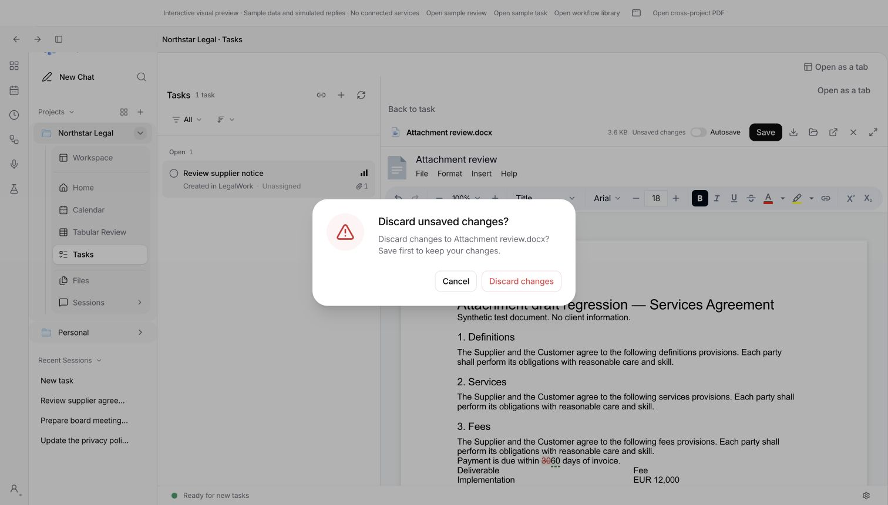
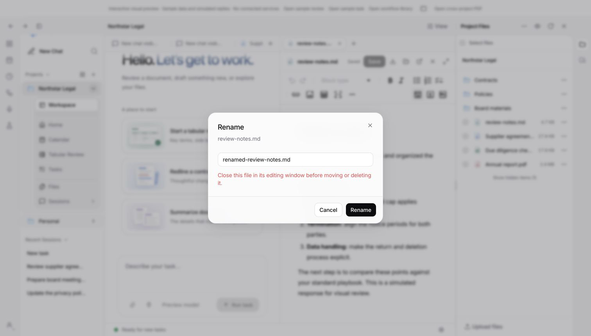

# Split-view adversarial review: second follow-up

2026-10-08 — verified the three supplied findings against `feat/split-view-autosave`
at `6a7b9f58` and refreshed `origin/dev` at `2928745b`. All three findings are
confirmed and corrected in this follow-up. This is verification of the supplied
review, not a new independent agent review. The [earlier report](adversarial-followup.md)
remains available for the preceding changes.

## Findings and fixes

| Finding | Why it was a problem | Correction and evidence |
| --- | --- | --- |
| **P1 — file-menu operations bypassed edit ownership** | Rename/delete in `workspace-entry-menu.tsx` called the server directly. An editor could still hold ownership and autosave to the old path after the mutation. | Menu operations now use the same guarded operation as drag/drop and bulk actions. Folder operations acquire canonical identity locks for the directory and its descendants, deduplicating aliases and rejecting incomplete listings or missing identities. Locks remain held through the operation. Rejected operations preserve cached drafts; successful changes invalidate descendant content and project-link queries. Automated regressions cover move/delete, owned descendants, alias cycles, incomplete enumeration and cache boundaries. The browser check also confirms that renaming an open Markdown file through its menu is blocked. |
| **P1 — Back to task discarded attachment edits** | Inline attachment close/replacement cleared state without consulting the document discard guard. The editor unmounted with no opportunity to retain its unsaved changes. | Back to task, attachment replacement and task transitions now use the existing app discard dialog. Cancel retains the attachment and cancels the transition; Discard closes it. Document keys use the actual task surface's scope, keeping project and global task attachments separate. Stale transitions after unmount and superseded asynchronous opens are ignored. Tests cover cancellation, confirmed discard, replacement, scope isolation and unmount; the real DOCX editor was exercised in the browser fixture. |
| **P2 — renaming a folder hid its linked files** | The filesystem directory moved, but links retained their previous `folder` values in `project-file-links.json`. Links inside that folder and its descendants disappeared from the expected location. | Folder rename updates matching link destinations under the link-metadata lock, preserving IDs, source references and similarly prefixed siblings. New metadata is prepared before the move; publication failure rolls the directory back. Link creation validates its destination inside the same lock, avoiding stale destinations when creation races a rename. Real-server tests cover direct/nested links, collisions and concurrent creation; a filesystem test injects metadata-publication failure and verifies rollback. |

The folder-link regression was also run against the original rename operation:
it failed because the old `Folder` and `Folder/Nested` destinations remained.
Restoring the fix makes that regression pass.

## Validation

Final runs after the production changes:

| Command | Result |
| --- | --- |
| `pnpm --filter @legalwork/app test` | **1,107 passed**, 0 failed; 170 files |
| `OPENCODE_TEST_BINARY="$PWD/apps/desktop/resources/sidecars/opencode" pnpm --filter legalwork-server test` | **1,590 passed, 16 skipped**, 0 failed; 195 files |
| `pnpm --filter @legalwork/desktop test` | **213 passed, 2 skipped**, 0 failed |
| `PATH="$PWD/apps/desktop/resources/sidecars:$PATH" pnpm --filter @legalwork/app test:e2e` | Passed; optional live AI run skipped |
| `pnpm --filter @legalwork/app typecheck` | Passed |
| `pnpm --filter legalwork-server typecheck` | Passed |
| `pnpm --filter @legalwork/desktop typecheck:electron` | Passed |
| `pnpm --filter @legalwork/desktop check:electron` | Passed; 110 renderer methods |
| `pnpm --filter @legalwork/app test:i18n` | Passed; **5,756 keys** complete in English and German |
| `pnpm exec node scripts/i18n-audit.mjs --ci` | Passed |
| `pnpm --filter legalwork-server build` | Passed |
| `pnpm --filter @legalwork/app build` | Passed; existing bundle-size warnings remain |
| `git diff --check` | Passed |

The full suites include six file-operation tests, three attachment-transition
tests and fourteen project-link/filesystem tests. An initial rollback test used
an invalid link ID; correcting the fixture to a UUID resolved that test failure.
No test was skipped to obtain the final results. The existing conditional skips
and preceding broader branch validation are documented in
[split-view-validation.md](split-view-validation.md).

`origin/dev` was fetched again and remains `2928745b`, already an ancestor of
this branch. No additional merge was required.

## Browser evidence

Using synthetic data at
`session-preview.html?unified=1&attachment-review=1&lang=en`:

1. Opened the DOCX attachment on a project task and typed a recognizable edit
   into the real document editor.
2. Clicked **Back to task** and verified the app-styled discard dialog.
3. Clicked **Cancel** and verified that the edited text and attachment remained.
4. Repeated the action and chose **Discard changes**; the task detail returned.
5. Opened `review-notes.md`, attempted Rename through its file menu, and verified
   the ownership error with the original file still present. Cancelled the form.

## Boundaries

The browser checks use synthetic files; no live project documents were changed.
Delete protection is covered by automated tests, not a submitted browser delete.
Folder-link behavior is covered by real-server filesystem tests. No full manual
Electron UI pass was performed in this round; the desktop automated suite passed.

Ownership coordination covers cooperating views in the same origin/profile.
External programs, separate servers and filesystem changes during directory
enumeration remain outside that coordination. Folder/metadata rollback handles
reported write failures; it is not a crash-atomic transaction across both paths.
