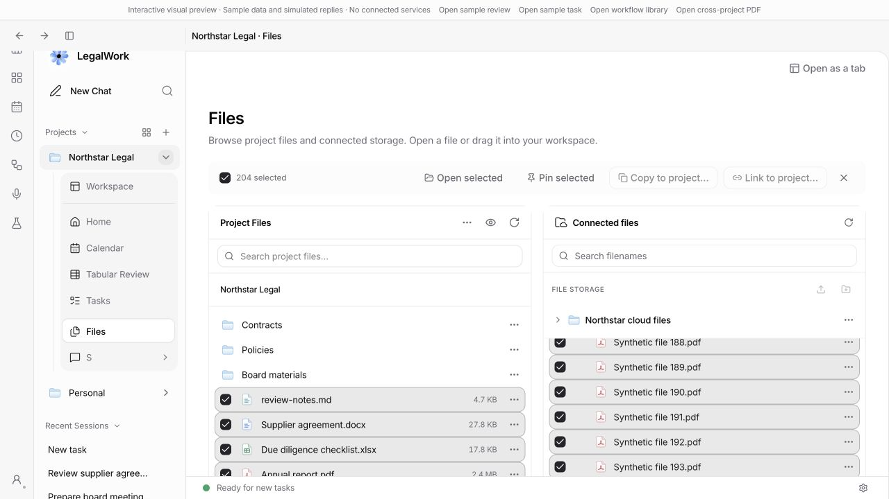

# Split-view adversarial review follow-up

Latest: [second adversarial follow-up](adversarial-followup-r2.md) verifies and fixes
the three findings against `6a7b9f58`, with updated test results and browser evidence.
The findings and counts below describe the earlier review round.

2026-10-08 — `feat/split-view-autosave`, compared with `dev`. The corrections below follow commit `5fc7de9d`; this report and its evidence ship with those corrections. Later interaction refinements are recorded in [files-window-ux.md](files-window-ux.md).

The supplied review describes findings against that commit and explicitly excludes the edits then in progress. This follow-up checks the concrete findings in the supplied summary. Its claimed totals of 92 raw / 78 confirmed findings cannot be independently reconciled without the underlying individual reports; those totals are not adopted here.

## Blockers

| Reported issue | Verification and correction |
| --- | --- |
| Stop strands the queue and marks an accepted prompt uncertain | Confirmed. Terminal assistant results, including aborts, complete the delivered entry. Stop pauses have a distinct reason; the next new message resumes them. A revision guard prevents a late abort response from re-pausing a queue already resumed by the user. Empty paused queues expose Resume. Transport failures remain uncertain to prevent duplicate delivery. |
| Agent tools use chat IDs while document panes use workspace IDs | Confirmed. Pane layout keys remain separate from agent identity. Open-file inventories, surfaces and action guards now share explicit membership in the project's open chat IDs. A chat-focused pane retains a visible document as the control target. Unrelated project chats remain excluded; legacy session scopes still work. App scope/focus/read-only tests and server bridge tests cover these contracts. |
| Packaged server runtime imports an unshipped types package | Confirmed; already corrected in the preceding UI round. Runtime schemas go through the bundled `project-file-schema.ts` entry point. Packaging guard and production server build pass. This was the failing server-test step on both GitHub platforms in PR #213; no new remote CI result is claimed before pushing. |

## Other confirmed findings

| Finding | Resolution |
| --- | --- |
| Expired edit submitted after another window removes the queue entry | Reject stale edit tokens before the completed-ID acknowledgement shortcut; the composer cannot interpret the missing edit as success. |
| Recreated API client releases the queue edit lease | Lease lifetime depends on server URL, workspace and session. A ref supplies the latest client for renewal without rerunning cleanup on route refresh. |
| Deleted chats remain mounted and persisted | Direct deletion and live deletion events clear the chat's pane state and remove its workspace tab. Other panes survive. |
| Visible sibling chat loses live updates | Each mounted workspace chat now holds a session-sync subscription. Reference-count tests include two simultaneous chats and independent release. |
| Empty transcript synchronization persists empty sessions | The empty state's focused-pane identity now matches normalization. Repeated empty and unopened transcript updates do not grow persisted pane state. |
| Evals focus discards an already visible document | Selecting a pane's already active tab only focuses it; it does not ask to discard or destroy its draft. |
| Drag shields survive drops / leaving the OS window | Drop and drag-end cleanup uses capture listeners; leaving the window boundary clears the external-file shield. |
| Project-file drop targets lose to the pane opener | Explicit project intake is marked and checked before foreign-file tab routing, preserving Copy/Link instead of opening a tab. |
| Review drop area only works over the small button | The review intake marker is on the whole drop-target root. |
| Repeated binary downloads and PDF reloads | Unchanged stat metadata skips the binary download. Matching bytes retain their buffer and blob URL, including servers without usable stat metadata. New saved content still refreshes. |
| DOCX initially mounts read-only then remounts as owner | Binary editors wait while ownership is being checked. |
| A generic discard clears an off-screen task note | Retained task drafts are scoped registrations: generic document guards exclude them; explicit task/session guards and window-close protection remain. |
| Virtualized file selection is lost off-screen | Selection uses the complete loaded row catalogue, not mounted DOM rows. Range selection stays within its own list. Browser proof: selecting a row, scrolling to the end, then selecting all yields all 200 connected files plus four local files. |
| Dragged Markdown note loses `.md` | Transfer payloads use the original filename, not the display title. |
| Hard-link publication fails on exFAT / some network shares | Unsupported hard links fall back to exclusive copy. Existing files and symlinks are never overwritten; regression tests simulate the unsupported operation and collision. A real exFAT volume was not mounted in this follow-up. |
| Missing destination or corrupt links file gives generic 500 | Missing folders return an actionable 404; malformed link metadata returns a 409 and preserves the damaged file. Missing initial metadata still means an empty link list. |
| Old server has no file identity | Explicit compatibility choice: retain read-only protection, show an update-server message and offer a retry. Inferring identity or enabling concurrent writes without ownership would undermine the branch's save guarantees. |
| Queue state/dispatcher/polling overhead | Deleted chats remove their queue file. Only queues with entries enter the periodic dispatch set. Unchanged revision reads avoid cloning attachments. Empty queues poll less frequently and background polling is disabled. Empty live-chat files retain the bounded completed-ID history for idempotent retries. |
| Pre-delivery errors are falsely uncertain | Known preparation failures are retryable `failed` entries; actual delivery transport failures stay uncertain. |
| Editing a queued item leaves the queue paused | Edit leases independently block dispatch without changing the user's pause setting. Submit, cancel and expiry release that hold; an existing manual pause remains. |
| Dead duplicate client queue implementation | Removed the unused runner, queue wrapper and tests specific to that obsolete implementation. |
| Queue lease / layout migration tests assert the wrong thing | Lease tests use a current revision before checking contention. Migration tests assert split orientation and geometry. |
| Ownership/editable changes resume a failed autosave | Ownership suspension is separate from the user's autosave preference. Failed autosave remains paused until an explicit retry/toggle. |
| Read-only document tools reject reads | Known read tools are allowed; mutations and unknown tools still require edit ownership. |
| Visited overviews leak across projects | Overview visit state resets when the selected project changes. |
| Files navigation pushes history twice | Workspace selection can update context without navigating; the requested destination performs the single navigation. |
| Copy/Link offers a source project as destination | Destination choices exclude the source projects, including batch transfers. |
| Sessions search clears selection on every keystroke | Search text is no longer part of selection scope. Matching selected rows remain selected; filtered-out rows are still deliberately removed from selection. |
| Deadline “View all” differs from Tasks | Project Home opens the Calendar page; an embedded workspace card opens its calendar tab. |
| Inconsistent promotion labels | Task promotion within a project now uses the same “Open as a tab” label as reviews and overview pages. “Workspace” remains the destination's navigation label. |
| `--read-only` cannot send chat messages | Confirmed behavior change; intentionally retained. CLI describes this as “Disable writes”. Queue submissions persist executable work and agent runs can write files, so bypassing the write boundary is not an appropriate compatibility fallback. |

## Findings predating this branch

These are still relevant to multi-pane work and were corrected:

- File-session batch writes now acquire the same per-file lock as other save paths. Eight concurrent writes with one base revision produce one success and seven conflicts.
- Native browser download destinations use the creating window's project route rather than the app-global project selection. Explicit agent project context still takes precedence. A window without a project cannot borrow another window's destination. Desktop tests deliberately set the global selection to the wrong project and verify each download path.
- Project browser synchronization respects browser ownership in Evals/legacy scopes as well as other project scopes, preventing accidental adoption.

## Claims that do not warrant a fix

- Click-to-toggle once selection exists is the established multi-selection interaction; an explicit checkbox also indicates state.
- Session-list expansion is intentionally controlled by its separate arrow, as documented in the existing workspace refinement.
- Compatible Memory Drive/storage drops have an explicit intake path and regression coverage; the pasted summary identifies no remaining concrete reproduction.
- `workspaceUpdateRemote` is exported by the desktop wrapper but has no renderer call site to fix.
- Cross-project linking is not a new per-project authorization bypass: the current server token model is server-scoped. Path containment, symbolic-link checks and no-overwrite behavior remain enforced.

## Validation

| Command / check | Result |
| --- | --- |
| `pnpm --filter @legalwork/app test` | 1,086 passed, 0 failed |
| `pnpm --filter legalwork-server test` | 1,577 passed, 16 skipped, 4 failed as described below |
| `pnpm exec node --test apps/desktop/electron/browser-panel.test.mjs apps/desktop/electron/browser-automation-broker.test.mjs` | 12 passed, 0 failed |
| `pnpm --filter @legalwork/app typecheck` | Passed |
| `pnpm --filter legalwork-server typecheck` | Passed |
| `pnpm --filter @legalwork/app build` | Passed; existing large-chunk warnings remain |
| `pnpm --filter legalwork-server build` | Passed, including schema and plugin bundles |
| `pnpm --filter @legalwork/app test:i18n` | Passed: 5,739 keys in both shipped languages |
| `pnpm exec node scripts/i18n-audit.mjs --ci` | Passed |
| `git diff --check` | Passed |

The four server failures are in the unchanged skill-composition/calendar-skill tests. Their child processes exit successfully, but the tests require empty stderr and encounter invalid-description warnings from installed skills in the local user's home directory. This is independent of the GitHub packaging failure and was also present in the preceding validation. No user skill files were changed. Tests requiring local sockets were run outside the restrictive sandbox after the sandbox-only attempts failed to bind.

The first full app run exposed test import-order dependence after session deletion began loading the tab store earlier. Pane tests now instantiate isolated stores using the same production store factory; the successful full-suite result above includes those tests.

The requested Astra agent independently rechecked the document-control integration, queue races, file selection, browser ownership/download routing and write lock after the fixes. Its final pass reported no additional high-confidence correctness blockers. That is a bounded code review, not a guarantee of merge readiness for every unprovided finding.

Browser verification uses synthetic `session-preview.html?unified=1&memory=large` data and the production selection components. No live model-driven conversation, native PDF renderer, physical exFAT volume, remote storage publishing or native OS drag was exercised in this follow-up. The earlier UI round's dialog and PDF URL evidence is in [workspace-polish.md](workspace-polish.md).

