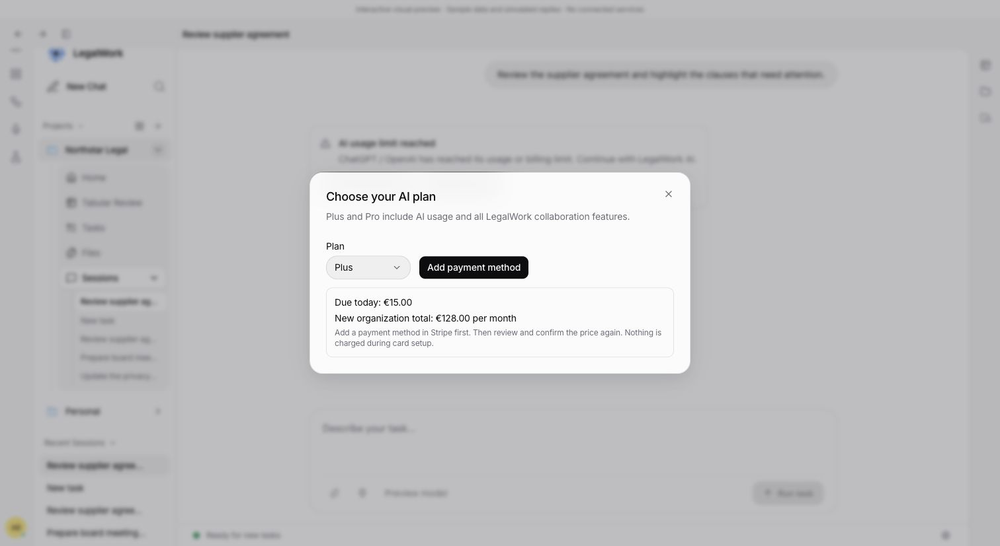

# Alpha billing recovery review — 5 October 2026

The screenshot uses the actual desktop app components in the dev-only session preview. It contains sample data and simulated transport responses, with no connected payment service.

Open `http://localhost:5315/session-preview.html?limit=sync&role=admin&upgrade=ready&no-card&lang=en`, choose an AI plan from the inline limit message, and review the price. The dialog shows Add payment method and explains that Stripe card setup does not charge the upgrade. In the real transport, setup opens the validated Stripe Checkout URL; returning requires a fresh price review and explicit confirmation.

The focused desktop recovery dialogs remain intact; no Usage & Limits management panel is added.

Automated verification covers concurrent duplicate OAuth callbacks (one exchange), finalized account results, existing provider/recovery behavior, and an empty Sync manifest removing stale hosted models both with and without an external provider. Both browser-reopen buttons now start a new platform sign-in with fresh state/PKCE rather than reuse a consumed URL. Sync account success closes the provider dialog even when its hosted model list is empty.

Actual paid Sync checkout plus the first reconnect in a packaged alpha were not exercised in this review. The existing public alpha does not contain these changes until this branch is merged and rebuilt.
