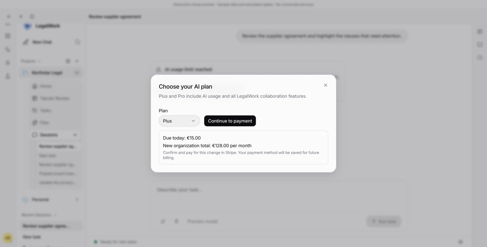
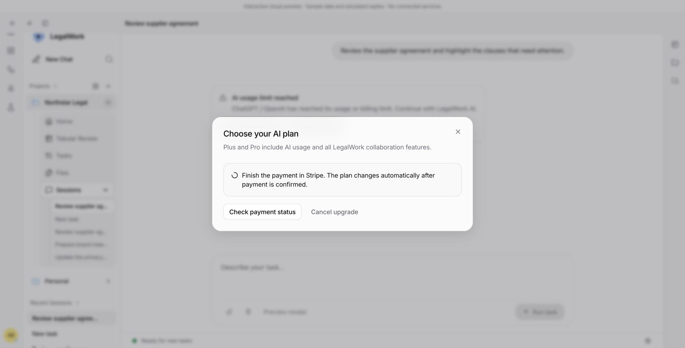
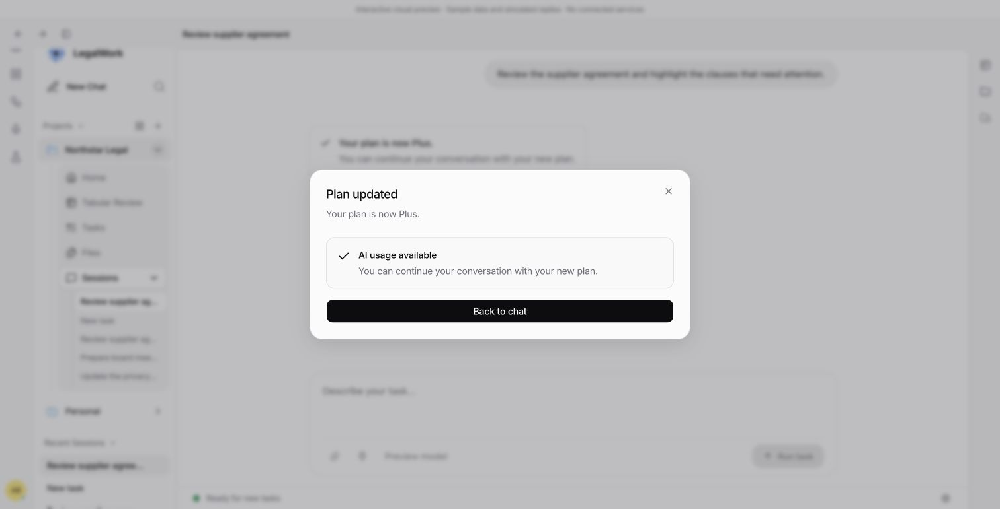

# Alpha billing recovery review — 5 October 2026

These screenshots use the actual desktop components in the dev-only session preview, with sample data and simulated responses. The paired backend review also records a real Stripe sandbox upgrade with exactly one charge.

Open `http://localhost:5315/session-preview.html?limit=sync&role=admin&upgrade=ready&no-card&lang=en`, choose an AI plan from the inline limit message, and review the price. **Continue to payment** opens Stripe's hosted page for the native subscription invoice, collecting the card and upgrade payment together. The server verifies payment before activating the plan; the app then shows the existing upgrade confirmation and checks fresh usage. A failed refresh cannot trigger another purchase.

Use `upgrade=payment-pending` to keep the simulated payment pending. The dialog offers payment-status checking and cancellation. In the real flow, it also offers resuming the same Stripe invoice payment; closing and reopening recovers the persisted operation.

After payment is confirmed, the dialog shows that the plan is active and whether AI usage is available.

The focused desktop recovery dialogs remain intact; no Usage & Limits management panel is added. Separate payment-method management remains on the platform.

Automated verification covers concurrent duplicate OAuth callbacks, finalized account results, provider/recovery behavior, and an empty Sync manifest removing stale hosted models. Browser-reopen buttons start fresh state/PKCE. Sync account success closes the provider dialog even when its hosted model list is empty.

Latest checks: app typecheck, i18n (5,220 keys per language), and six focused usage-client/recovery tests passed. CUA verified price review, waiting, cancellation and completion using real desktop components. Model API unit/integration tests and the actual sandbox invoice payment verify payment fulfillment and security. The real sandbox account was restored to Sync with no saved card and unchanged credits after both payment and unpaid cancellation checks.

Actual paid Sync checkout plus its first reconnect in a packaged alpha remain acceptance checks. The public alpha needs the paired branches merged and rebuilt.
