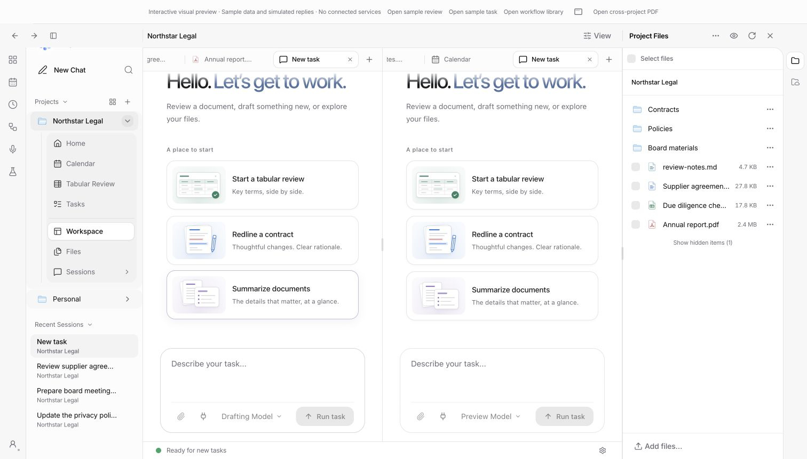
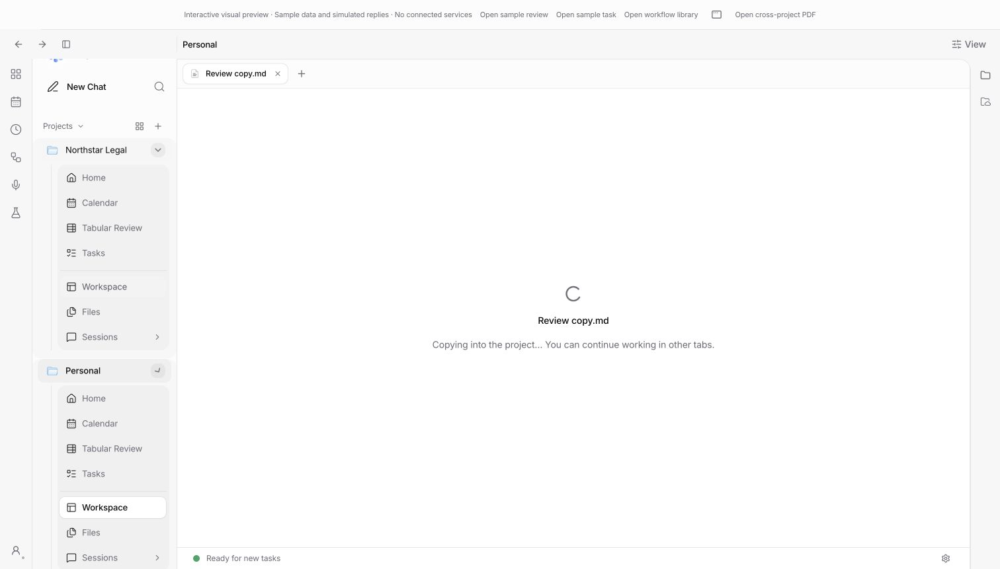
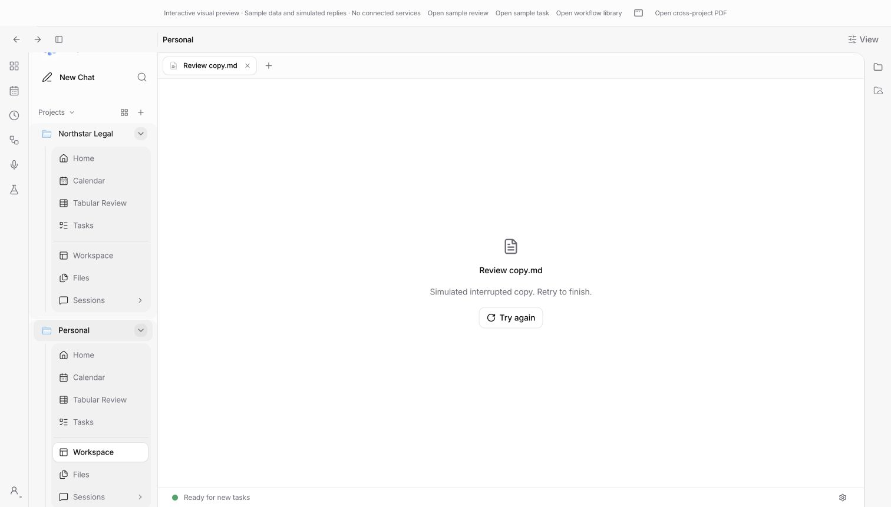
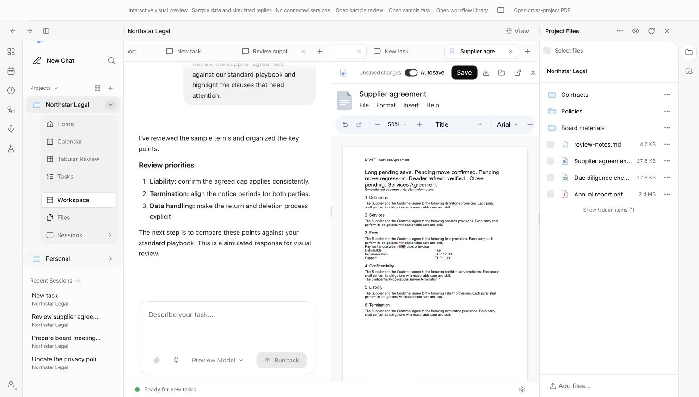
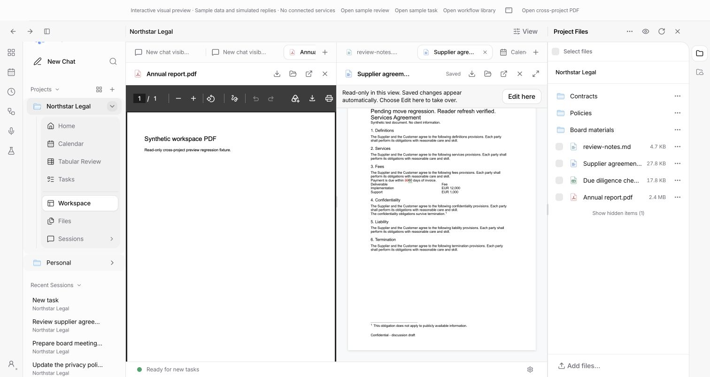
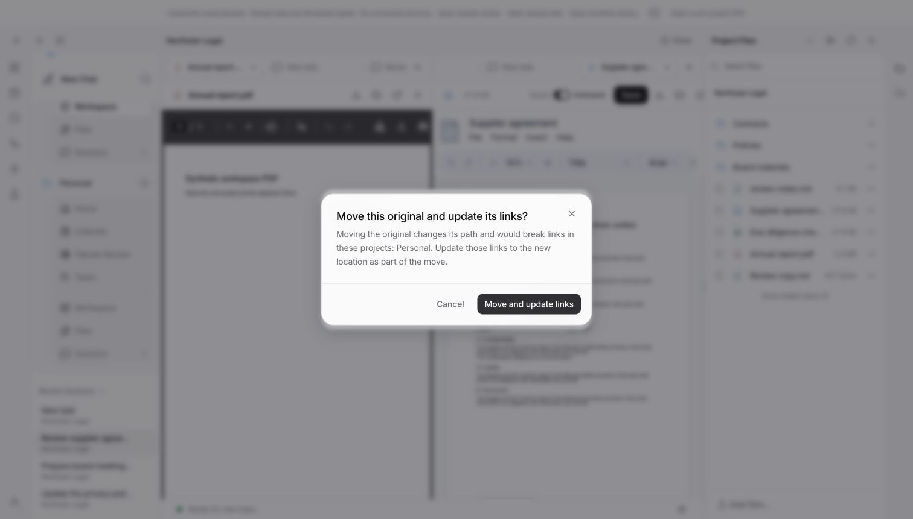
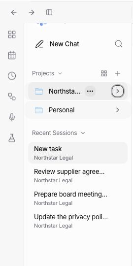

# Review follow-up — 9 October 2026

Implements [Chris's requested changes on PR #213](https://github.com/eigenweltlabs/legalwork/pull/213#pullrequestreview-5467766902), reviewed at `dedbc45a`. `origin/dev` at `4da59017` is merged, including the firm policies and model-catalog changes. The final fetch found no newer `dev` commits.

## Changes and evidence

| Review point | Result | Verification |
| --- | --- | --- |
| Reopened queued edit loses its lease | Recover the complete edited buffer as an independent unsent draft. Keep attachments, mentions, pasted content and the previous stashed composer. Explain that the original queue item is unchanged. A rejected edit lease also recovers instead of recommending destructive cancellation. | Composer regression covers close/remount recovery and the retained original composer; existing server lease, expiry and dispatcher tests pass. |
| Split chats share model controls | Each chat owns its compact/full picker and persisted model/reasoning selection, keyed by endpoint, project and session. The app default initializes new chats. Sending, queueing, commands and fusion use that chat's selection. An unavailable old model can still be changed even when the current default's picker would normally be locked. | Model-store regression; browser: two visible chats, one picker open, left model changed while right stays unchanged. |
| Queue accepts a session from another project | Before reads, writes and dispatch, resolve the session and compare its directory with the addressed workspace, including canonical local aliases and remote path normalization. Reject mismatches before queue access or engine mutation. | Real server route test uses an engine exposing a foreign project's session globally. Ordinary/conditional GET, pause and enqueue all return 404; no prompt or session update is sent. |
| Stale duplicate document view | Keep the writer's editor revision/undo identity, but publish a new revision for readers after saving. Reader views also check versions periodically while visible, without reloading unchanged binary previews. | Snapshot regression checks reader bytes/revision, stable writer identity and dirty-buffer retention. Two browser views of the real DOCX editor: the second is read-only and receives the saved text automatically. |
| DOCX moving/reopening crash | Guard editor dispatch and the queued ready callback against a destroyed ProseMirror view. Move the existing document host with state-preserving DOM movement when available; retain the existing fallback. | Browser: edit, move the focused document with a deliberately delayed autosave, wait for save, close and reopen; text retained, no captured editor errors. A controller/store integration regression moves a focused dirty DOCX during an in-flight save, cancels closing, completes the write, then closes/reopens against the saved snapshot. **The reported `matchesNode` crash was not reproduced**, so this is a targeted lifecycle safeguard, not a claim that every possible cause has been eliminated. |
| Copy feedback / local wording | Open a pending file tab before IO. Show indeterminate copy progress, then content or an error with Retry in that same tab. Serialize copy jobs; closing a pending tab never resurrects it at completion. Local actions say **Add files…**; actual connected-storage uploads retain upload wording. | Copy regressions cover open-before-IO, failure/retry, closed tabs and unrelated project state. Browser: delayed cross-project copy, simulated failure, retry and successful content in the original tab. |
| Plus menu | Calendar, Tabular Review and Tasks open in the requesting pane, or focus their existing project-view tab. | Browser: all three entries visible; Calendar opens, and requesting it from the other pane leaves one Calendar tab. |
| Navigation / Recent Sessions | Workspace sits immediately above Files in the lower project group. Global Recent Sessions show the project name. Opening a recent chat preserves the destination layout and document tabs. | Browser navigation away/back through Recent Sessions; layout regression verifies pane IDs, split tree, sizes and document tabs, including repeated opening. |
| Moving linked originals | Identify links in the available projects, name affected projects before moving, and offer Cancel or Move and update links. After moving, update link source paths, including descendants. Re-read metadata to preserve intervening link renames/removals/retargets. Open linked views in the current window follow the new path. Metadata failures offer a separate retry without repeating the move. | Five regressions: cancellation, remote destination endpoint, descendants vs sibling prefixes, intervening link changes, metadata retry and unavailable inventory. Browser: link a PDF into Personal, rename the original, confirm the warning, then open the updated link at the new original path. |
| Split defaults | Side-by-side remains the automatic two-pane arrangement. Top/bottom splits remain explicit choices. | Existing opening-profile and layout regressions pass; browser uses side-by-side panes and exposes optional vertical actions. |

## Commands and results

Executed on macOS after integrating `dev`:

| Command (from repository root) | Result |
| --- | --- |
| `pnpm --filter @legalwork/app test` | **1,121 passed, 0 failed** across 174 files |
| `OPENCODE_TEST_BINARY="$PWD/apps/desktop/resources/sidecars/opencode" pnpm --filter legalwork-server test` | **1,613 passed, 17 skipped, 0 failed** across 199 files |
| `pnpm --filter @legalwork/desktop test` | **213 passed, 2 skipped, 0 failed** |
| `pnpm --filter @legalwork/app typecheck` | Passed |
| `pnpm --filter legalwork-server typecheck` | Passed |
| `pnpm --filter @legalwork/desktop typecheck:electron` | Passed |
| `pnpm --filter @legalwork/desktop check:electron` | Passed; 110 renderer methods covered |
| `PATH="$PWD/apps/desktop/resources/sidecars:$PATH" pnpm --filter @legalwork/app test:e2e` | Passed: i18n, local paths, session flow/switching, filesystem engine and browser entry |
| `pnpm --filter @legalwork/app build` | Passed; existing bundle-size and upstream annotation warnings |
| `pnpm --filter legalwork-server build` | Passed |
| `git diff --check` | Passed |

Total: **2,947 tests passed, 19 conditional skips**, plus the scripted integration checks above. Language validation covers **5,838 keys in both English and German**. Skips include native OCR/model and opt-in real-engine/platform prerequisites; they are not counted as passes. Earlier native Electron/interop validation is documented separately in [split-view-validation.md](split-view-validation.md).

## Browser reproduction and screenshots

Development fixture: `http://localhost:5188/session-preview.html?unified=1&lang=en&review-checks=1`. It uses real UI/editor components with synthetic data and simulated IO, without connected services. `review-checks=1` enables two model options, a delayed first copy that fails once, and delayed DOCX writes. Add `&save-delay=10000` to make the pending-save move easy to exercise.

1. Open two chats in separate panes. Change one model and inspect the other. Open Calendar through +, then request it from the other pane.
2. Copy `review-notes.md` to Personal under a new name. Observe the immediate pending tab, error, Retry and eventual document. Return through a Recent Session and inspect the retained layout.
3. Open `Supplier agreement.docx`, enable Autosave and type a marker. Move its tab while the write is pending. Open the same original in a second preview view, make another edit in the writer, and observe the reader update. Close during an unsaved edit, cancel, wait for saving, then close/reopen and inspect the marker.
4. Link a PDF into Personal. Rename its original through the file menu; inspect the affected-project warning, accept relinking, and open the destination link. Its source path now shows the renamed original.

The local file chooser walkthrough was blocked by the Chrome extension's missing file-URL permission; no permission was changed. The common pending/retry UI was exercised through cross-project copy, and native copy logic was covered by the desktop suite. This pass did not launch a fresh full Electron UI session or exercise physical network drives. Multi-project relinking scans the projects available to the client and is not a distributed filesystem/metadata transaction; failed metadata updates require the offered retry. External renames are outside that move workflow.

Additional evidence: [copy completed](chris-review-2026-10-09/copy-complete.png), [DOCX saved after moving](chris-review-2026-10-09/docx-moved-saved.png), [updated link opened](chris-review-2026-10-09/linked-original-opened.png).

## Sidebar collapse follow-up

The project-header **New chat** shortcut now disappears when its project is collapsed. The title reserves less space in that state, while the project menu stays available. Expanding restores the shortcut. Browser verification covered mouse collapse, keyboard expand/collapse and opening the collapsed project's menu. App typecheck and the 19 tests in `sidebar-primitives.test.ts`, `shell-config.test.tsx` and `project-view-navigation.test.ts` passed after this follow-up.

