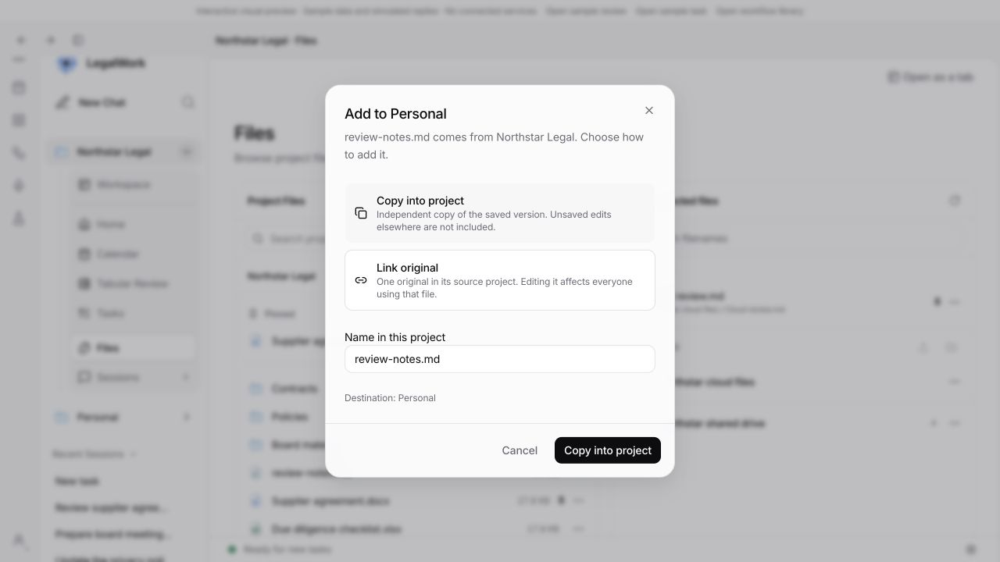
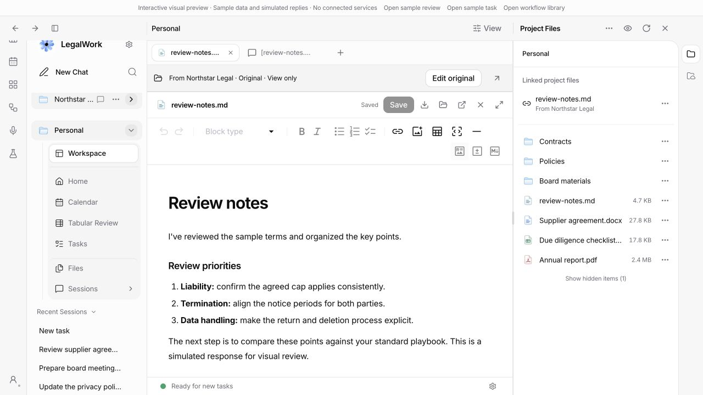

# Cross-project files

The workspace can open another project's original file without importing it. The tab keeps its source identity through layout restoration and starts read-only when viewed from another project. A source banner identifies the original, including when the document is expanded; **Edit original** uses the existing editing and handoff controls.

Dropping a file onto a project's heading, Files page, or folder offers **Copy** (the default) or **Link**. Copy captures the saved bytes and refuses filename collisions. Links retain the original project's identity; renaming or removing a link changes only its metadata. Dragging a link onward still refers to the original source.

Dropping into a chat adds an unsent reference. Dropping onto Sessions or the Sessions page's new-session action creates an unsent draft. Sending or queuing the message captures a saved-file snapshot in the receiving project and records its source and content hash. Queued draft editing and retries retain that snapshot.

Project Overview is labelled **Home** again, including restored tabs.

## Verification

Run from the repository root:

| Command | Result |
| --- | --- |
| `pnpm --filter @legalwork/app test` | 995 passed |
| `pnpm --filter legalwork-server exec bun test src/project-file-links.test.ts src/project-files.e2e.test.ts` | 7 passed |
| `pnpm --filter @legalwork/app typecheck` | Passed |
| `pnpm --filter legalwork-server typecheck` | Passed |
| `pnpm --filter @legalwork/app test:i18n` | 5,591 keys complete in English and German |
| `node scripts/i18n-audit.mjs --ci` | Passed |
| `pnpm build:ui` | Passed; existing bundle-size and annotation warnings |
| `pnpm --filter legalwork-server build` | Passed |

New tests exercise source identity and tab restoration, exclusion of credentials from drag payloads, registered-connection resolution, changing files during snapshot capture, queued references, concurrent link updates, malformed metadata, traversal/symlink containment, authentication, read-only servers, and exclusive copies without overwriting.

Browser checks used the synthetic session preview: Files-to-project transfer dialog, persistent links, foreign originals starting read-only, explicit editing, restoration, expanded-document source banners, Files-to-Sessions and lone-tab-to-Sessions drops, and sending a file reference. The API tests exercise real temporary files and server routes; the preview's server responses are fixtures.

## Boundaries

- Drag payloads carry project and file identifiers, not endpoints or credentials. Access resolves through registered project connections and existing server permissions.
- Links need an available source connection and file. Moving or deleting the original requires relinking; there is no automatic cross-project rename propagation.
- Chat snapshots contain the saved file at send/queue time, not an unsaved editor buffer, and do not update when the original changes later.
- Connected-storage sources use the existing checkout path. Live cloud-provider publishing was not manually verified.
- Client and server changes belong together. The running Electron app needs a server restart to expose the new copy/link routes; browser preview checks alone do not replace that restart.
