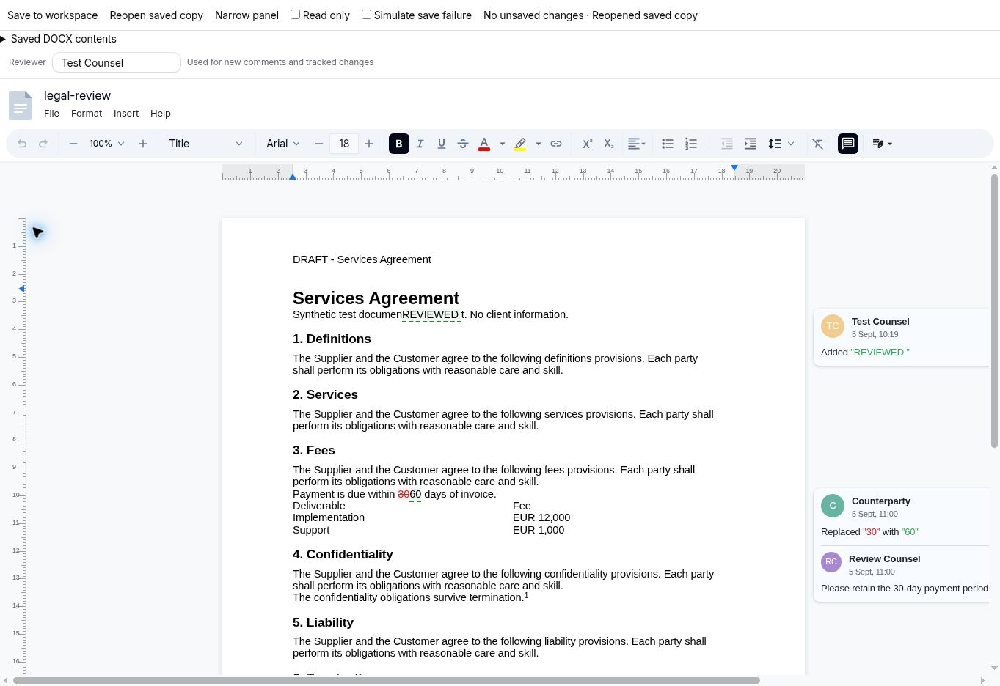

# DOCX editor review: lawyer workflow

Reviewed 5 September 2026 against LegalWork `dev` (`21c6176`) and the installed Eigenpal React/agents **1.8.3** packages. This is a review of that exact integration, not a claim of Microsoft Word parity.

## Findings fixed in this PR

| Lawyer task | Previous behavior | Change |
| --- | --- | --- |
| Redline a contract | The controlled `mode="editing"` prop had no `onModeChange`, so selecting Suggesting did not enable it. | Persist the selected editor mode. Browser test confirms a new insertion with the reviewer author survives serialization and reopening. |
| Read and action review notes | Global CSS forcibly hid comments, revision cards and margin markers. | Remove those overrides and use Eigenpal's native review layout, including horizontal scrolling instead of clipped content. |
| Navigate a long agreement | Document outline was explicitly disabled. | Restore the native heading outline; expose the ruler and Help menu. |
| Identify the reviewer | Comments/changes defaulted to “Legal Cowork.” | Add an editable reviewer name stored as a local device preference; fallback is “LegalWork.” This is attribution, not authenticated identity. |
| Save without losing context | Every successful save changed the editor React key, discarding selection and undo history. | Keep the loaded document identity through own saves and same-version refreshes. |
| Recover from an agent/disk update | Query invalidation could remount a dirty document and replace the optimistic-lock baseline. | Retain the dirty snapshot and original modification timestamp; show a disk-change notice and keep server conflict rejection. |
| Know what is saved | No dirty indicator; editor keyboard save did not persist to the workspace. | Track document/comment mutations, add Cmd/Ctrl+S, and only clear dirty after successful persistence. Edits made during a save remain dirty. |
| Leave the document | Explicit tab switches/closure could silently discard drafts. | Confirm before opening/selecting another panel tab or closing the active tab/pane; warn before browser unload. |
| Send the current draft | Download read the older file from disk. Open externally could open stale content. | Download serializes the live draft. Open externally saves first and stops on failure or further edits. Label Eigenpal's own export action “Download copy.” |
| Open a read-only target | Only viewing mode was passed. | Also set the editor's actual read-only prop, hiding mutation controls. |

The save button stays available even when clean. The pinned adapter does not emit `onChange` for every header/footer/property operation, so the wrapper also observes its immutable document reference. This check does not serialize or traverse the document repeatedly.

## Browser validation performed

The actual LegalWork web application was started and its welcome screen inspected. Editor interactions were tested using **the production `ArtifactDocxEditor` component**, mounted in a development-only harness with a synthetic contract and an in-memory save callback. The harness reparses each saved buffer with `DocxReviewer.fromBuffer` and exposes the saved comments, changes, and text. This exercises the real parser/editor/serializer; it does not exercise the Electron filesystem bridge.

| Check | Result |
| --- | --- |
| Initial import does not appear dirty | Pass; an initial-normalization false positive was found and fixed during testing. |
| Imported redline and comment cards visible | Pass. |
| Six clause headings in outline; heading selection | Pass. |
| Find “Supplier” | Pass: 1 of 6 matches. |
| Select Suggesting, insert text | Pass after fixing controlled mode; insertion attributed to Test Counsel. |
| Save and reopen that insertion | Pass: serialized revision and author preserved; reopened sidebar shows it. |
| Reject original 30 → 60 replacement | Pass: resulting clause retains 30 and serialized revision list is empty. |
| Add review text without editing body | Pass for dirty tracking and initial serialization; reopen issue below. |
| Save, then use undo | Undo remains enabled after save. |
| Simulated failed save | Pass: dirty draft retained; successful keyboard retry clears dirty. |
| Read-only mode | Formatting toolbar and reviewer input absent. |
| 620px panel | Inspected: native toolbar/document scrollbars keep content reachable, but this is still a cramped editing experience. |
| Native downloaded file | Download-event capture timed out; external Word reopening was not verified. |



## Remaining release blockers and priorities

1. **Review-thread round trips need work in the pinned editor.** Adding a reply on the combined tracked-change/comment card serializes the text and author. After reopening, that reply is not displayed in the card. In the tested sequence, saving again after rejecting the associated revision no longer included the added reply. Do not claim reliable negotiation-thread round trips until this is resolved with an upstream fix and a regression fixture. Reproduce: open the fixture, expand Counterparty, Reply, Save, Reopen, inspect the card and saved-content report, then Reject and Save again.
2. **Draft recovery must cover the whole application lifecycle.** This PR guards explicit panel-tab and pane actions plus browser unload. Switching sessions/routes, application crashes, and forced quit still need a durable recovery journal and navigation-wide protection. There is no autosave claim here. Keeping multiple hidden editor instances mounted is deliberately avoided: this version installs document-wide keyboard handlers, which can affect inactive editors.
3. **Make document work a first-class, wide workspace.** Native review cards need space. At 620px, a lawyer must scroll horizontally. Default to a wide document with a collapsible AI pane, preserving explicit zoom choices. Do not solve the layout by hiding review controls or forcing page transforms; that can separate the visible page from selection overlays.
4. **Build a Word interoperability gate.** Use real-world, non-confidential fixtures covering multilevel clause numbering, cross-references, section breaks, landscape schedules, footnotes, header/footer edits, complex tables, fonts, comments and 50+ page agreements. Compare rendering and reopen in Word/LibreOffice after each save. The synthetic fixture here is a starting point, not a fidelity certification.
5. **Negotiation handoff:** expose deliberate “with markup” versus “clean copy,” document comparison, and clear version history. Clean export must leave the working redline intact. Validate print/PDF output independently.
6. **Use native capabilities more deliberately:** heading styles/outline, find and replace, rulers/page setup, headers/footers, tables, revision accept/reject, and comments already exist. Add guided legal templates and sensible document defaults around these, instead of rebuilding another formatting ribbon.
7. **Keep the agent and the live draft coordinated.** Disk updates are now prevented from replacing a dirty editor snapshot. A fuller integration should let the agent act against the current draft, offer explicit accept/reject of its proposals, and resolve disk/draft conflicts clearly. Do not silently change the concurrency baseline.

## Reproduce locally

```bash
pnpm install --frozen-lockfile
pnpm dev:ui
# Open http://localhost:5173/docx-review.html
node --experimental-strip-types --test apps/app/tests/docx-document-state.test.ts
pnpm typecheck
pnpm build:ui
pnpm test:e2e
```

The fixture is `apps/app/scripts/fixtures/legal-review.docx`; it contains no client data. The test page is absent from production build entrypoints. For stable browser QA without HMR:

```bash
pnpm --filter @legalwork/app exec vite build --config vite.docx-review.config.ts --mode docx-review
cp apps/app/docx-qa/docx-review.html apps/app/docx-qa/review.htm
# With dev:ui running, open /docx-qa/review.htm
```

The generated `docx-qa` directory is ignored and sits outside the production public-assets directory. The root development launcher also accepts host/port arguments for supervised web previews, while plain `pnpm dev` still launches Electron.

## Command results in this environment

- `node --experimental-strip-types --test apps/app/tests/docx-document-state.test.ts`: **5 passed**.
- `pnpm typecheck`: **passed**.
- `pnpm build:ui`: **passed**, with existing large-chunk warnings.
- Fixed browser-QA build: **passed**.
- `pnpm test:e2e`: local-file-path checks ran, then **blocked by missing `opencode` executable** (`spawn opencode ENOENT`).
- Full dependency install: the `better-sqlite3` native build failed while extracting Node headers (`fchown EINVAL`). `pnpm install --frozen-lockfile --ignore-scripts` completed for web validation. Electron end-to-end validation remains outstanding.
