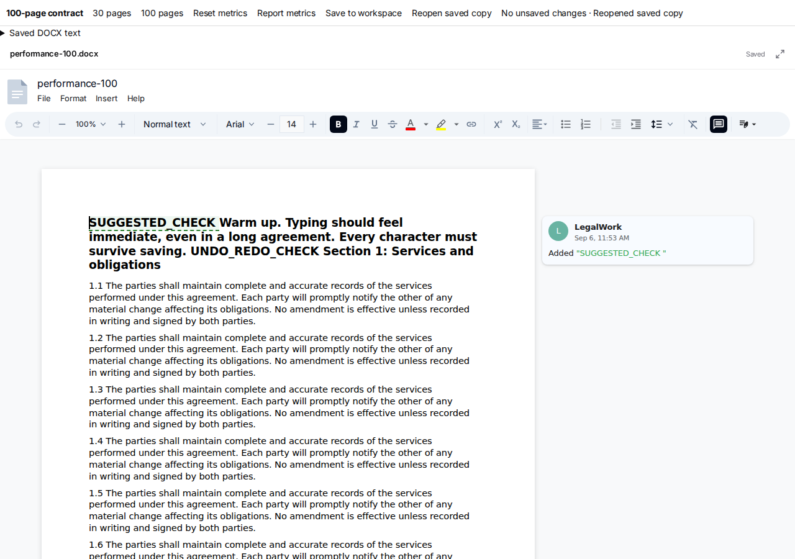

# DOCX typing performance

Compared with PR #107 at `d26da8e0ab851249fd4246013cbc88977b2c7d27`, this change removes repeated work from the typing path while keeping document changes and saves synchronous.

## Measured results

Production React/Vite builds, Chromium 149 headless on Linux, 1280 × 900 viewport, no CPU throttling. Each run types the same 93 characters into the first paragraph at 70 ms intervals after warmup. Documents contain 30 or 100 pages of synthetic contract clauses. Builds and benchmarks ran separately.

| Document | Median input → second frame | 95th percentile | Main-thread tasks ≥50 ms | Document paints |
| --- | --- | --- | --- | --- |
| 30 pages, before | 58.6 ms | 79.7 ms | 4 | 186 |
| 30 pages, after | 37.3 ms | 52.3 ms | 0 | 93 |
| 100 pages, before | 90.0 ms | 161.4 ms | 59 | 186 |
| 100 pages, after | 45.5 ms | 56.2 ms | 0 | 93 |

The 100-page test reduces median delay by 49% and the 95th percentile by 65%. Every typed character survived saving and reopening. These are measured browser results, not a guarantee for every machine or document. Double `requestAnimationFrame` measures the next rendering opportunity, not physical display latency. The harness also records Event Timing and the editor's `painter:painted` event; raw results are in [docx-typing-performance.json](docx-typing-performance.json).

## Changes

- **One layout per edit.** Publishing the new DOCX projection used to change the layout callback's identity and trigger an additional header/footer layout effect. The callback now reads the latest document from a ref and retains explicit dependencies for section properties, footnotes, headers/footers, theme, styles, zoom and comment rendering. Body transactions still schedule layout immediately.
- **No redundant document comparison.** Confirmed ProseMirror `docChanged` transactions skip history's full JSON serialization of both documents. External/property updates retain equality checking and no-op handling. History and save timing remain intact.
- **Reuse character measurements.** Exact canvas character widths are cached by canvas context, font and shaping settings, bounded to 1,000 entries per context, and cleared through the existing font-loading reset. UTF-16 positions and letter-spacing calculations are unchanged.
- **Geometry updates follow layout changes.** Page fitting watches page dimensions, layout structure and native zoom instead of every text/caret mutation. Review-card positioning coalesces work, caches revision extraction by immutable document, and ignores its own style writes.

Eigenpal patches cover ESM and CommonJS. The lockfile changes only the two package patch hashes and their references. No editor upgrade, input debounce, delayed document synchronization or asynchronous save projection was introduced.

## Validation

- `pnpm install --frozen-lockfile --ignore-scripts --offline`: passed.
- `pnpm --filter @legalwork/app test`: 315 passed across 51 files, including new history and measurement tests plus existing DOCX roundtrips.
- `pnpm typecheck`: passed.
- `pnpm build:ui`: passed with existing bundle/externalization warnings.
- `docx-review-cards.js` and `docx-review-position.js`: passed in local Chromium. Includes replies, Accept/Reject, save/reopen, 420 px and 620 px panels, expansion, scrolling, adjacent revisions and native zoom.
- `docx-performance-check.js`: passed for 30 and 100 pages. Checks undo/redo, Enter/Backspace, editing at the end of the document, immediate save/reopen, and suggested insertions retaining revision markup.
- `git diff --check`: passed.

## Reproduce

From the repository root:

```sh
pnpm install --frozen-lockfile
PORT=5174 pnpm dev:ui
```

Open `/docx-performance.html?pages=30&run=unique`, then run the existing Playwright CLI workflow:

```sh
pnpm dlx @playwright/cli run-code --filename=apps/app/scripts/docx-performance-check.js
```

Repeat with `pages=100`. Use a fresh browser context or a unique `run` value to avoid an earlier synthetic recovery draft. Keep the same browser, typing cadence and CPU settings across comparisons; run no other builds or benchmarks concurrently.

For a production fixture, from `apps/app`:

```sh
pnpm exec vite build --config vite.docx-performance.config.ts --mode docx-performance
pnpm exec vite preview --outDir dist-docx-performance --port 5174
```

For the baseline, check out `d26da8e`, copy only the harness HTML, harness scripts and benchmark Vite config into that checkout, and install its original lockfile. The fixture is excluded from the normal application build.

The automated run exercised the real production editor and in-memory workspace persistence using synthetic documents. Native Electron performance on macOS and Word/LibreOffice interoperability were not measured here.


