# Files and new-window UX follow-up — 2026-10-08

Branch: `feat/split-view-autosave`, local uncommitted changes. This follows
`adversarial-followup.md` and `workspace-polish.md`; no new remote CI run is claimed.

## Result

- The main Files page and its workspace tab have a labelled, prominent Upload files button in the Project Files header. The right file sidebar keeps its upload action at the bottom. The root overflow menu no longer repeats Upload; individual folder menus can still upload into that folder.
- Select files selects the current file catalogue. Open, pin, copy, link, delete, and clear are available together. Copy/link use the same borderless treatment as the other actions, without ellipses. The narrow sidebar uses labelled icon actions. Connected-provider entries do not support the new local-files deletion action.
- Single or selected project files can move to folder rows or ancestor breadcrumbs, in the full page, a Files tab, and the right sidebar. Matching filenames never overwrite existing files. Dropping into the current directory is a no-op. No “Move to Project Files” banner is rendered; folder/breadcrumb targets are highlighted directly.
- Drags within Files tabs reserve a 40-pixel outer gutter for left/right/top/bottom splits (increased from 24 pixels after feedback). Folder targets win over this gutter. Files dragged in from the right sidebar use the ordinary pane opening/split targets instead. Tab strips and other document panes remain destinations for opening files. No invisible overlay covers folder rows.
- Inactive tabs have separator strokes only between adjacent inactive tabs. Only the active tab has its outline and surface. The CSS accounts for the context-menu wrappers around tabs.
- New-window creation offers an empty workspace or a copy of open tabs/layout, with an optional remembered choice. Customization and the button's context menu can change it. Preferences sync between windows. An empty seed replaces an inherited legacy layout. Unsaved drafts are not copied.
- Global Projects exposes Workspace alongside Home, Calendar, Reviews, Tasks, and Files.
- File-operation errors are scoped to the app's notification host. Embedded DOCX editors no longer render a second copy of the same app error.

## Task navigation and composer follow-up

“Open in project” previously opened a tab under the task's stored project ID
without checking whether that project was still available. The route resolver
then fell back to another project, losing the workspace query and leaving the
task tab in an unreachable scope. The local task store contains such stale
links. The action now resolves the project against the task's own server before
changing tabs or navigating. Unavailable links leave the task detail open and
explain that its project must be reconnected or changed. Remote project IDs are
mapped to their desktop route IDs, without matching projects on another server.
Legacy tabs migrate before opening the task so they cannot take its focus when
the destination mounts.

The composer toolbar now wraps its controls in one flex flow. The nested
16-rem group previously forced Run task onto a third row even when it could fit
beside Reasoning effort. At 277 CSS pixels of toolbar width both now share the
second row; at 639 pixels all controls fit on one row. Draft editing is also
independent of model readiness: a missing model blocks submission, while the
user can still type. Session transitions continue to disable editing.

Verification for this follow-up:

- `pnpm --filter @legalwork/app exec bun test tests/panel-side-pane.test.ts tests/workspace-routes.test.ts tests/task-draft.test.ts`: 88 passed. Six new navigation regressions cover project isolation, legacy focus, reopening, missing projects, remote IDs and server ownership.
- `pnpm --filter @legalwork/app typecheck`: passed.
- `pnpm --filter @legalwork/app test:i18n`: passed, 5,753 keys in both languages.
- Browser preview with `?unified=1&empty-chat=layout&composer-layout=1&lang=en`: inspected actual controls at 390- and 760-pixel viewport widths. The running Electron app and its user data were not driven by UI automation. Task navigation was verified against the production tab store in the tests above, not end-to-end in Electron.

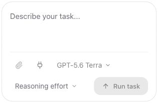

## Existing files from the tab's + menu

The Files action in a tab strip, and the Files action in an empty pane, now open
an in-app chooser with Project Files and Memory Drive. They no longer launch
the operating system's file picker. The existing file browsers provide folder
navigation, search, linked originals and connected-storage files; Upload files
remains an explicit action.

The chooser retains the pane that opened it. Normal files use the established
source-aware opening path. Linked files and bulk selection use a scoped opening
callback so neither an opening profile nor another focused pane can redirect
the selection. A closed destination is rejected instead of reopening elsewhere.

Browser checks with synthetic data: opened a local Markdown file without an
extra split; split that file to the right; selected two project files through
the left pane's + menu and verified both appeared on the left; opened a connected
Memory Drive file through the right pane's + menu and verified it appeared on
the right. The dialog closed after each selection. No native file picker or
live storage upload was used.

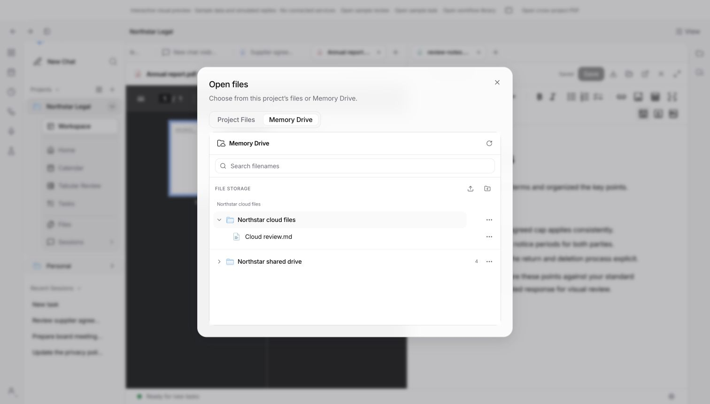

The complete validation rerun and its remaining failures are recorded in
[split-view-validation.md](split-view-validation.md).

## Data handling

Move/delete acquire the same document identity Web Lock as the editor. An open editing owner produces one close-file-first message before filesystem mutation. Successful operations evict stale content caches and update pins. A failed operation preserves cached content. Batch deletion keeps failed items in its confirmation dialog.

Server rename operations lock source and destination in deterministic order, including the no-overwrite check. Delete also takes its path lock. Eight simultaneous moves to the same destination produce one success and seven collisions with all losing source files intact.

## Verification

- `pnpm --filter @legalwork/app test`: 1,093 passed, 0 failed.
- `pnpm --filter @legalwork/app typecheck`: passed.
- `pnpm --filter @legalwork/app test:i18n`: 5,752 keys in both English and German, passed.
- `pnpm --filter @legalwork/app build`: passed; existing bundle-size warnings remain.
- `pnpm --filter legalwork-server typecheck`: passed.
- `pnpm --filter legalwork-server build`: passed. Unrelated generated calendar output restored.
- `pnpm exec bun test src/project-files.e2e.test.ts` from `apps/server`: 5 passed, 0 failed, including the concurrent move collision regression.
- `git diff --check`: passed.

Browser interaction against `session-preview.html?unified=1`, using the real components with synthetic files:

1. Moved a file from the right sidebar into Contracts and verified its new path.
2. Selected two files on the main Files page, dragged them into Contracts, and verified both destinations.
3. In a Files tab, dragged a file onto the root breadcrumb; it moved without opening another tab.
4. Dragged a file to the tab strip; it opened as a document tab.
5. Dragged a file 14 pixels from the left pane boundary; it opened a new left split.
6. Selected all files, checked the confirmation dialog's filenames, cancelled deletion, and opened all selected files as tabs.
7. With a DOCX editor mounted, dragged its owned file into a sidebar folder. Exactly one notification appeared (`[data-sonner-toast]` count: 1).
8. Chose and remembered an empty window, verified the next click bypassed the dialog, then changed the choice through right-click. Changed it to Copy in Customization and verified that another tab used the updated choice; restored Ask every time.
9. Expanded a project in global Projects, verified its Workspace action, and used it to return to the existing workspace.
10. Verified the large Upload label and the root menu containing Refresh folder/New folder, with no duplicate Upload entry.

Native Electron window creation and native file copying were not performed by the browser fixture. The fixture uses an explicit in-memory importer and a simulated window callback. The browser checks verify the controls, choices, persistence, layout and drag routing; server tests verify real filesystem mutations. Previously documented unrelated full-server-suite failures remain in `adversarial-followup.md`.

## Screenshots

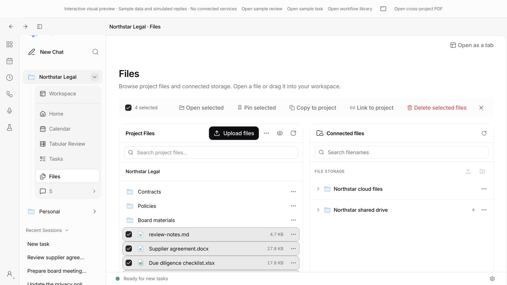
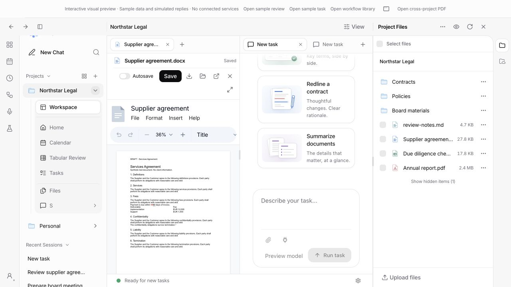
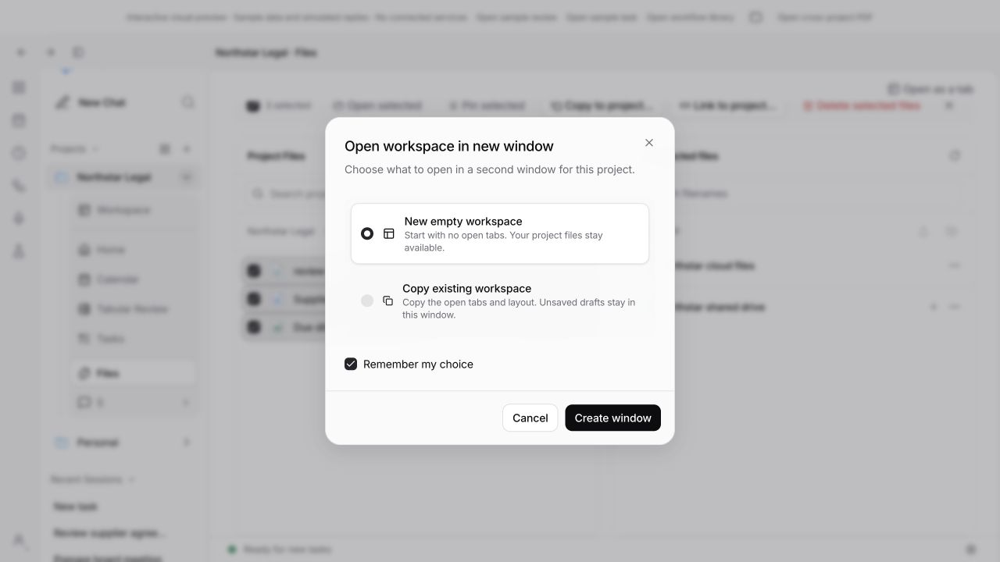
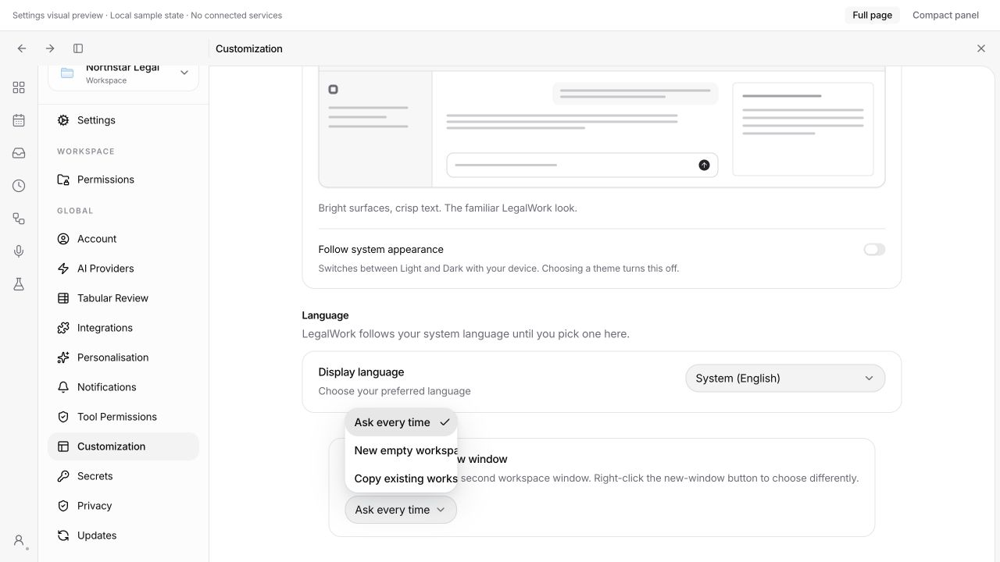
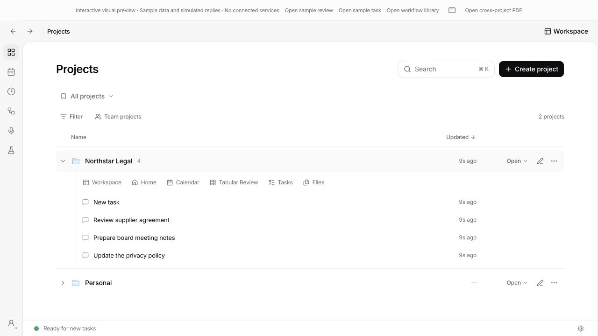
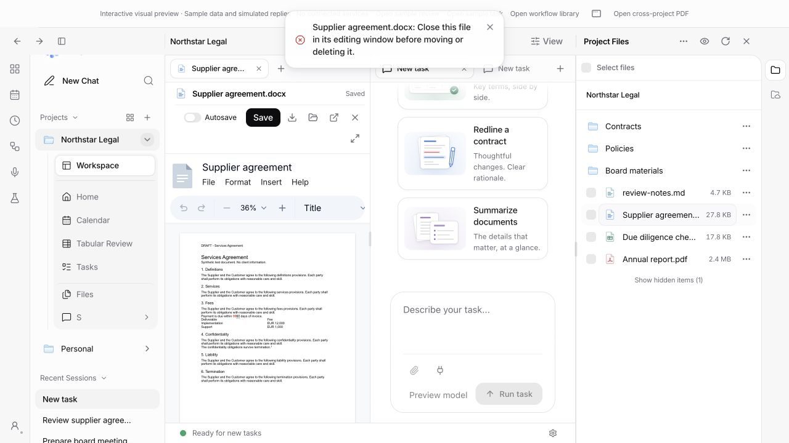

## Tab context menu: close this pane

Added “Close all tabs in this pane” / “Alle Tabs in diesem Bereich schließen”.
The action reads the current pane, asks once for its unsaved documents before
closing anything, and uses the existing close path for each tab (including
individual native browser tabs). Other panes are unaffected.

Verified in the browser: cancelling preserved all seven tabs; confirming closed
the six tabs in the chosen pane and retained the other pane's DOCX. Closing the
remaining pane left an empty workspace with its New tab control available.
Typecheck and i18n passed (5,753 keys); the pane and discard-dialog test suites
passed 78 tests. `git diff --check` passed.

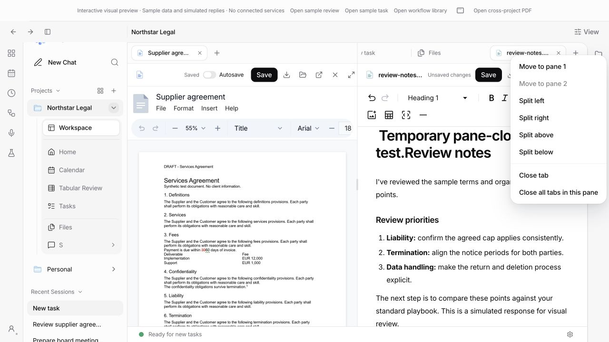
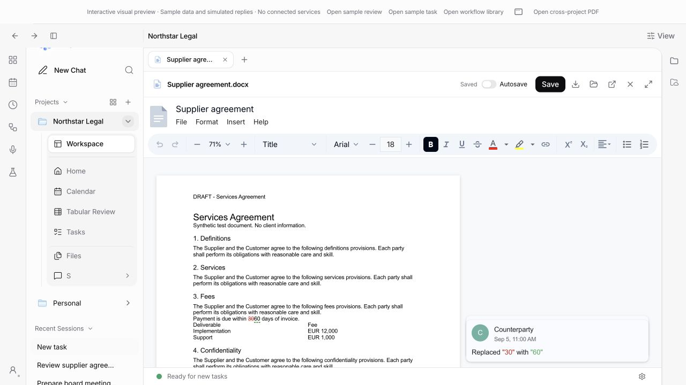

## Tab insertion and transient queue display

The window's capture-phase `drop` listener cleared the source tab before the
destination strip processed the event. The source now remains available until
`dragend` (or cancellation/blur), so the existing insertion marker and midpoint
calculation place it at the intended position.

Browser verification: reproduced a last-to-first drag doing nothing, then verified
last-to-first, first-to-last, last-to-middle, and insertion from another pane
between two tabs. Moving the source pane's final tab collapsed that pane without
losing the requested destination position.

The queue now waits for its idle check and durable dispatch claim before publishing
the enqueue result or a concurrent poll. An immediately starting prompt is already
`sending`, which the UI excludes from waiting messages. The model response stays
asynchronous; follow-ups and paused/busy sessions remain visibly queued. Stop/edit
actions do not wait for the idle check. This retains the shared dispatcher and
durable queue rather than bypassing them for the first message.

Verification for this follow-up:

- App and server typechecks: passed.
- `pnpm --filter @legalwork/app exec bun test tests/tab-strip-drop.test.ts tests/panel-side-pane.test.ts tests/queued-order.test.ts`: 76 passed.
- `pnpm exec bun test apps/server/src/session-message-queue.test.ts`: 18 passed, including immediate start, concurrent polling/enqueue, real waiting messages and Stop during an idle check.
- From `apps/server`, `pnpm exec bun test src/session-read-model.e2e.test.ts --test-name-pattern 'shared session queue API'`: 3 passed.
- `git diff --check`: passed.

Queue behavior was verified against the dispatcher and HTTP API with a simulated
model transport. The browser preview uses simulated replies and does not exercise
a live model or production queue backend.

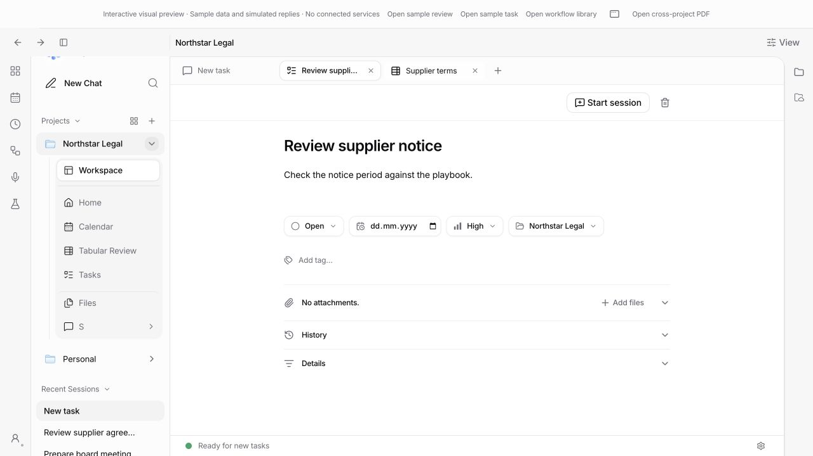

## Sidebar project ordering (superseded by reactive feedback below)

The initial implementation used a native drag from the project header and a single insertion
line before or after an entire project block. Expanded Home/Workspace/Files/etc.
stay in place during the gesture; the order changes only on drop. This removes
the live translation of tall, transparent expanded blocks across neighbouring
entries. Expanded state and the existing saved-order callback are preserved.
Other drag types keep their existing file, chat and workspace destinations.

Browser checks passed for a collapsed project moved before an expanded project,
two expanded projects reordered by dropping over a child navigation entry, and
an expanded project moved after a collapsed project. Dropping outside the list
kept the original order and removed all drag styling/insertion markers. The
preview now implements its project-order callback, so these checks exercise the
actual sidebar rather than a no-op preview handler.

App typecheck passed. The project-order and workspace-drop-intent suites passed
8 tests (134 assertions). `git diff --check` passed.

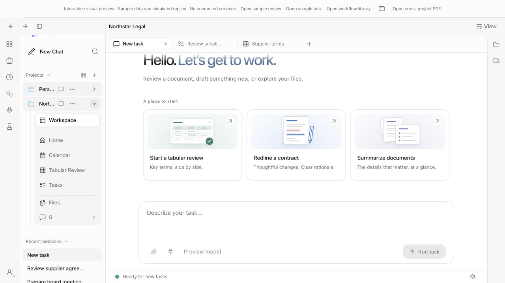

## Right-sidebar files dropped into a Files tab

The right file sidebar marks the drag origin after individual-row and multi-file
selection payloads have been written. Files-tab drop routing can read this marker
during hover, before the browser exposes the payload itself. A sidebar drag now
uses the ordinary centre/open and left/right/top/bottom split targets, including
when hovering a folder. Explorer-origin drags retain folder moves and the 40-pixel
split gutter. Moving files between folders inside the right sidebar is unchanged.

Browser verification: dragged sidebar `review-notes.md` onto the Files tab's
Contracts row in the central zone; it opened in the existing pane and remained
at its original path. Dragged the sidebar PDF onto a folder row 100 pixels from
the Files pane's left boundary; it opened a left split. Then moved the spreadsheet
from inside the Files tab into Contracts and verified its new path without a split.

App typecheck and 13 file-move/drop-intent/geometry tests passed. The browser
checks use synthetic files; no user documents were moved.

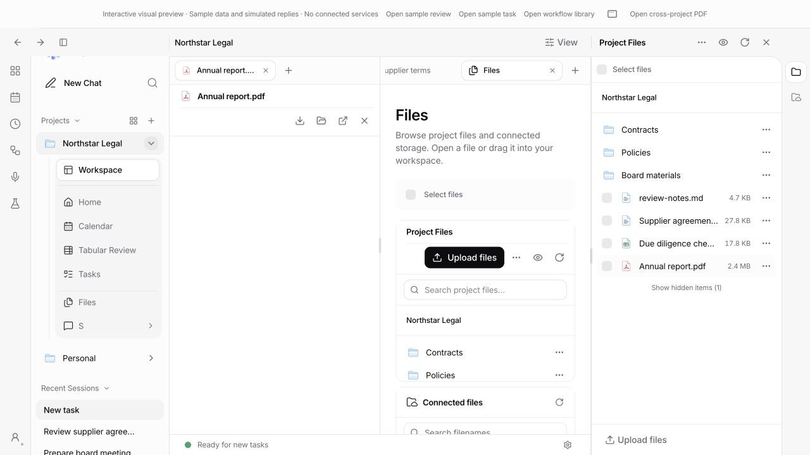

## Reactive drag feedback and independent UI audit

Replaced black insertion markers with tab-width gaps and translated neighbours.
The dragged tab has an opaque floating surface; its original stays mounted so
native drags continue into other panes. Geometry comes from unchanged slots,
including horizontal scrolling, rather than animated surfaces. Dropping does not
apply an extra scroll step. Empty strips retain enough height to show the gap.
Drop, leaving a strip, drag end, blur and effect teardown remove transient styles.

Projects again move responsively as whole blocks. Their opaque background and
raised shadow prevent navigation text from showing through; header hover actions
stay hidden during the gesture. A real browser test caught the trailing click
opening the dragged project; the gesture now consumes that click and leaves the
current workspace selected. Subsequent ordinary clicks still navigate.

An independent Astra agent reviewed Files (full, tab and sidebar), Memory Drive,
project Home/catalogue, calendar/dialogs, task/review panes, tab menus, workflow
editor, compact/full settings, and light/dark workspaces. Confirmed fixes:

- Sessions label clipping: compact overflow menu retains New chat/Create a Group.
- Narrow composer: model/actions and send controls wrap without overlap.
- Tools menu clipping in split panes: shared portalled Popover with viewport bounds,
  keyboard focus handling, Escape/outside dismissal, and internal section switching.
- Due-today dates: amber-11 replaces insufficiently contrasted amber-9 text.

Primary agent reviewed Astra's changes; Astra then reviewed the final drag code.
That review additionally caught release-time auto-scroll changing the insertion
slot and a zero-height empty-strip placeholder; both were corrected and re-reviewed.

Verification:

- `pnpm --filter @legalwork/app typecheck`: passed after final changes.
- Tab strip, pane layout, file move and drop intent suites: 86 passed; final tab
  geometry rerun: 4 passed.
- Astra's composer-state, task-format and model-behavior suites: 38 passed.
- `git diff --check`: passed.
- Real browser drags: same-pane reordering, cross-pane before-target insertion,
  horizontally scrolled insertion, outside-drop cleanup, collapsed and expanded
  project movement, preserved selected workspace, subsequent normal navigation.
- Browser narrow/short views: 900×720 and 900×500; tool menu Configure remains
  reachable. Mouse opening preserves editor focus; keyboard opening focuses menu
  controls and Escape returns focus. Light-theme due-date contrast verified.

The native drag API completes gestures atomically; an attempted concurrent Escape
check did not establish cancellation timing, so Escape during a held tab drag is
not claimed as browser-verified. Production busy queues and native desktop windows
were not exercised by this preview audit. Sample files only; no user files moved.

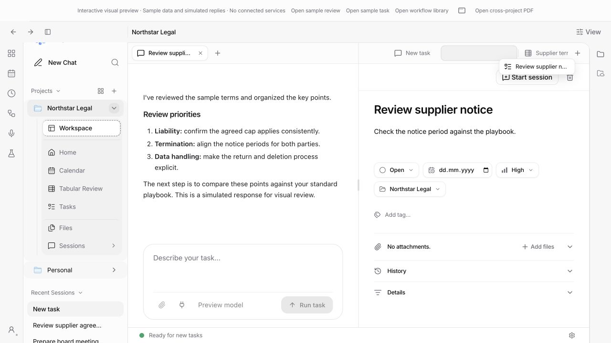
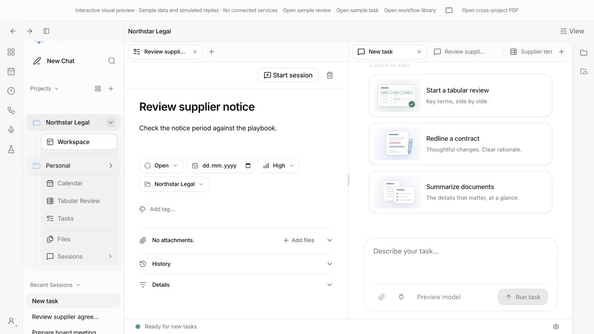
