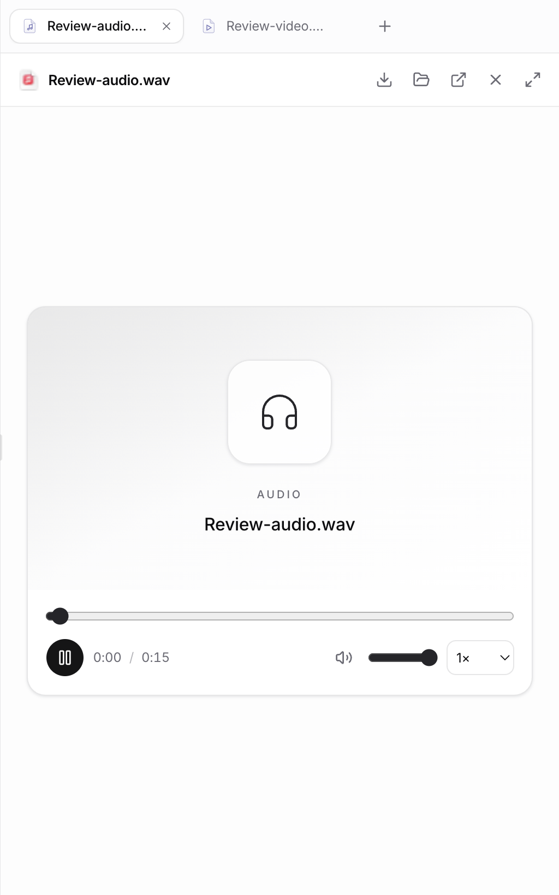
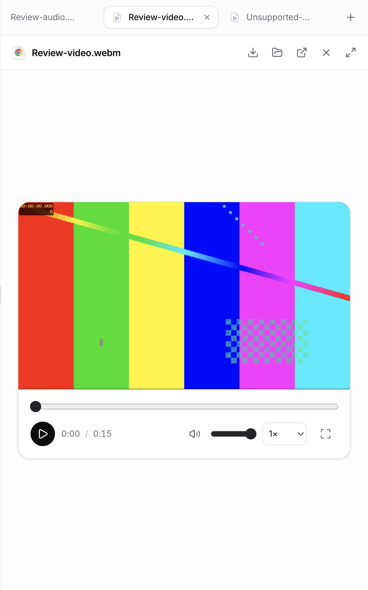

# Audio and video preview

Created `feat/media-file-preview` from freshly fetched `origin/dev` at `d98afd317`.

Audio and video files open in the existing artifact viewer through file selection, working-copy import, or file references. The shared player uses native HTML media decoding, existing LegalWork buttons/colors, and no new dependencies. It includes play/pause, elapsed/total time, keyboard-accessible seeking and volume, mute, playback speed, and video fullscreen. Both formats support the existing panel expand, download, reveal, and external-open actions. Media is never automatically played by the component.

Recognized audio extensions: mp3, wav, m4a, aac, ogg, oga, opus, flac, weba, aiff, aif. Video: mp4, m4v, webm, mov, ogv, mkv, avi. Recognition routes a file to the player; actual decoding depends on Electron's supported codecs. Unplayable files display an error with download/external-open guidance. The existing viewer downloads the file into a blob before playback; this change does not add server-side streaming or transcoding.

## Validation

- `pnpm --filter @legalwork/app typecheck` — passed.
- `pnpm --filter @legalwork/app build` — passed, with existing chunk-size warnings.
- `pnpm --filter @legalwork/app exec bun test scripts/open-target.test.ts tests/import-viewer-file.test.ts` — 25 tests passed; includes media routing, uppercase extensions, artifact collection, and unchanged URL behavior.
- Actual Electron app, using synthetic 15-second WAV and VP9 WebM fixtures: metadata loaded, playback advanced, seeking worked with native pointer/keyboard input, mute and 1.5× speed updated playback properties.
- Video fullscreen opened successfully; returning to the panel worked. Controls wrapped within a 270 px card without horizontal overflow (equivalent to a compact sidebar with padding).
- Switching away from a playing video removed and paused the old media element. A malformed MP4 displayed the error state and disabled playback.
- H.264 MP4 and MP3 fixtures also loaded successfully with decoded media ready and no media errors.

Screenshots are cropped from the actual Electron viewer, excluding the adjacent conversation.

