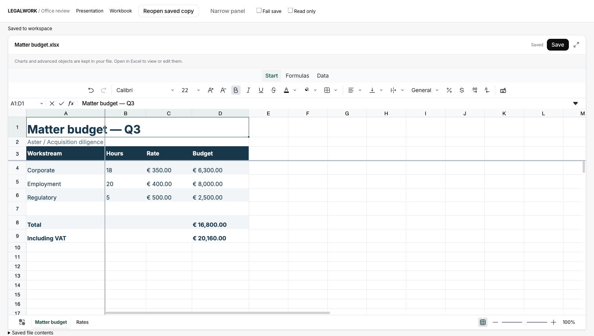
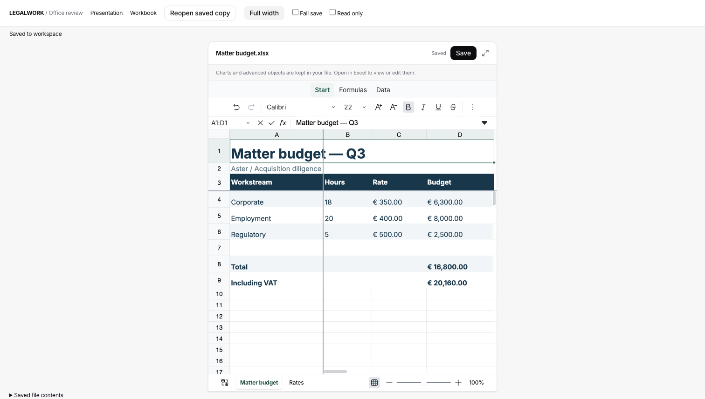
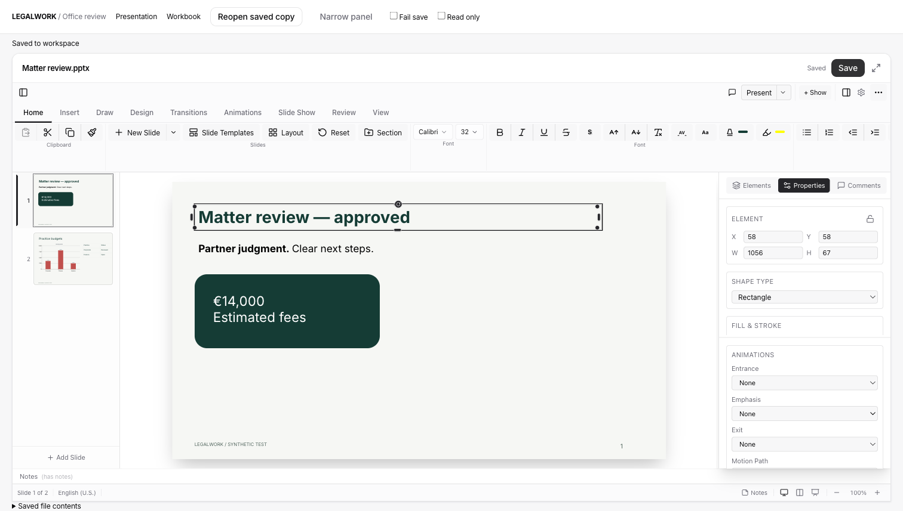
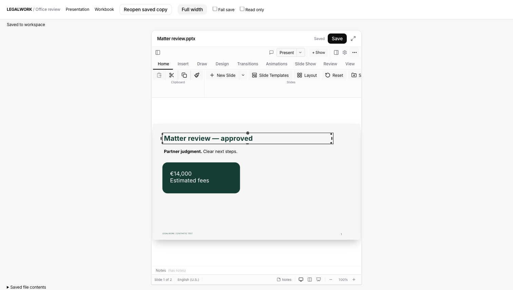

# Office artifact editors

Branch: `feat/office-artifact-editors`, based on freshly fetched `origin/dev` at `b2c000ad250a01daa3bb7e6e280cab7e849a54da` (7 September 2026).

Legalwork opens `.pptx` and `.xlsx` files in editable artifact panels. Both use the existing artifact Save action, optimistic file-version checks, dirty-document close protection, draft downloads, save-before-open-externally behavior, and expandable panel. Remote files follow the existing read-only policy. Saves retain the mounted editor; failed writes retain the draft. Ctrl/Cmd+S saves from the focused editor.

## Libraries and licensing

- PowerPoint: `pptx-react-viewer@3.5.4`, Apache-2.0. Two small pnpm patches adapt its optional AI-SDK import to the host SDK and expose `markSaved()` so dirty state is acknowledged only after a successful workspace write.
- Excel: `@univerjs/core`, `@univerjs/themes`, and `@univerjs/preset-sheets-core`, all pinned to 0.25.1. No Univer Pro packages, conversion service, or commercial SDK is included. The umbrella `@univerjs/presets` package was deliberately excluded because it installs Pro dependencies.
- XLSX conversion is Legalwork code under MIT: JSZip retains the original OOXML package; SheetJS reads values/formulas; xmldom patches supported changes in place.
- Legalwork's LICENSE remains MIT. Dependencies keep their licenses. The PowerPoint package includes `mtx-decompressor@1.6.0` under MPL-2.0. Its complete, unmodified source and license are shipped under `apps/app/public/third-party/office-editors/mtx-decompressor-source`, from upstream commit `9758209fcc74d4ab71bb02a9a8b11cf850bc5c7d`. This is file-level source availability, not a relicensing of Legalwork.
- `public/third-party/office-editors/` is copied into web and desktop renderer builds. It contains dependency licenses, upstream notices, and MPL source. `pnpm --filter @legalwork/app exec node scripts/office-license-notices.mjs` refreshes the dependency notices and rejects unresolved licenses and Pro packages.

## Behavior and scope

PowerPoint provides slide navigation, direct text editing, shapes, tables, charts, notes, formatting, and presentation mode through the library. The embedded stylesheet is isolated with CSS `@scope` to prevent its Tailwind defaults changing Legalwork. Narrow panels collapse the side panes; the inspector can be reopened as an overlay. Legalwork owns save status rather than displaying the vendor's export status as a successful disk write.

Excel supports multiple existing sheets, cell values, formulas, copy/paste, undo/redo, font/color/number formatting, alignment, borders, and underline/strike-through. Original merges, freeze panes, widths, charts, comments, validations, and other untouched package parts are retained. Formula results are awaited before saving; Excel is also instructed to recalculate on open. An unchanged workbook returns its original bytes.

This is not complete Excel compatibility. Charts, pivot tables, conditional formatting, validations, and advanced objects are retained, but their full UI is not implemented by the open-source preset. The editor explains that these should be viewed/edited in Excel. Row/column/sheet structural edits are blocked because moving cells requires updating references across those retained parts. Protected sheets and array-formula edits are rejected rather than silently flattened. Legacy `.xls`/`.ods` files use the external-open fallback; CSV/TSV retain their existing text editor.

Both editors load lazily. The production editor chunks are substantial (about 1.5–1.6 MB gzip each); large/complex real-world workbooks and decks still need broader compatibility and performance testing. The browser checks here use synthetic files and in-memory persistence, not the deployed server or Microsoft Office.

## Reproduce the checks

```sh
pnpm install --frozen-lockfile
pnpm --filter @legalwork/app typecheck
pnpm --filter @legalwork/app exec bun test scripts/office-workbook.test.ts tests/docx-document-state.test.ts scripts/artifact-spreadsheet.test.ts
pnpm --filter @legalwork/app build
PORT=5188 pnpm --filter @legalwork/app dev
```

Open `http://localhost:5188/office-review.html?format=xlsx` or `?format=pptx`. The development-only harness uses the production editor components and Legalwork panel chrome with synthetic fixtures, an in-memory workspace write, reopen, narrow-panel, read-only, and failed-save controls. It is not a production build entry point.

Automated checks cover exact no-op preservation, multi-sheet value/formula edits, charts/comments/validation/freeze retention, formatting round trips, repeated saves, refusal of unsafe structure/array edits, and existing document conflict/close behavior. Browser checks cover real text/cell input, save/reopen, repeated edits after saving, failed saves, compact layout, and read-only behavior. No live customer documents or deployed application were modified.

Validation: 14 focused tests passed; app typecheck and production build passed. The built renderer includes the license notices and MPL component source.

## Recorded browser results

- XLSX: B4 changed from 10 to 18; the saved D4 cache is 6,300 with formula `B4*C4`. Reopening, changing Rates!A1 to 0.2, simulating a failed save and retrying produced a saved D9 value of 20,160 with its cross-sheet formula intact. The failed save kept “Unsaved changes”; successful retry returned to “Saved”.
- PPTX: typed “Matter review — approved”, saved, and verified that text in the exported slide XML. `ppt/charts/chart1.xml` and the exact synthetic speaker note remained. Repeated saves and edits correctly changed the dirty indicator. A failed write retained the draft.
- Both editors have 620 px panel and full-width screenshots below; read-only mode disables persistence and editing while keeping navigation available.





