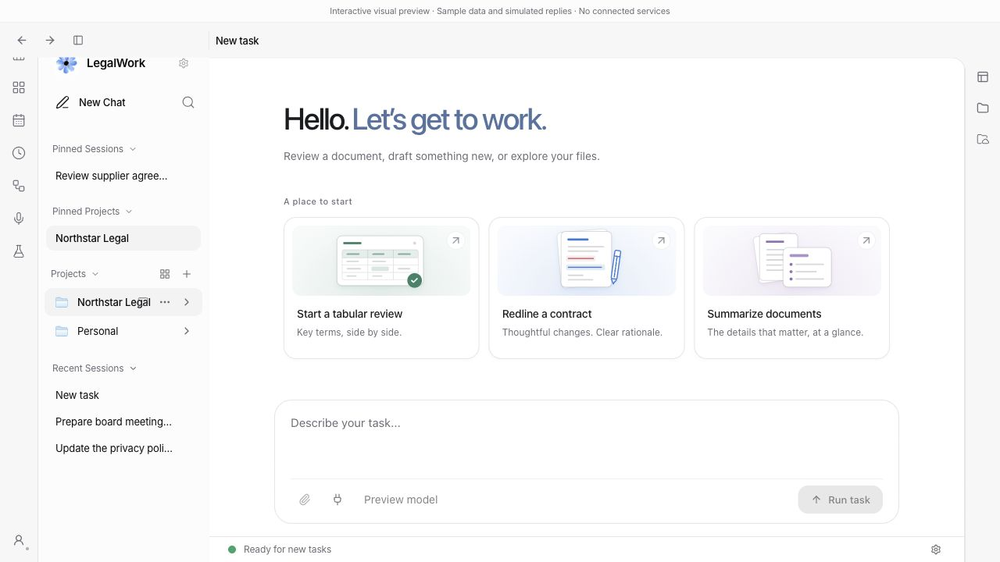
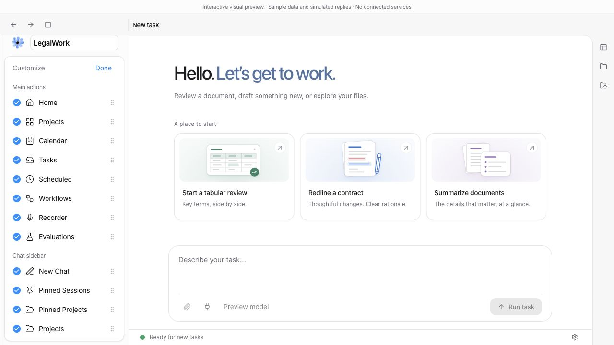

# Pinned projects in the chat sidebar

The second left sidebar now shows Pinned Projects beside Pinned Sessions using the same section heading, spacing and compact rows. It uses the existing project pins from the Projects page and only appears when a pinned project is present in the current workspace list. Removing the final pin removes the section.

Click a pinned project to open its overview. Its context menu can open or unpin the project; the visible actions menu also offers the existing project actions. Project menus in the regular sidebar now offer Pin/Unpin as well.

Customize navigation includes a Pinned Projects toggle and reorder handle. Hiding the section preserves the pins. Existing saved section orders gain the new section next to Pinned Sessions without changing the relative order of existing items. Subsequent visibility and position choices persist normally.

## Verification

- `pnpm --filter @legalwork/app test`: 861 passed. Three new preference regression tests cover defaults, migration from older custom orders, and saved visibility/position.
- `pnpm --filter @legalwork/app typecheck`: passed.
- `pnpm --filter @legalwork/app test:i18n`: 5,553 keys across English and German passed.
- `node scripts/i18n-audit.mjs --ci`: passed.
- `pnpm --filter @legalwork/app build`: passed with existing chunk/dependency warnings.
- Browser verification in the isolated session preview: initially hidden with no pins, pin via the project menu, persistence after reload, context-menu unpin of the last project, hide without removing pins, re-enable, keyboard reorder and reload, and project shortcut selection. Checked English and German labels and both pinned sections together. No browser console errors.

Reproduce with `pnpm --filter @legalwork/app dev --port 5213` and open `http://localhost:5213/session-preview.html?lang=en`. Pin a sample project and chat using their sidebar menus. The preview uses synthetic data and does not connect to personal services.

