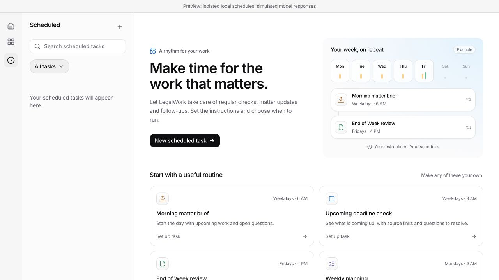
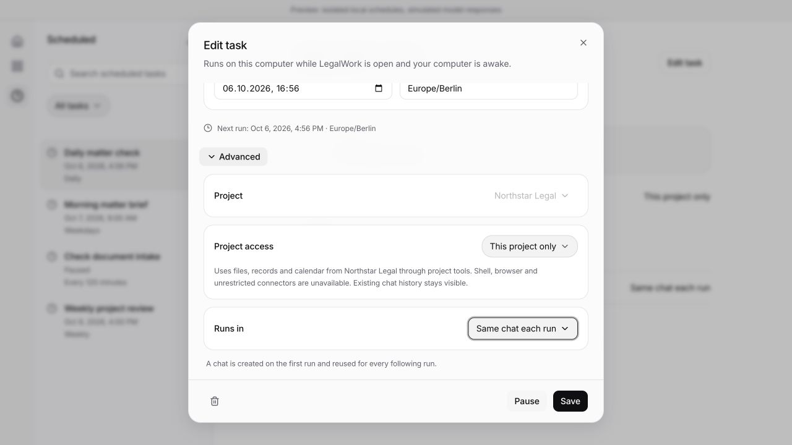

# Local scheduled tasks

LegalWork can schedule a prompt once or repeatedly, reuse one project chat or create a chat for each run, and pause, resume, edit or delete the schedule. The Scheduled page, inline Open cards and editor use the existing Surface, IconTile, Base UI controls and semantic design tokens. English and German are supported. Task details group the next run, named project and explicit access scope. Edit, Pause/Resume and Delete are visible in the detail header; sidebar tasks show their project and offer the same actions through right-click or the visible menu button. Deletion confirms the task name and retains existing chats.

## Suggested routines

The welcome view includes an example week and four editable presets: Morning matter brief at 06:00 on weekdays, Upcoming deadline check at 08:00 on weekdays, End of Week review on Friday at 16:00, and Weekly planning on Monday at 09:00. Presets choose the next matching local date and use the computer's IANA time zone, saved with the task. Existing task schedules are unchanged; the blank New task editor still defaults to Daily.

## Project access

New tasks default to **Daily**, **Same chat each run** and **This project only**. Project selection and Project access are under Advanced. The single Runs in picker replaces the redundant toggle, and the searchable project menu has a bounded, scrolling list.

A reusable chat is created only on the first due run and its ID is saved on the task, so subsequent runs continue the same chat after an app restart. Existing chats can also be selected, and New chat each run remains available. Legacy tasks retain their saved destination behavior.

Each task defaults to **This project only**. The selected project is also the destination for its chats. **All projects** permits access to other authorized local projects and keeps the user's normal tool permissions and approvals.

Project-only runs use a hidden engine agent with an explicit allowlist of project-scoped tools: project records, notes, calendar reads, saved reviews and Jev document queries. Shell, native file tools, browser automation, delegation, global task search and unrestricted connectors are disabled in this mode. Cross-project read tools derive access from the trusted engine agent context, not model arguments. The server verifies the engine's effective agent and saved chat permissions before dispatch; a stale engine or a chat with broader saved permissions pauses the task with a recovery message.

The boundary is an engine tool-access policy. Trusted local plugins continue to run normally, and existing chat history remains visible. Choose a new chat for each run when previous conversation context should not carry over. Scope changes apply to future runs, and each history entry retains the scope used for that run. No session permission settings are overwritten.

## Execution and recovery

- Tasks and the last 50 delivery records live in the local runtime SQLite database. The server checks immediately on startup, then polls every 15 seconds while it is running and the computer is awake.
- If LegalWork is closed at 13:00 and reopened at 13:05, the pending task runs as soon as the local engine is ready. This includes one-time tasks and the final occurrence of a repeating schedule. The history preserves the original due time and the actual delivery start time.
- Busy or offline engines retain the pending occurrence until available. Missed repeats coalesce to one catch-up run, then continue on the original schedule. Reopening again does not repeat a delivered occurrence, and intentionally paused tasks remain paused. New chats are created only when a task is due.
- A transactional revision check claims an occurrence and advances its schedule before sending. Concurrent server processes cannot claim the same occurrence. Edits or pauses during chat creation cancel delivery.
- A confirmed HTTP delivery is shown as **Sent to chat**, not as completed work. Failed delivery pauses the task. An interrupted dispatch remains **Delivery unconfirmed**, and is never automatically replayed. Inspect the chat before rescheduling to avoid repeating side effects.
- Pausing, inspecting and deleting stored schedules remains available when a project's drive is disconnected. Remote workspaces cannot host local schedules.

## Recurrence

Once, fixed-minute intervals, daily, weekdays, weekly and custom RRULE are supported. Custom rules support DAILY, WEEKLY, MONTHLY and YEARLY with INTERVAL, BYDAY, BYMONTH, BYMONTHDAY, one BYHOUR/BYMINUTE, COUNT, UTC UNTIL and WKST. Unsupported combinations fail validation. Expansion is bounded to 40 years from the start date so impossible rules cannot stall the server.

Calendar repeats retain their wall time through daylight-saving changes. Ambiguous or nonexistent initial wall times require correction or an explicit offset; subsequent ambiguous or nonexistent occurrences are skipped. Interval repeats use elapsed minutes. The editor previews the next occurrence in the selected time zone before saving.

## Verification, 2026-10-06

- `pnpm --filter @legalwork/app test`: 856 tests passed, including preset weekday/weekend/year rollover, persisted cards, current server data, cross-project Open prevention and Home message handoff.
- `pnpm --filter legalwork-server exec bun test src/scheduled-tasks src/opencode-plugins/legalwork-scheduled-task-tools.test.ts src/legalwork-runtime-config.test.ts`: 40 passed, the opt-in engine test skipped in this command. Includes reopening five minutes late for one-time, interval, daily and final calendar occurrences; several missed days; delayed engine startup; no duplicate dispatch on another restart; and paused tasks staying paused.
- `LEGALWORK_TEST_OPENCODE_BIN=/Applications/LegalWork.app/Contents/Resources/sidecars/opencode pnpm --filter legalwork-server exec bun test src/scheduled-tasks/engine.test.ts`: passed against engine 1.18.29 with a local model fixture. Verifies actual tool filtering and blocked/allowed cross-project reads through the bundled plugin.
- App, server and Electron TypeScript checks passed. App and server builds passed. The app build reports existing large-bundle and dependency warnings.
- `pnpm --filter @legalwork/app test:i18n`: 5,550 keys across English and German passed.
- `node scripts/i18n-audit.mjs --ci`: passed after replacing dynamically constructed scheduling translation keys with static calls. Scheduled card tests and app/server typechecks were rerun for this follow-up.
- Follow-up regression tests cover reusing a newly created chat across a database reopen, switching to new chats, preserving the mode on partial HTTP edits, stale-editor conflicts, and failure or pause during initial chat creation.
- Follow-up UI checks verified Daily defaults, both chat choices, save/reload persistence, Advanced placement, project search with the existing desktop profile, a bounded project menu, and the German editor at 390 px. The development Electron app was restarted with the rebuilt server and the same profile.
- Follow-up UI checks verified the 06:00 brief, 08:00 deadline check, Friday 16:00 review and Monday 09:00 planning previews in Europe/Berlin, including saving/reloading the planning preset. Verified sidebar right-click and visible menus, Edit on an unselected task, Pause/Resume, deletion from sidebar/detail/editor, canceling deletion, preserving the selected task when deleting another, and deletion persistence after reload. Checked the welcome and detail views in German, dark mode and at 390 px with no horizontal overflow. The existing dev Electron instance hot-loaded these renderer changes.
- The desktop plugin bundle checker passed against `apps/server/dist/opencode-plugins`.
- Browser checks passed for create, custom recurrence, invalid time zone/rule validation, searchable chat selection, access scope changes, pause/resume, reload persistence and deletion. Checked desktop and 390 px German editor layouts.
- Development Electron was launched on the merged branch with the existing profile and renderer origin preserved. Verified that the Scheduled sidebar link opens `/scheduled`, the page stays there after a full reload, the window heading says Scheduled, and the editor defaults to This project only. The legacy chat-restoration redirect explicitly excludes Scheduled.
- `pnpm --filter @legalwork/desktop test:native`: SQLite and native PTY checks passed under Electron 43.7.5. Server build and app/Electron typechecks passed after the merge.

The UI checks use production components and the real local scheduling API/store in an isolated fixture. Engine integration uses simulated model responses. Live paid model execution and the complete packaged Electron navigation flow were not manually exercised.

## Reproduce the UI

After `pnpm install --frozen-lockfile`, run these in separate terminals:

```sh
pnpm exec bun scripts/preview-scheduled-tasks.ts
pnpm --filter @legalwork/app dev --port 5197
```

Open `http://localhost:5197/scheduled-tasks-preview.html` (append `?lang=de` for German or `?lang=de&theme=dark` for German dark mode). The fixture seeds synthetic tasks in a temporary directory and simulates the model engine. It does not touch personal schedules or send messages to a real account. Stop the fixture with Ctrl+C to remove its temporary data. The preview entry is development-only and excluded from the production build.

## Screenshots




[German dark detail](task-detail-dark-de.jpg) · [German detail at 390 px](task-detail-mobile-de.jpg)





