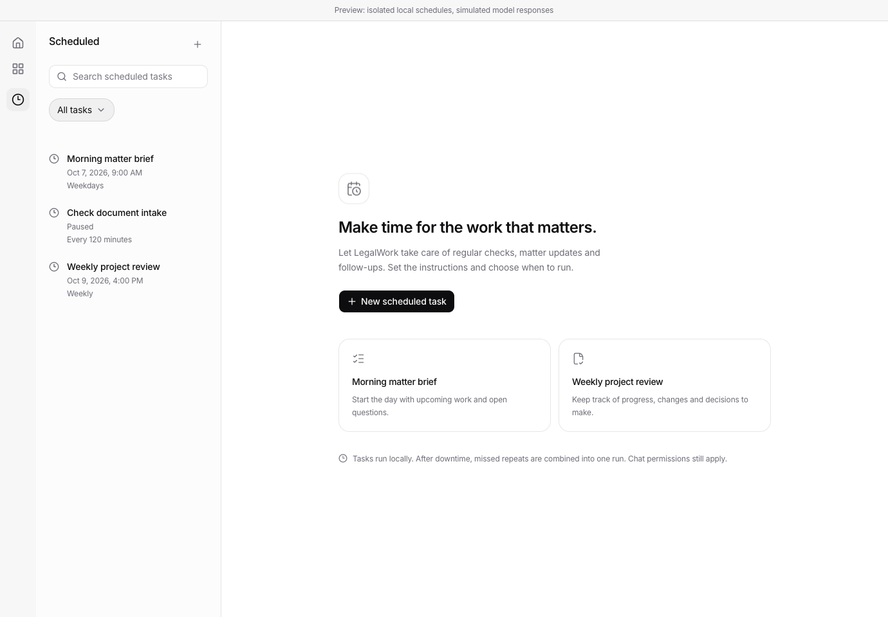
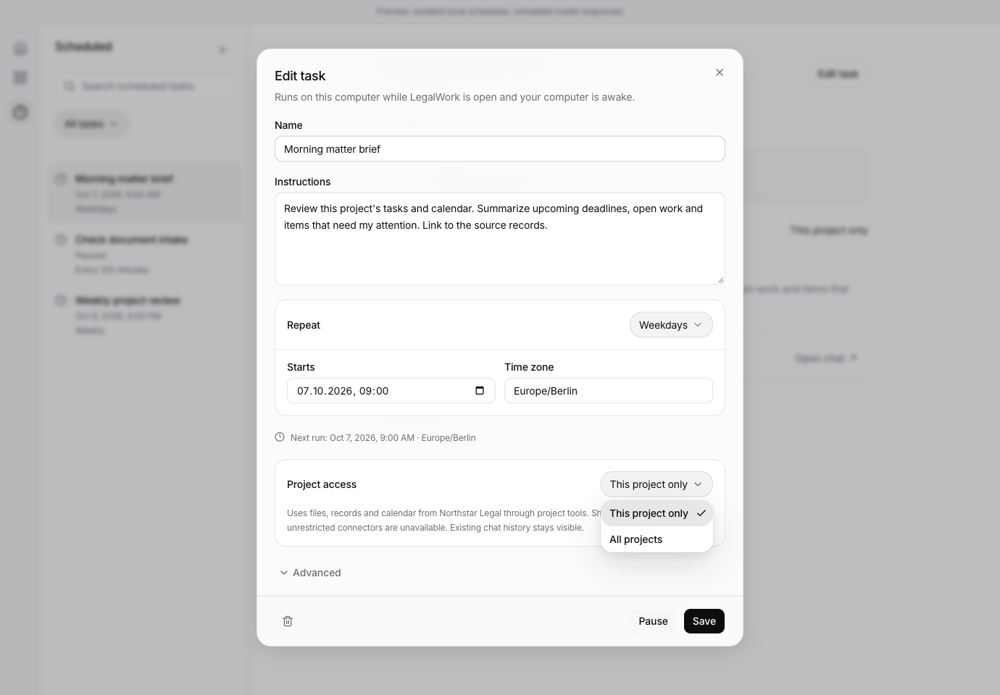
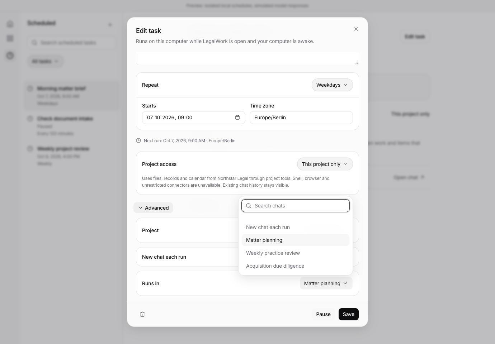
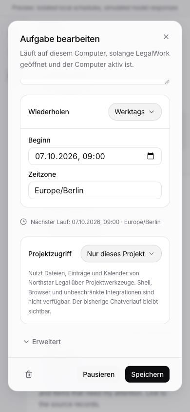

# Local scheduled tasks

LegalWork can schedule a prompt once or repeatedly, continue an existing project chat or create a chat for each run, and pause, resume, edit or delete the schedule. The Scheduled page, inline Open cards and editor use the existing Surface, IconTile, Base UI controls and semantic design tokens. English and German are supported.

## Project access

Each task defaults to **This project only**. The selected project is also the destination for its chats. **All projects** permits access to other authorized local projects and keeps the user's normal tool permissions and approvals.

Project-only runs use a hidden engine agent with an explicit allowlist of project-scoped tools: project records, notes, calendar reads, saved reviews and Jev document queries. Shell, native file tools, browser automation, delegation, global task search and unrestricted connectors are disabled in this mode. Cross-project read tools derive access from the trusted engine agent context, not model arguments. The server verifies the engine's effective agent and saved chat permissions before dispatch; a stale engine or a chat with broader saved permissions pauses the task with a recovery message.

The boundary is an engine tool-access policy. Trusted local plugins continue to run normally, and existing chat history remains visible. Choose a new chat for each run when previous conversation context should not carry over. Scope changes apply to future runs, and each history entry retains the scope used for that run. No session permission settings are overwritten.

## Execution and recovery

- Tasks and the last 50 delivery records live in the local runtime SQLite database. The server polls every 15 seconds while it is running and the computer is awake.
- Busy or offline engines defer dispatch. Missed repeats coalesce to one catch-up run. New chats are created only when a task is due.
- A transactional revision check claims an occurrence and advances its schedule before sending. Concurrent server processes cannot claim the same occurrence. Edits or pauses during chat creation cancel delivery.
- A confirmed HTTP delivery is shown as **Sent to chat**, not as completed work. Failed delivery pauses the task. An interrupted dispatch remains **Delivery unconfirmed**, and is never automatically replayed. Inspect the chat before rescheduling to avoid repeating side effects.
- Pausing, inspecting and deleting stored schedules remains available when a project's drive is disconnected. Remote workspaces cannot host local schedules.

## Recurrence

Once, fixed-minute intervals, daily, weekdays, weekly and custom RRULE are supported. Custom rules support DAILY, WEEKLY, MONTHLY and YEARLY with INTERVAL, BYDAY, BYMONTH, BYMONTHDAY, one BYHOUR/BYMINUTE, COUNT, UTC UNTIL and WKST. Unsupported combinations fail validation. Expansion is bounded to 40 years from the start date so impossible rules cannot stall the server.

Calendar repeats retain their wall time through daylight-saving changes. Ambiguous or nonexistent initial wall times require correction or an explicit offset; subsequent ambiguous or nonexistent occurrences are skipped. Interval repeats use elapsed minutes. The editor previews the next occurrence in the selected time zone before saving.

## Verification, 2026-10-06

- `pnpm --filter @legalwork/app test`: 823 tests passed, including persisted cards, current server data and cross-project Open prevention. The two card tests also passed after the final editor snapshot fix.
- `pnpm --filter legalwork-server exec bun test src/scheduled-tasks src/opencode-plugins/legalwork-scheduled-task-tools.test.ts src/legalwork-runtime-config.test.ts`: 31 passed, the opt-in engine test skipped in this command.
- `LEGALWORK_TEST_OPENCODE_BIN=/Applications/LegalWork.app/Contents/Resources/sidecars/opencode pnpm --filter legalwork-server exec bun test src/scheduled-tasks/engine.test.ts`: passed against engine 1.18.29 with a local model fixture. Verifies actual tool filtering and blocked/allowed cross-project reads through the bundled plugin.
- App, server and Electron TypeScript checks passed. App and server builds passed. The app build reports existing large-bundle and dependency warnings.
- `pnpm --filter @legalwork/app test:i18n`: 5,489 keys across English and German passed.
- The desktop plugin bundle checker passed against `apps/server/dist/opencode-plugins`.
- Browser checks passed for create, custom recurrence, invalid time zone/rule validation, searchable chat selection, access scope changes, pause/resume, reload persistence and deletion. Checked desktop and 390 px German editor layouts.

The UI checks use production components and the real local scheduling API/store in an isolated fixture. Engine integration uses simulated model responses. Live paid model execution and the complete packaged Electron navigation flow were not manually exercised.

## Reproduce the UI

After `pnpm install --frozen-lockfile`, run these in separate terminals:

```sh
pnpm exec bun scripts/preview-scheduled-tasks.ts
pnpm --filter @legalwork/app dev --port 5197
```

Open `http://localhost:5197/scheduled-tasks-preview.html` (append `?lang=de` for German). The fixture seeds synthetic tasks in a temporary directory and simulates the model engine. It does not touch personal schedules or send messages to a real account. Stop the fixture with Ctrl+C to remove its temporary data. The preview entry is development-only and excluded from the production build.

## Screenshots








