# Local scheduled tasks

LegalWork can schedule a prompt once or repeatedly, reuse one project chat or create a chat for each run, and pause, resume, edit or delete the schedule. The Scheduled page, inline Open cards and editor use the existing Surface, IconTile, Base UI controls and semantic design tokens. English and German are supported. Task details group the next run, named project and explicit access scope. Edit, Pause/Resume and Delete are visible in the detail header; sidebar tasks show their project and offer the same actions through right-click or the visible menu button. Deletion confirms the task name and retains existing chats. Edit switches the detail pane to an inline form with sticky Save and Cancel controls. Sidebar Edit uses the same pane, and chat Open cards navigate to the selected task. New task creation still uses a dialog. Custom rules are edited directly in the form.

## Task templates

The welcome view includes an example week and four editable presets: Morning matter brief at 06:00 on weekdays, Upcoming deadline check at 08:00 on weekdays, End of Week review on Friday at 16:00, and Weekly planning on Monday at 09:00. Presets choose the next matching local date and use the computer's IANA time zone, saved with the task. Existing task schedules are unchanged; the blank New task editor still defaults to Daily.

## Project access

New tasks default to **Daily**, **Same chat each run** and **This project only**. Creation starts with a visible, required Project picker above the task name. The global Scheduled page has no implied project, so neither blank tasks nor presets preselect one. Project access is visible in the main form in both creation and inline editing; existing tasks show their fixed project in the inline editor header. The single Runs in picker replaces the redundant toggle, and the searchable project menu has a bounded, scrolling list.

A reusable chat is created only on the first due run and its ID is saved on the task, so subsequent runs continue the same chat after an app restart. Existing chats can also be selected, and New chat each run remains available. Legacy tasks retain their saved destination behavior.

The creation dialog shows a model picker directly below the instructions, initially set to the app's selected model. Existing tasks expose the picker under Advanced in the inline editor. The saved provider/model is used on future runs. Chat-created schedules capture the model handling the current tool call internally, including when creating a new chat for every run. The creation tool has no model argument and adds no model-selection guidance to the agent. Failure to resolve the current model prevents creation instead of silently choosing another model.

Each task defaults to **This project only**. The selected project is also the destination for its chats. **All projects** permits access to other authorized local projects and keeps the user's normal tool permissions and approvals.

Project-only runs use a hidden engine agent with an explicit allowlist of project-scoped tools: project records, notes, calendar reads, saved reviews and Jev document queries. Shell, native file tools, browser automation, delegation, global task search and unrestricted connectors are disabled in this mode. Cross-project read tools derive access from the trusted engine agent context, not model arguments. The server verifies the engine's effective agent and saved chat permissions before dispatch; a stale engine or a chat with broader saved permissions pauses the task with a recovery message.

The boundary is an engine tool-access policy. Trusted local plugins continue to run normally, and existing chat history remains visible. Choose a new chat for each run when previous conversation context should not carry over. Scope changes apply to future runs, and each history entry retains the scope used for that run. No session permission settings are overwritten.

## Sidebar delivery and unread replies

Scheduled delivery announces a session change over the app's existing SSE connection. Each window reconciles authorized local chat metadata every five seconds, on reconnect and on focus. New chats continue to trigger a list refresh until they appear, including when an earlier refresh was skipped or failed. A full reconciliation every thirty seconds also catches removal and archive changes. The endpoint exposes IDs and timestamps, never transcript contents.

Unseen assistant activity gets a small green dot on the chat, its project, and collapsed sections or parent chats containing it. User messages and compaction summaries do not create dots. A chat is read once its snapshot has loaded in the foreground; expansion or background prefetch does not clear it. Read markers persist across restarts and synchronize across windows. On first use or upgrade, existing chats start read. A persisted cutoff is established on the first successful metadata sync, including an empty snapshot. Only later assistant replies create dots, so historical chats loaded later stay read and replies received while the app is closed remain unread on reopening.

Advanced includes **Add the chat to pinned chats**, enabled by default. Successful automation delivery records the actual destination and moves that chat to the top of Pinned. The clock before the chat name identifies automation chats. Each run's pin is applied once, so a manual unpin survives refresh/restart until a later run with pinning enabled. Turning pinning off does not remove an existing pin. Failed deliveries do not pin. Saved delivery markers survive deleting a schedule.

## Execution and recovery

- Tasks and the last 50 delivery records live in the local runtime SQLite database. The server checks immediately on startup, then polls every 15 seconds while it is running and the computer is awake.
- If LegalWork is closed at 13:00 and reopened at 13:05, the pending task runs as soon as the local engine is ready. This includes one-time tasks and the final occurrence of a repeating schedule. The history preserves the original due time and the actual delivery start time.
- Busy or offline engines retain the pending occurrence until available. Missed repeats coalesce to one catch-up run, then continue on the original schedule. Reopening again does not repeat a delivered occurrence, and intentionally paused tasks remain paused. New chats are created only when a task is due.
- A transactional revision check claims an occurrence and advances its schedule before sending. Concurrent server processes cannot claim the same occurrence. Edits or pauses during chat creation cancel delivery.
- A confirmed HTTP delivery is shown as **Sent to chat**, not as completed work. Failed delivery pauses the task. An interrupted dispatch remains **Delivery unconfirmed**, and is never automatically replayed. Inspect the chat before rescheduling to avoid repeating side effects.
- Pausing, inspecting and deleting stored schedules remains available when a project's drive is disconnected. Remote workspaces cannot host local schedules.

## Recurrence

Once, fixed-minute intervals, daily, weekdays, weekly and custom RRULE are supported. Custom rules support DAILY, WEEKLY, MONTHLY and YEARLY with INTERVAL, BYDAY, BYMONTH, BYMONTHDAY, one BYHOUR/BYMINUTE, COUNT, UTC UNTIL and WKST. Unsupported combinations fail validation. Expansion is bounded to 40 years from the start date so impossible rules cannot stall the server.

Calendar repeats retain their wall time through daylight-saving changes. Ambiguous or nonexistent initial wall times require correction or an explicit offset; subsequent ambiguous or nonexistent occurrences are skipped. Interval repeats use elapsed minutes. The editor previews the next occurrence in the selected time zone before saving.

Chat scheduling automatically uses the computer's local time zone. The agent receives the current local date/time on each turn, and the creation tool fills in an omitted zone. Requests such as "every morning" default to 06:00 on the next future morning without asking for a time or zone. Explicit user times/zones take precedence; edits retain the task's saved zone.

## Verification, 2026-10-06

- Sidebar follow-up: `pnpm --filter @legalwork/app test` passed all 867 tests; `pnpm --filter legalwork-server test` passed 1,523 tests with 16 opt-in tests skipped. App/server typechecks and production builds passed. `pnpm --filter @legalwork/app test:i18n` and `node scripts/i18n-audit.mjs --ci` passed (5,556 shipped translation keys).
- New regressions cover assistant-only unread state, foreground reading, read persistence, exact destination pinning, manual unpin preservation, disabled pinning, restart recovery, task deletion, failed delivery, metadata reconciliation after a missed list fetch, pagination, authenticated metadata access, and archived/remote chat exclusion.
- Browser integration verified a real scheduled delivery appears in Pinned without reloading, with a clock and unread dot, project and collapsed-section dots, clearing after opening the loaded chat, the Advanced default-on switch, and save/reopen persistence after turning it off. Tests used the real server, SQLite metadata, scheduler and production sidebar with a simulated engine.

- Model selection follow-up: all 861 app tests and all 42 scheduling/server tests passed, including the actual bundled engine with simulated responses. App typecheck, app/server builds and plugin bundle resolution passed. Regression assertions cover capturing the current model without an agent argument, a changed chat model, failure to resolve the model, and delivering with an edited model after server restart.
- UI model checks verified visible selection during creation, selection under Advanced during inline editing, model-only unsaved draft protection, Cancel restoration, and save/reload persistence. Search and selection work in German dark mode at 390 px without horizontal overflow. The browser reported no console errors. Checks used the isolated fixture, with no paid model calls or real user schedules changed.

- `pnpm --filter @legalwork/app test`: 858 tests passed, including preset weekday/weekend/year rollover, persisted cards, current server data, cross-project Open prevention and Home message handoff.
- `pnpm --filter legalwork-server exec bun test src/scheduled-tasks src/opencode-plugins/legalwork-scheduled-task-tools.test.ts src/legalwork-runtime-config.test.ts`: 41 passed, the opt-in engine test skipped in this command. Includes reopening five minutes late for one-time, interval, daily and final calendar occurrences; several missed days; delayed engine startup; no duplicate dispatch on another restart; and paused tasks staying paused.
- `LEGALWORK_TEST_OPENCODE_BIN=/Applications/LegalWork.app/Contents/Resources/sidecars/opencode pnpm --filter legalwork-server exec bun test src/scheduled-tasks/engine.test.ts`: passed against engine 1.18.29 with a local model fixture. Verifies actual tool filtering and blocked/allowed cross-project reads through the bundled plugin.
- App, server and Electron TypeScript checks passed. App and server builds passed. The app build reports existing large-bundle and dependency warnings.
- `pnpm --filter @legalwork/app test:i18n`: 5,552 keys across English and German passed.
- `node scripts/i18n-audit.mjs --ci`: passed after replacing dynamically constructed scheduling translation keys with static calls. Scheduled card tests and app/server typechecks were rerun for this follow-up.
- Follow-up regression tests cover reusing a newly created chat across a database reopen, switching to new chats, preserving the mode on partial HTTP edits, stale-editor conflicts, and failure or pause during initial chat creation.
- Follow-up UI checks verified Daily defaults, both chat choices, save/reload persistence, Advanced placement, project search with the existing desktop profile, a bounded project menu, and the German editor at 390 px. The development Electron app was restarted with the rebuilt server and the same profile.
- Follow-up UI checks verified the 06:00 brief, 08:00 deadline check, Friday 16:00 review and Monday 09:00 planning previews in Europe/Berlin, including saving/reloading the planning preset. Verified sidebar right-click and visible menus, Edit on an unselected task, Pause/Resume, deletion from sidebar/detail, canceling deletion, preserving the selected task when deleting another, and deletion persistence after reload. Checked the welcome and detail views in German, dark mode and at 390 px with no horizontal overflow. The existing dev Electron instance hot-loaded these renderer changes.
- Inline editor checks verified Save updates both sidebar and detail immediately and survives reload, Cancel restores the saved values, unsaved drafts stay open when switching tasks, invalid zones/rules disable Save, and revision conflicts preserve the draft with an error beside Save. Verified creation still defaults to Daily and Same chat each run, plus German dark mode at 390 px with sticky actions and no horizontal overflow. Weekly edit regressions keep the saved BYDAY when changing only the time or time zone.
- Project-picker follow-up verified blank tasks and presets start without a project, Save stays disabled until selection, project search works, and the chosen project and scope survive saving and reloading. Checked the German dark picker at 390 px with no horizontal overflow. All 858 app tests, app typecheck/build and translation checks passed again.
- The desktop plugin bundle checker passed against `apps/server/dist/opencode-plugins`.
- Chat time-zone regressions verify automatic zones for all three schedule types in Berlin and New York, explicit zone overrides, and 06:00 across Berlin's daylight-saving change. The bundled engine receives the local clock/default guidance and successfully creates a same-chat, project-only morning schedule without a time-zone argument, using simulated model responses. The first engine check timed out during startup; a retry passed. The combined run with `LEGALWORK_TEST_OPENCODE_BIN=/Applications/LegalWork.app/Contents/Resources/sidecars/opencode pnpm --filter legalwork-server exec bun test src/scheduled-tasks src/opencode-plugins/legalwork-scheduled-task-tools.test.ts src/legalwork-runtime-config.test.ts` passed all 42 tests. Server build/typecheck and plugin bundle resolution passed.
- Browser checks passed for create, custom recurrence, invalid time zone/rule validation, searchable chat selection, access scope changes, pause/resume, reload persistence and deletion. Checked desktop and 390 px German editor layouts.
- Development Electron was launched on the merged branch with the existing profile and renderer origin preserved. Verified that the Scheduled sidebar link opens `/scheduled`, the page stays there after a full reload, the window heading says Scheduled, and the editor defaults to This project only. The legacy chat-restoration redirect explicitly excludes Scheduled.
- `pnpm --filter @legalwork/desktop test:native`: SQLite and native PTY checks passed under Electron 43.7.5. Server build and app/Electron typechecks passed after the merge.

The UI checks use production components and the real local scheduling API/store in an isolated fixture. Engine integration uses simulated model responses. Live paid model execution and the complete packaged Electron navigation flow were not manually exercised.

## Reproduce the UI

After `pnpm install --frozen-lockfile`, run these in separate terminals:

```sh
pnpm exec bun scripts/preview-scheduled-tasks.ts
pnpm --filter @legalwork/app dev --port 5197
```

Open `http://localhost:5197/scheduled-tasks-preview.html` (append `?lang=de` for German or `?lang=de&theme=dark` for German dark mode). The fixture seeds synthetic tasks in a temporary directory and simulates the model engine. It does not touch personal schedules or send messages to a real account. Stop the fixture with Ctrl+C to remove its temporary data. The preview entry is development-only and excluded from the production build.

The sidebar integration fixture is at `http://localhost:5197/session-inbox-preview.html`. Click **Schedule preview run** and keep the page open; the chat appears within the scheduler's fifteen-second check interval. Open it in a foreground window to clear the dots. Both fixtures use the same temporary server and never create paid model calls.

## Sidebar navigation follow-up

The main page now comes directly from the route. Tasks and Projects no longer race against separately updated page flags, so the chat sidebar stays collapsed throughout navigation. Task search and notifications also navigate directly to `/tasks`, including when opened from Settings; the old four-second pane retention workaround is removed.

Verified Tasks to Projects, back/forward navigation, and returning to Home in the running development Electron app with the existing profile. Home restores the saved expanded sidebar. `pnpm --filter @legalwork/app test` passed 869 tests; app typecheck and production build passed. Regression coverage distinguishes global main panes from project task/calendar pages and chats.

## Sidebar alignment follow-up

Unread dots occupy a fixed trailing slot for short and long project names, pinned projects and chats. Session indicators participate in row layout, so titles truncate before the activity state and unread dot. Menus and chevrons keep their own space. The scheduled-chat clock uses a 14 px icon with a lighter 1.5 px stroke, placed 6 px before the session name; the right side remains for unread state and actions.

Verified normal and narrow sidebars, light/dark themes, project menus, and the running development Electron app after restarting it with the existing profile. All 869 app tests, including 14 sidebar/inbox checks, app typecheck and production build passed. Regression tests cover first-use history, late-loaded history, empty initial snapshots, restart persistence and upgrades from the first unread implementation without replaying pin actions. Verified historical dots disappear in the existing development profile and stay cleared after reload. A new fixture delivery still pins its chat and adds unread dots without a refresh, while older chats remain read. To reproduce the layout fixture, use `session-inbox-preview.html?layout` or `?layout&narrow&theme=dark`, then click **Schedule preview run**.

## Scheduled-page copy and German prompts

The English and German welcome pages name the feature directly as Scheduled tasks / Geplante Aufgaben, explain project selection, instructions and execution time, and describe each template's output. Removed the rhythm/routine slogans. All four presets already have full German prompts selected by the current app language; these are the instructions passed into the editor and saved, not just translated tile labels. Saved prompts keep their original language when the app language changes.

Verified all four German prompts in the editor and saved/reloaded Weekly planning in the isolated fixture, confirming its German instructions persist. Checked both welcome pages and all four English descriptions visually. `pnpm --filter @legalwork/app test:i18n` passed for all 5,556 keys in English and German; `node scripts/i18n-audit.mjs --ci` and `git diff --check` passed.

## Scheduled chat review regression, 2026-10-07

An all-project scheduled review could list chats but could not read their transcripts through project tools. The agent followed the interactive UI memory instructions, opened chats, and read the wrong active chat before navigation finished. Requests for 100 list items also repeatedly failed the 50-item limit. The scope switch itself worked.

Project reads now support `kind=sessions` with explicit chat IDs. The server checks the chat's directory and archive state before fetching messages and verifies message ownership. Reads return bounded user/assistant text, excluding reasoning, synthetic content and tool output. Follow `nextOffset` for long text, then `nextBefore` for older messages using the engine's opaque pagination cursor. Cross-project tools still derive authorization from the trusted scheduled-agent context. Oversized scheduled list requests are capped at 50 and return normal pagination.

Scheduled agents cannot use LegalWork UI snapshot, action discovery or navigation tools. The all-project agent omits those tools from its model toolset, and execution guards reject them even if a chat has a saved approval. Interactive chats retain UI control. Agent instructions direct scheduled reviews to transcript tools, prohibit UI/database workarounds and distinguish chat history from verified source records.

The shipped engine integration uses an isolated database and simulated model responses. It seeds 23 messages in another project, reads both pages by ID, proves that project-only access rejects the same read and that all-project access succeeds, and checks that neither scheduled agent exposes UI controls or dispatches UI actions. No private session contents are stored in this repository.

Validation: server production build passed; 48 focused tests, including the shipped-engine integration, passed. The full server suite passed 1,527 tests with 16 opt-in tests skipped. Run the integration with `LEGALWORK_TEST_OPENCODE_BIN=/path/to/opencode pnpm exec bun test src/scheduled-tasks/engine.test.ts` from `apps/server` after building the server.

## Abort status and visible access, 2026-10-07

An intentional stop now leaves the chat idle instead of setting a persistent red error dot when a late `MessageAbortedError` arrives. The interrupted message remains in the transcript and queued messages stay paused. Real provider failures and budget-triggered stops retain their error and recovery state. Project access now appears near the top of both the creation dialog and the inline edit form, outside Advanced, with the existing default and saved scope preserved.

Verified both editors visually against the isolated fixture. App typecheck and production build passed. All 871 local app tests passed, including late abort ordering, retained transcript, idle status, paused queues and preservation of genuine errors. One unrelated archived-session command test failed on the first full run; it passed both in isolation and on the complete rerun.

Project access is now a compact label-and-selector row in both editors. Removed the technical explanatory text and its unused English/German translations. Verified creation and inline editing visually; app typecheck, `pnpm --filter @legalwork/app test:i18n` (5,554 keys), `node scripts/i18n-audit.mjs --ci` and `git diff --check` passed.

## Screenshots

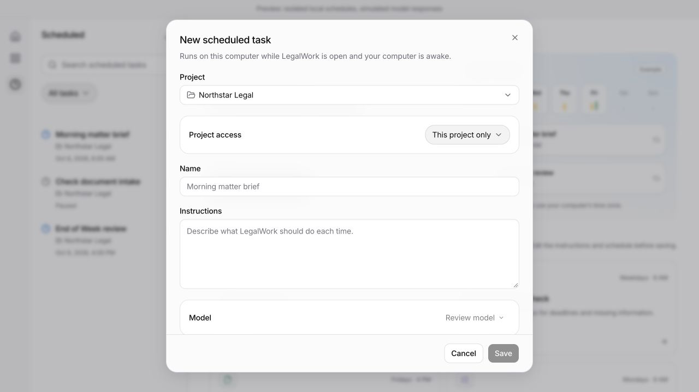

[Project access visible in inline editing](edit-visible-scope.png)

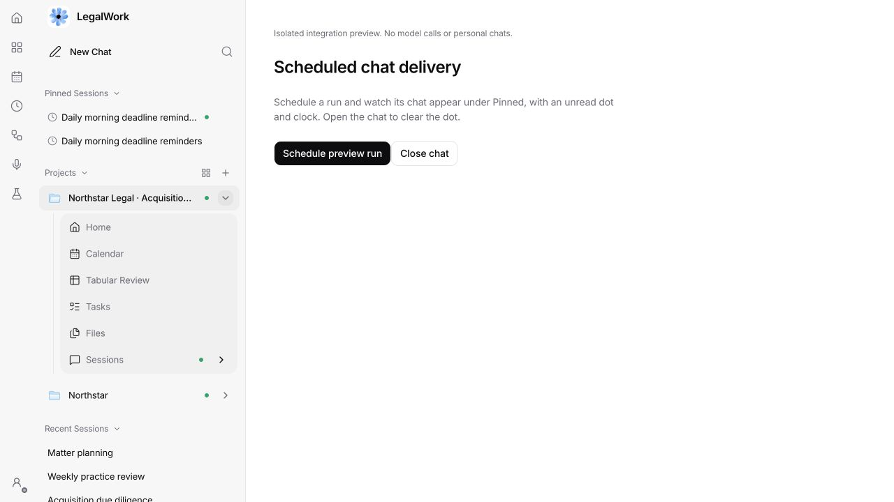

[Narrow dark sidebar](sidebar-alignment-narrow-dark.png)


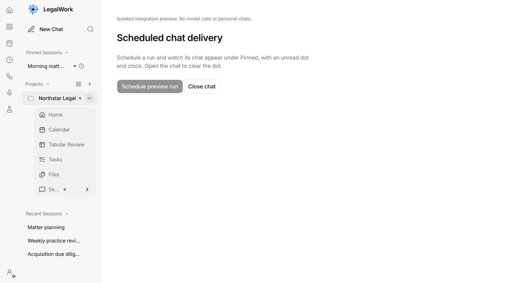

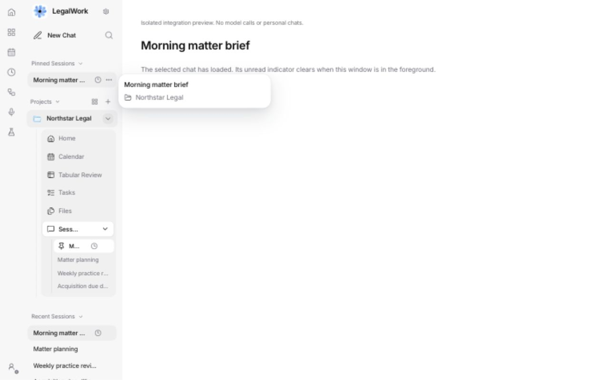

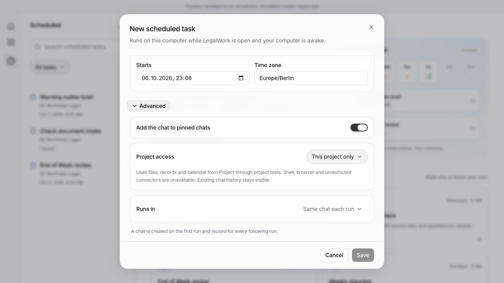

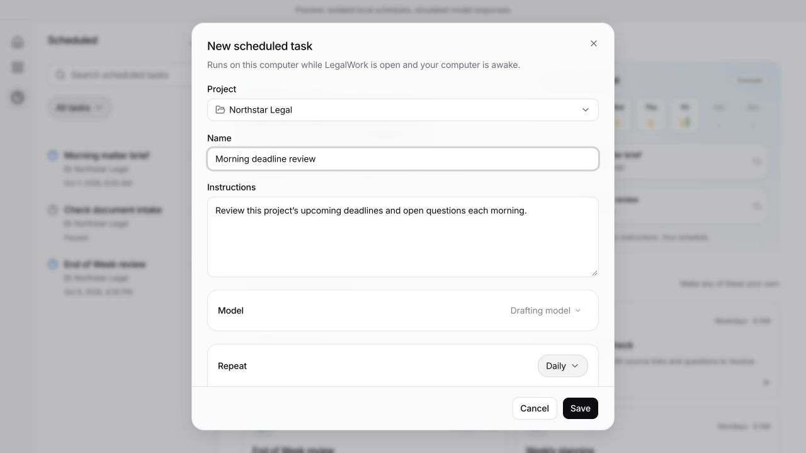

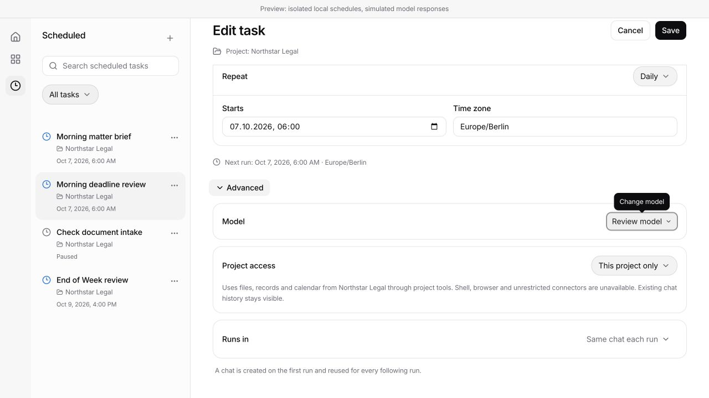

[German model picker at 390 px](model-mobile-de.png)

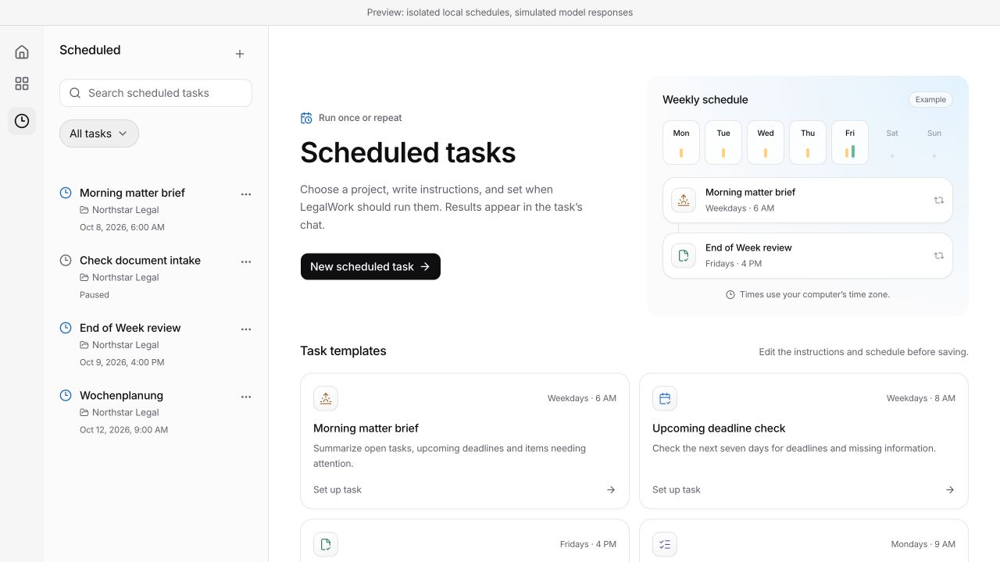

[German overview](overview-de.png) · [Task templates](templates-en.png) · [Saved German prompt](template-prompt-de.png)

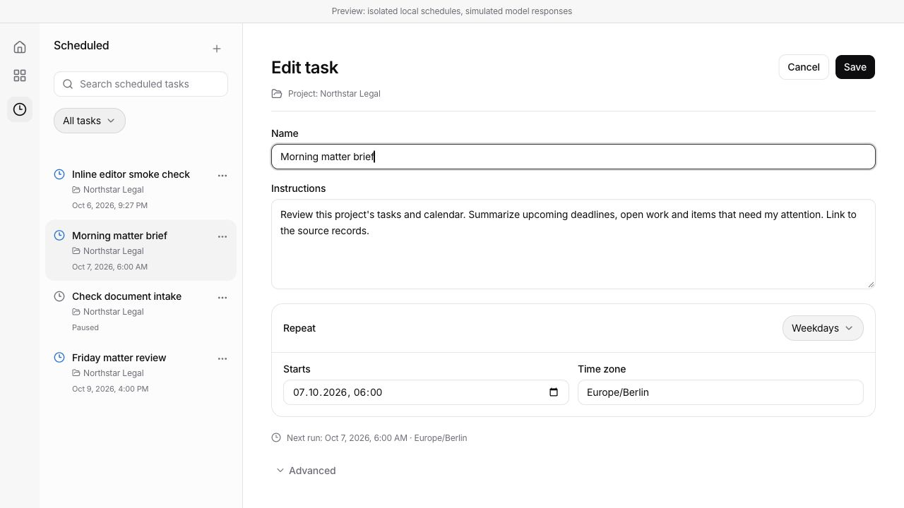

[German inline editor at 390 px](inline-edit-mobile-de.jpg)

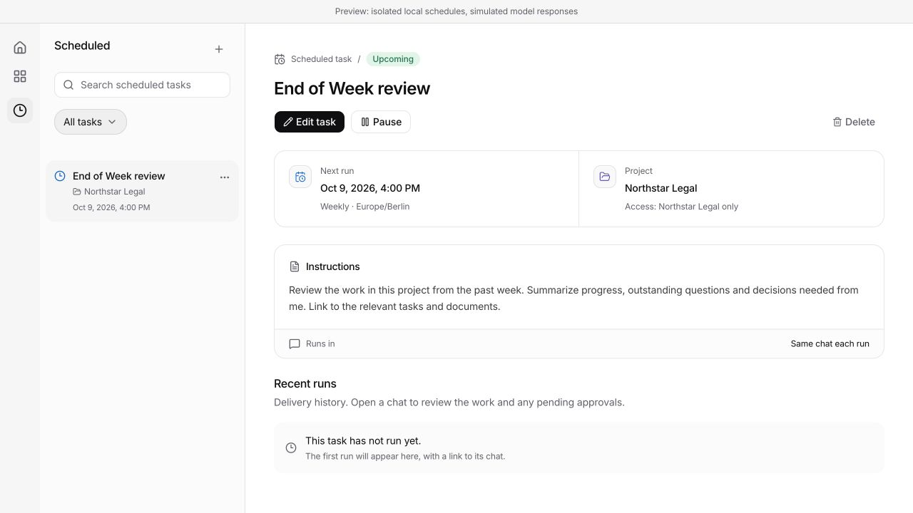

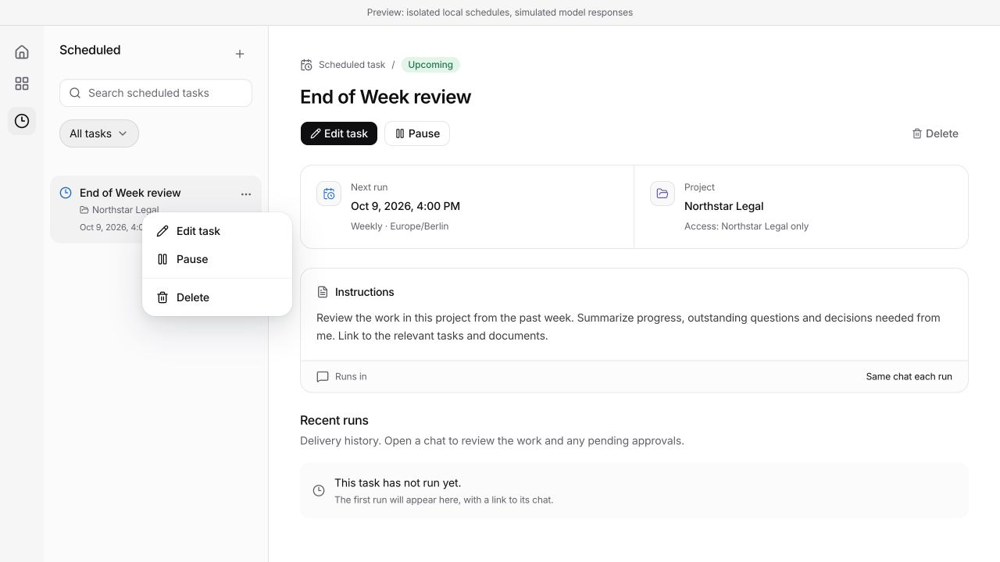

[German dark detail](task-detail-dark-de.jpg) · [German detail at 390 px](task-detail-mobile-de.jpg)

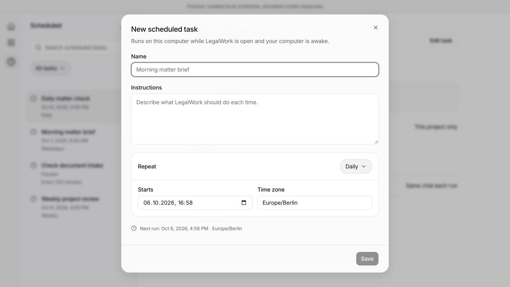

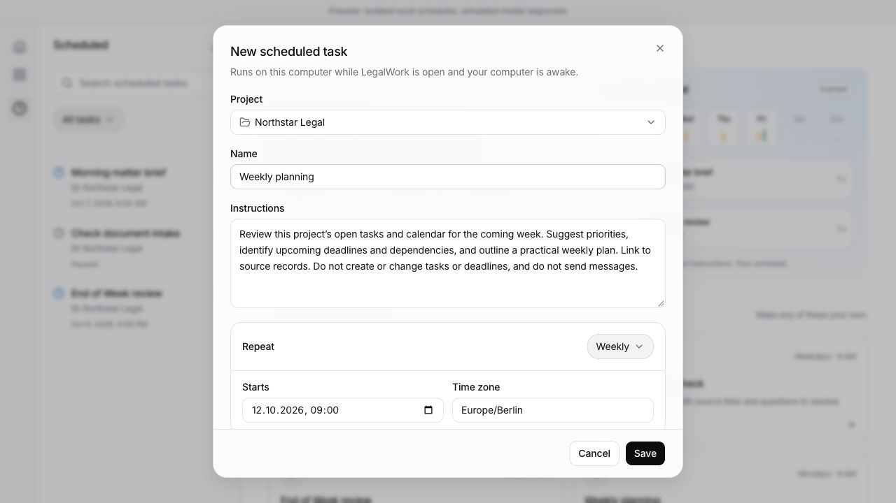

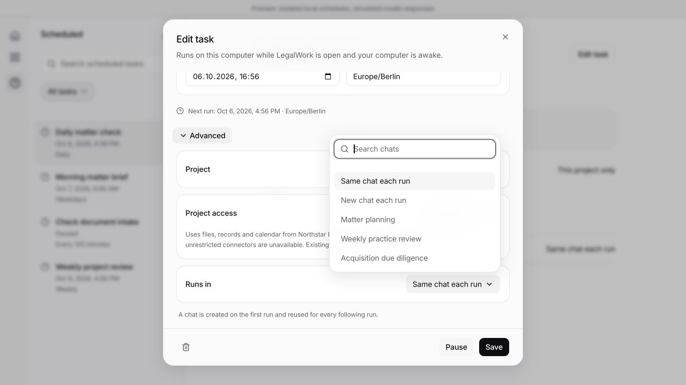

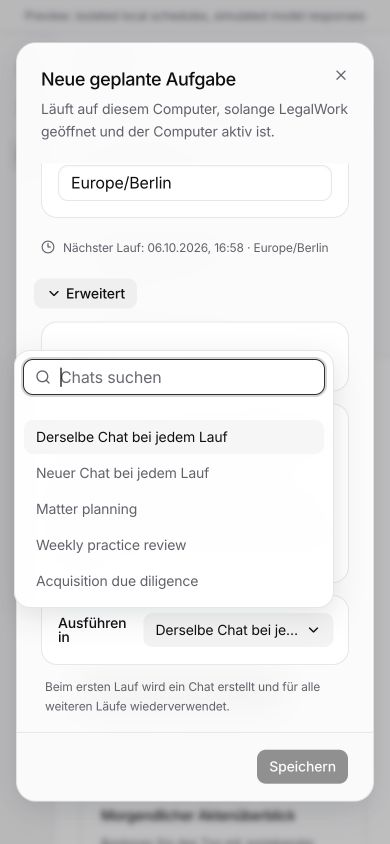
