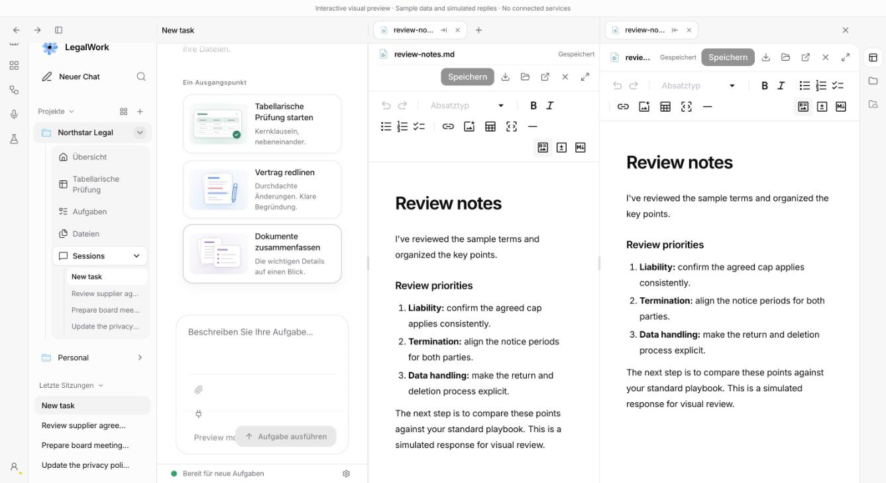
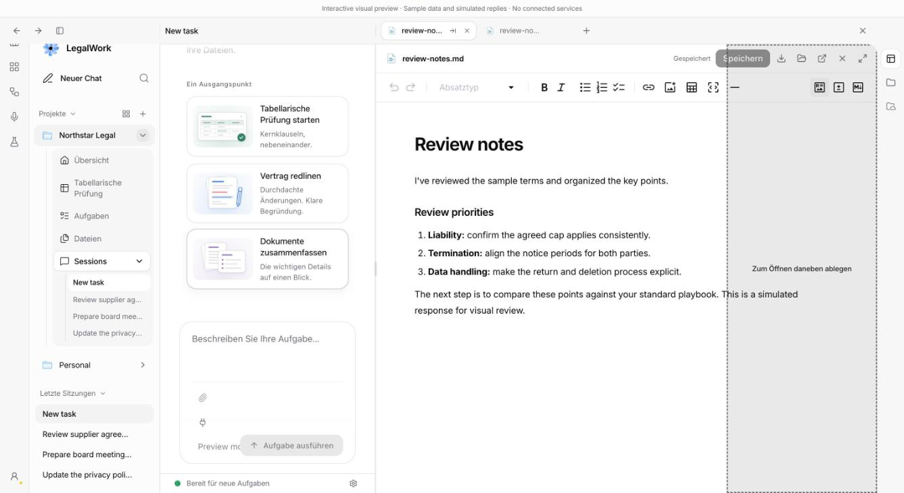

# Documents side by side

Created `feat/side-by-side-documents` from `origin/dev`, rebased onto `f64d51b9` (#202).

A document tab can now be opened beside the current one, so a contract and its precedent sit next to each other in the same window. The viewer splits into a main pane and a side pane, each with its own tab strip and a draggable divider. Two gestures open the split: the arrow button that appears on a document tab, or dragging the tab onto the right third of the viewer. Dragging a tab onto the other pane moves it across; the arrow on a side tab moves it back. Closing the last side document closes the side pane.

Only document tabs move. Browser and task tabs stay in the main pane, and the main pane never empties into the side pane, so the split is always a second document beside a first. A tab sits in exactly one pane, which keeps every document mounted once; the same rule Project Temple had to enforce after its editor broke when a document was shown in two panes.

## What changed

- `panel-tab-store.ts` carries `sideTabIds` and `sideActiveTabId` per session, normalised on every write so both panes only ever point at tabs that exist. `moveTabToSide` and `moveTabToMain` are the new actions. `reorderTabs` accepts the order of one pane and leaves the other pane's tabs in place. Closing or moving an active tab activates its neighbour in the same pane. Reopening a document already in the side pane shows it there instead of pulling it back.
- `docx-document-state.ts` gains `confirmDiscardSessionDocuments(sessionId, targetIds)`. With two editors mounted at once, switching a tab in one pane must only ask about the document that is about to unmount, not about a draft in the other pane. It matches both the artifact key and the bare tab id workflow editors register under, and it honours `retainOnSwitch`. The store uses it for opening, selecting, closing and moving documents; closing a workflow tab keeps its own exact-key guard, and the global guard still protects closing the whole viewer and leaving the session.
- `side-panel.tsx` renders the split with the existing `ResizablePanelGroup`, adds a native drag on document tabs under a private MIME type, and wraps each strip and content area in a `TabDropZone`. The zones listen in the capture phase so the editor underneath cannot swallow the drop. Without a split, only the outer third of the main pane accepts a drop and shows the overlay; with a split, either pane accepts a tab from the other.
- With the tab strip in the window header, both strips share the header row and take the same widths as the panes below, following the divider as it moves. The button that closes the viewer moves to the outer end of the side strip. Without a header target, each pane carries its own strip.
- `use-side-panel-tabs.ts` recognises a selection that landed in the side pane.
- Four strings in English and German: open to the side, move to the main pane, and the two drop overlays.

Nothing is persisted beyond what was persisted before. Document tabs are not restored across relaunch today, so the side pane is not either; when they are, `sideTabIds` can join the persisted shape.

## Validation

- `pnpm --filter @legalwork/app typecheck` — passed.
- `pnpm --filter @legalwork/app test:i18n` — passed, 5053 keys × 2 languages.
- `pnpm --filter @legalwork/app test` — 755 passed, 0 failed.
- `pnpm build:ui` — passed, with the existing chunk-size warnings.
- New `tests/panel-side-pane.test.ts` (12 tests): a tab lives in one pane; the main pane never empties; only documents move; closing the last side tab closes the pane; closing or moving an active tab picks the neighbour within its pane; reopening a side document activates it there; reordering one pane keeps the other; transcript and browser sync keep the split; workflow editors keep their guard rules, including `retainOnSwitch`; the unsaved guard asks only about the document that would unmount, and a refusal changes nothing.
- `tests/storage-file-tabs.test.ts` passes unchanged.
- Session preview (`PORT=5174 pnpm dev:ui`, `/session-preview.html`, German UI, 1600 × 1000): opened `review-notes.md` from the workspace root and again from the Contracts folder; the arrow on the second tab opened it beside the first; each header strip measured the same left edge and width as its pane, before and after dragging the divider; a synthetic `DataTransfer` drag of the side tab onto the main strip in the header showed the "move here" overlay and collapsed the split; a synthetic drag of a main tab over the left part of the editor showed no overlay, over the right third showed "open beside", and dropping there reopened the split. No console errors or warnings during the flow.





## Not covered here

- A real pointer drag in Electron, and a drop while the main pane shows a browser tab. The native browser view covers the content area, so the drop target there is the tab strip.
- A dirty document moving between panes prompts to discard, the same prompt as switching tabs today. Saving first keeps the draft.

## Reproduce the checks

```sh
pnpm --filter @legalwork/app typecheck
pnpm --filter @legalwork/app test:i18n
pnpm --filter @legalwork/app exec bun test tests/panel-side-pane.test.ts tests/storage-file-tabs.test.ts
pnpm --filter @legalwork/app test
pnpm build:ui
PORT=5174 pnpm dev:ui   # then open http://localhost:5174/session-preview.html
```
