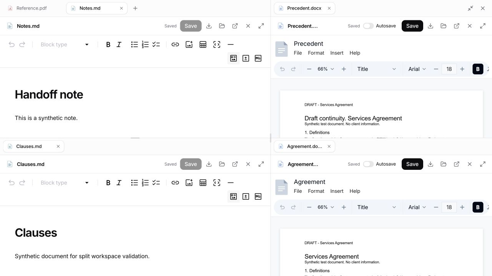
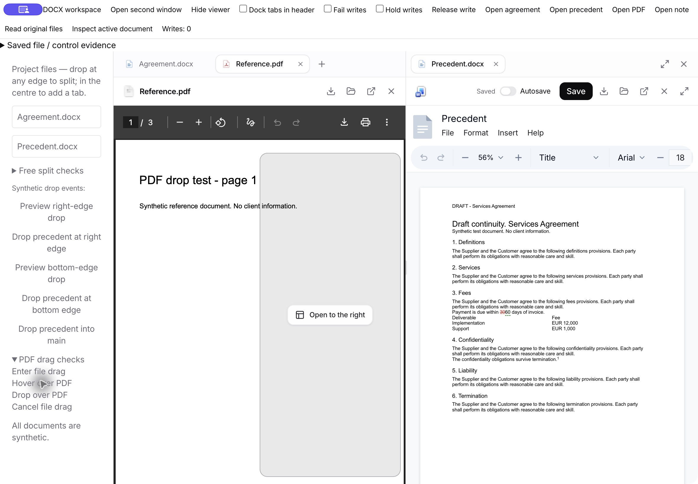
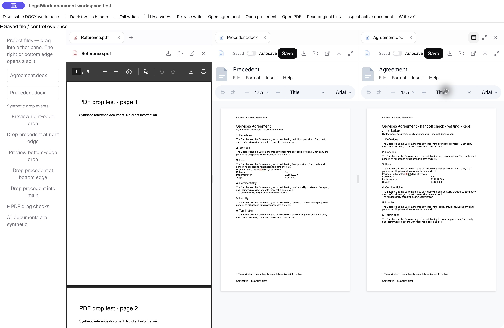
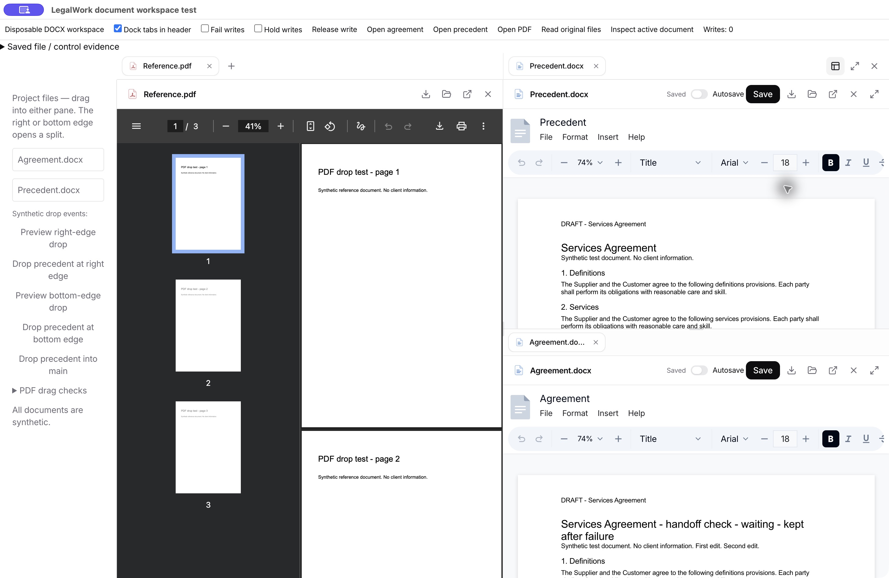
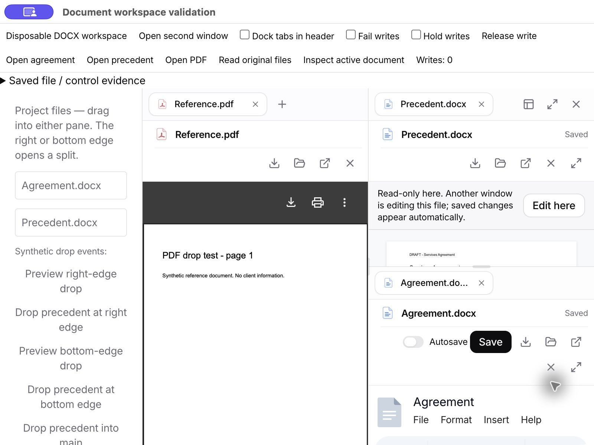
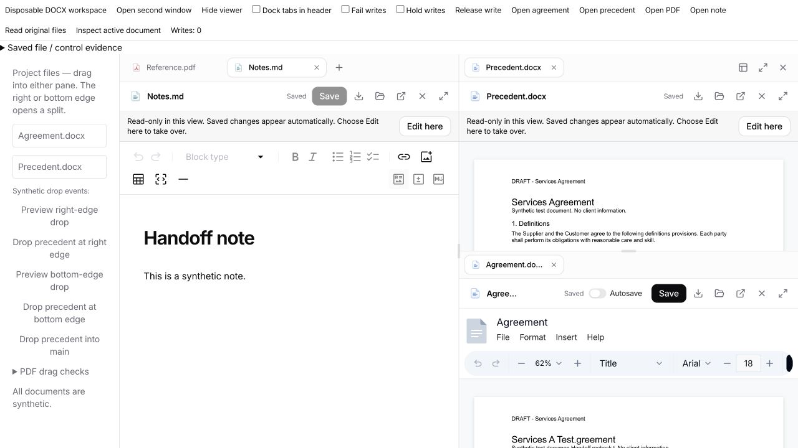
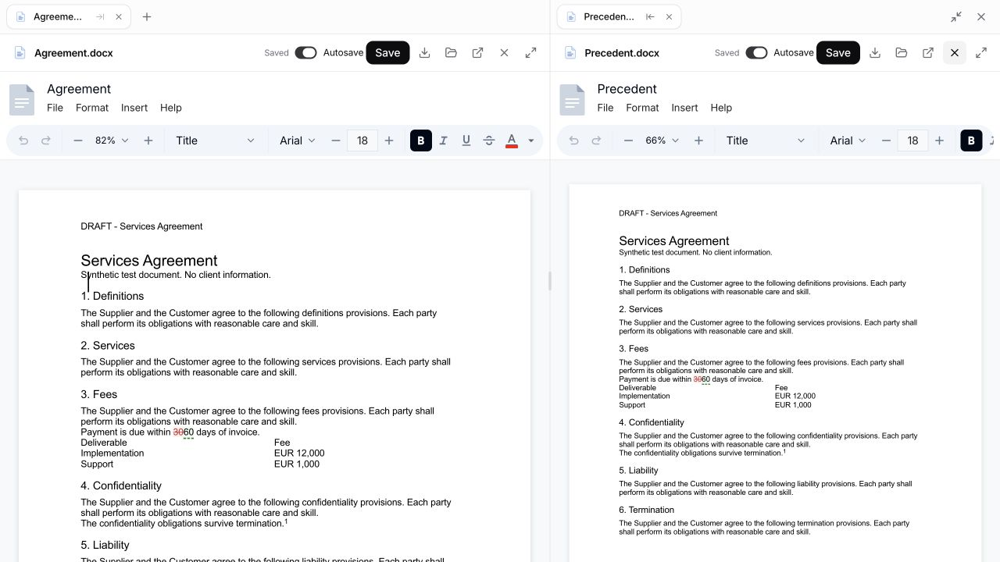
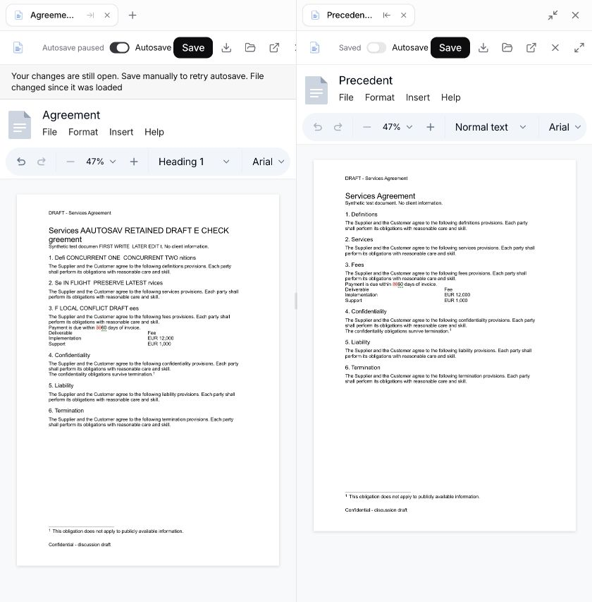

# Document workspace and original-file autosave

Local branch: `feat/side-by-side-documents`, based on `dev` at `f64d51b9`. Nothing has been pushed or published.

## Behavior

- Each editable local DOCX has an **Autosave** switch beside Save. It defaults to off and remembers the choice for that workspace/path on this device.
- When enabled, changes are serialized after 1.5 seconds without editing, or within 10 seconds during continuous editing. Writes update the original workspace file through the existing LegalWork binary-file API. This is not just a recovery copy or a download.
- Saves run one at a time. Edits made during an in-flight save remain dirty and trigger another save. Turning the switch off cancels pending autosaves; it cannot undo a write already in flight. Manual Save remains available.
- Failed writes pause automatic retries, show a persistent message and retain the draft. A successful manual save, or switching off and on, retries/resumes autosave. Existing modification-time conflict checks prevent overwriting an externally changed file. Retrying does not bypass a conflict.
- IndexedDB recovery remains separate from original-file saving. Restoring a draft honors its original conflict baseline and the current autosave preference. The recovery prompt explains this.
- The first save retains the loaded original in local history. Rapid autosaves share five-minute checkpoints rather than consuming all five retained versions within seconds. Manual saves remain distinct. A history browsing/restoration UI is still outside this change.
- Autosave is currently offered for editable local workspace DOCX files. Connected-storage checkout/publish flows, remote/read-only documents, PDF, Markdown, spreadsheets and presentations do not acquire this switch.

## Split workspace — free layouts (5 October)

The preset menu is removed. Drop a document tab, Project File or Memory Drive file at the **left, right, top or bottom edge of any pane** to split that pane in half. Drop in the centre or its tab strip to add/move the document as a tab. Right-click a tab for the same four split directions (when that group has another tab) or to move to another existing pane. No new keyboard shortcuts are added. Fullscreen remains available, with shared controls at the overall top-right even in nested layouts and docked headers.

The outer quarter of each pane chooses the nearest relative edge; the middle half is the centre target. The indicator previews the destination half with a rounded solid outline, translucent fill, compact label and a short reduced-motion-aware transition. Its inset keeps it away from document toolbars. The temporary drag shield still places it above PDFium and other iframe viewers; it clears on drop, drag end, Escape, leaving the window or blur.

Up to **six visible panes** are allowed. Additional documents can remain as tabs. Relocating the sole tab of an existing pane is allowed at the limit because its old pane disappears. A drop that would actually create a seventh pane is refused with an explanation; it does not silently replace a document or change the layout. Splitting a pane's only tab against itself is a no-op, not a duplicate view.

### Moving and closing rules

| Action | Result |
| --- | --- |
| Close an inactive tab | Remove only that tab; keep the visible document and geometry. |
| Close/move the active tab when its group has other tabs | Activate the next tab to its right, otherwise its left neighbour. |
| Close/move the last tab in a pane | Its sibling fills their shared rectangle. A sibling subtree expands as a unit, retaining its internal proportions. |
| Close a bottom pane in one column | The pane/subtree directly above fills that column; the other column stays in place. The reverse applies to top/left/right panes. |
| Move the last tab from the original main pane | Allowed; no special main-pane exemption and no arbitrary global rearrangement. |
| Drop onto the centre of another pane | Move once, activate at the destination, and collapse the emptied source. Existing destination tabs remain available. |
| Move a visible dirty document or expand a surviving sibling | Keep the same editor host, draft and Undo history. |
| Hide or close a different dirty editor | Run its existing discard guard before changing the tree or tab membership. Cancellation leaves both unchanged. |
| Close the focused document/pane | Focus its replacement tab or the nearest surviving sibling, rather than an unrelated first pane. |
| Finish a cloud import after its target closes | Do not recreate the removed pane; explain that a new drop target is needed. |
| Drop multiple files at an edge | Create one split, then add the remaining files as tabs in that group. |
| Close the final tab | Return to one empty viewer. |

Each split stores its own direction, children and divider ratio. Pane ids stay stable; surviving split ratios are remapped when a child is split or removed. Delayed resize callbacks from obsolete children are ignored. Only visible document editors are mounted. The existing one-editor-per-file ownership and controlled cross-window handoff are unchanged; this is not collaborative editing or cross-window tab dragging.

Workspace tabs, arbitrary split geometry, selected tabs and divider ratios survive reload. Old two-pane and preset layouts migrate, including their proportions. Transient evidence views and connected-storage working copies still do not restore. Removing those leaves collapses just their branch. Browser/task/workflow tabs remain in one integration group, which can sit anywhere in the tree. Detached windows retain their independent sessionStorage layouts.

### Validation

- **807 app tests passed**, including the final stale-resize guard; **50 focused tests** and app typecheck also passed. Production UI build and the **5,088-key English/German audit** passed. Existing build chunk-size warnings remain.
- The geometry test enumerates every binary split shape/orientation up to six panes and verifies **9,373 individual leaf removals**. Store tests cover 500 successive operations, all four edges, left/right stacks, pane limits, relocation at the limit, cancelled dirty-document actions, neighbour selection, restoration, malformed persisted data, browser integration and cloud working-path retention.
- Real browser checks with disposable documents: two stacked panes in both columns; four-direction file/tab drop listeners; six panes and rejected seventh pane; relocation at the cap; close/collapse; docked headers; a resized 55/45 divider and four-pane tree restored on reload.
- A typed unsaved DOCX draft survived multiple cross-pane moves, promotion after closing the pane beneath it, and fullscreen/restore. Undo removed the edit, Redo restored it, and Save wrote it once. No false Edit here appeared.
- An isolated Electron instance visibly rendered the rounded preview above native PDFium and completed the synthetic drop. Actual pointer automation did not establish a successful native drag, so native mouse/Finder gestures remain a manual check. A connected Memory Drive download/publish was not exercised; its routing and retained working path are covered by tests.
- No client documents, DOCX selection-rendering CSS, autosave cadence or multi-window ownership code were changed.





## Editing in multiple app windows

One view owns editing for each original file; other views are read-only and refresh after successful saves/autosaves. **Edit here** requests a handoff. The current owner blocks new input, waits for in-flight writes, saves any later edits, and drains recovery checkpoints before releasing ownership. A failed save refuses the handoff and retains the original draft. The receiving view reloads the original before enabling editing. A handoff does not transfer Undo history; moving panes within one window still preserves it.

The server returns an opaque canonical file identity, so workspace/directory aliases share an ownership key. Web Locks provide exclusivity in the app's origin/profile; BroadcastChannel carries handoff/save notifications. Closing a mounted editor drains pending work before releasing; renderer termination releases the browser lock. A waiting request times out without forcibly taking a dirty editor. DOCX recovery is accessed only by the owner under the canonical key, with migration from the former workspace/path key. Autosave preferences synchronize between windows.

Both raw and text original-file writes now serialize the baseline check and replacement within one server process, preventing two overlapping requests from both passing the same baseline check. Existing text merge/conflict semantics remain intact. This also protects writes from clients outside the cooperating renderer flow when they supply a baseline.

Scope: ownership covers these app views in the same profile/origin, not Word, direct filesystem tools, other browser profiles, or independent server processes. Existing conflict checks remain necessary. Live refresh happens after saving, not for every unsaved keystroke. The desktop agent-control server still targets its existing main window; it does not silently redirect commands to a detached window. An action aimed at a read-only document is refused. This is not collaborative editing. The updated app requires the updated server's file identity response; unavailable identity/locking leaves the file read-only.

## Validation on 5 October 2026

- Full app suite: **789 passed, 0 failed**, 116 files. New tests cover ownership/handoff/failure/draining, independent files, three-pane restoration, explicit empty drop targets, and dirty-pane collapse guards.
- File API integration suite: **8 passed, 0 failed**. Concurrent raw/text writes with the same baseline return one success and one conflict in ten repetitions. Canonical identity survives atomic replacement and matches a directory symlink alias.
- App/server typechecks and English/German audit passed (5,084 keys each). Production UI build passed with existing large-chunk warnings; whitespace checks passed.
- Real DOCX editor and server in two browser views: clean handoff, dirty handoff, read-only save refresh, failed-save refusal, and an in-flight save followed by later edits and a second drained save all passed. The receiver contained both edits. Autosave-off persisted across the handoff. Markdown dirty handoff also saved and transferred the latest text.
- Two isolated Electron BrowserWindows using the installed runtime: both views initially showed the same documents, only one could edit each file, and **Edit here** transferred Agreement while Precedent remained independently editable in the first window.
- Native Electron visual checks covered three columns, large-left/stacked-right, top-right controls, right-click tab actions, and the overlay above PDFium. Narrow-pane document actions now wrap rather than overflow beneath the adjacent pane.
- All fixtures were synthetic. Native mouse/Finder drag gestures, a live connected-storage publish, and Office-format handoff UI are not claimed as manually verified. No DOCX selection-rendering code, page-fit hook, layout stylesheet, editor version or patch was changed.







## Lifecycle follow-up — 5 October

The first ownership implementation could leave a reopened viewer read-only even without another window. Its one-time `ifAvailable` check ran while the previous local instance was still draining and releasing its lock. React StrictMode's effect teardown/recreation exposed this consistently with cached file identity. The review harness had omitted StrictMode, unlike the actual app.

Local disposals are now awaited by file identity before a new instance checks for another writer. Cleanup is idempotent and waits for the browser lock operation to finish, not merely the callback's release signal. It still drains pending writes/recovery and never steals a live writer. The harness now runs under StrictMode and has Hide/Show viewer controls. A regression test failed before this change and passes afterward.

Autosave's caption is 6px from its switch and separated from Save by 14px. Save-status text reserves the width of the unsaved label, keeping the adjacent controls still when status changes. The save timing and dirty-detection logic are unchanged: idle synthetic documents stayed saved; a real edit produced one save, and expansion generated no new change events. The user also confirmed the reported status flicker had stopped.

Validation: **791 app tests passed**, app typecheck/build and whitespace checks passed (existing build chunk warnings). Three consecutive Hide/Show cycles produced no Edit here button; a genuine second view remained read-only, and a dirty DOCX handoff saved and transferred the new text. Save-button coordinates were identical in saved and unsaved states. No selection-rendering change.



## Editor documentation checked

The pinned packages are `@eigenpal/docx-editor-react`, `core` and `agents` **1.8.3**, including this repository's existing patches. The [published React package documentation](https://www.npmjs.com/package/%40eigenpal/docx-editor-react) exposes change/save APIs and `useAutoSave`. The installed `dist/hooks.d.ts` documents `useAutoSave`'s localStorage recovery manager, with a storage key, recovery/discard operations and a save timestamp callback. It does not provide LegalWork's original-file persistence or conflict checks.

This implementation therefore uses the installed editor's change events and `save({ selective: false })`, through LegalWork's existing serialized save and revision checks. No editor upgrade or new dependency was introduced.

## Validation on 4 October 2026

- App typecheck and English/German translation audit passed (5,060 keys in each language).
- Full app suite: **763 passed, 0 failed**, 112 files. The initial sandboxed run could not bind localhost ports; the run with local-server access passed.
- Focused autosave, history, panel and connected-storage tests: **25 passed**. They cover off/on behavior, cancellation of queued writes, serialized saves with later edits, deadline saves, paused retries, history coalescing, draft guards and persistent pane restoration.
- Production UI build passed with existing large-chunk warnings. `git diff --check` passed.
- In-app browser with the real editor and real LegalWork server, using disposable synthetic DOCX originals: off retained an unsaved edit without writing; enabling saved it to the original; the saved DOCX was downloaded and parsed to verify its content.
- A held write completed while a later edit remained dirty; the next write persisted both edits. A simulated failed write paused autosave and preserved the draft; manual Save recovered.
- An external edit to the original file caused a real server conflict. The original retained the external marker and did not acquire the conflicting local draft. A fresh page offered that draft for recovery with the changed-file warning.
- Moving a dirty side DOCX to the main pane preserved the draft and Undo; Undo reverted the same edit after moving. Focused-document agent metadata selected the side document correctly.
- Expanded workspace, keyboard resize from 50% to 55%, tab/pane restoration and remembered autosave settings were verified. The divider returned at 55% after reload.

Native pointer tab drags did not establish a successful move through automation. Native Electron pointer gestures and drops onto native browser overlays remain manual checks; do not report them as passed. This round validates the real web editor/API path, not a full newly installed desktop build. During development, a harness hot-reload issue was corrected by disposing its React root; final checks use a fresh page. The existing native discard confirmation briefly blocked browser automation, so fresh pages were used for subsequent checks.





## Reproduce

```sh
pnpm --filter @legalwork/app typecheck
pnpm --filter @legalwork/app test:i18n
pnpm --filter @legalwork/app exec bun test tests/document-autosave.test.ts tests/document-version-history.test.ts tests/panel-side-pane.test.ts tests/storage-file-tabs.test.ts
pnpm --filter @legalwork/app test
pnpm --filter legalwork-server typecheck
pnpm --filter legalwork-server exec bun test src/artifact-files.e2e.test.ts
pnpm build:ui
```

For an isolated live check, run these in separate terminals from the repository root:

```sh
pnpm exec bun apps/server/scripts/document-workspace-review.ts
PORT=5174 pnpm dev:ui
```

Open `http://localhost:5174/document-workspace-review.html`. The server logs its temporary workspace directory, copies the synthetic fixture into two originals, and uses the real authenticated file routes on localhost:5175. The development-only page exposes failed/held writes, a release button, original-file readback and active-document metadata. **Hold writes** waits until **Release write** is clicked; turn holding off before releasing to let subsequent saves finish normally. The harness is not a production build entry and uses no model calls or client documents.

For file-drop checks, drag a fixture from the Project Files list to any document edge. The explicitly labeled synthetic-event buttons provide a separate check of the production drop listeners and the portaled editor path. Use **Preview right-edge drop** to inspect the indicator, **Drop precedent at right edge** to open the split and **Drop precedent into main** to move it back.

The bottom-edge buttons exercise vertical creation. **Dock tabs in header** reproduces the desktop header placement; use tab context menus or **Free split checks** to arrange panes. The latter sends explicitly synthetic project-file or tab drag events through the production listeners, with a selectable source, target and edge. **Open second window** opens an independent detached view using the same test files; use **Edit here** on a read-only document to test handoff. **Open note** supplies a synthetic Markdown fixture. Hold/fail controls affect writes originating in their own test view, so enable them in the editing owner when checking handoff failure or waiting.
