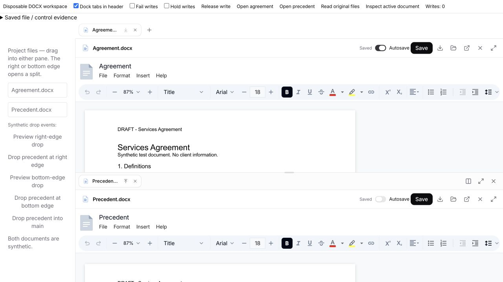
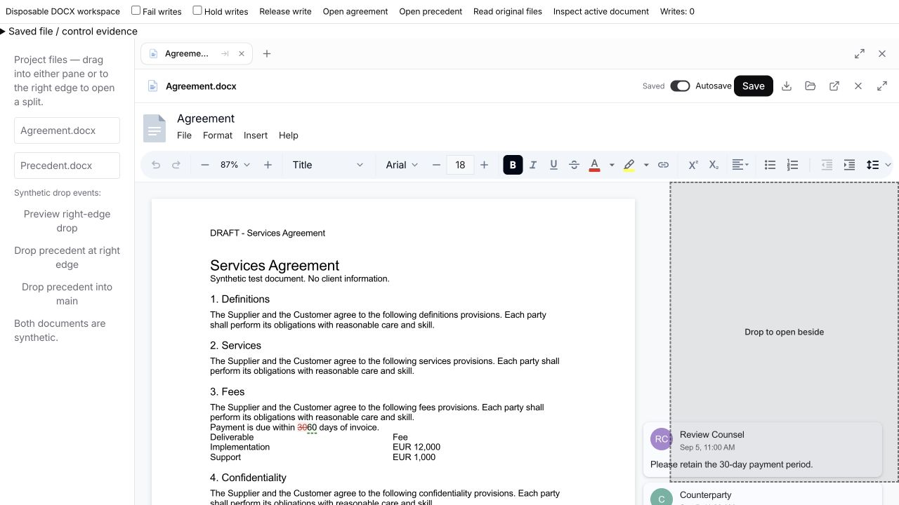
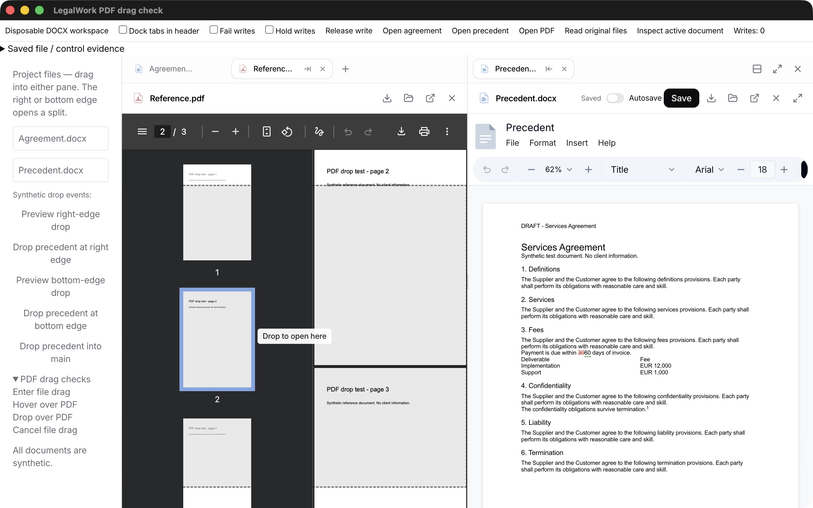

# Document workspace and original-file autosave

Local branch: `feat/side-by-side-documents`, based on `dev` at `f64d51b9`. Nothing has been pushed or published.

## Behavior

- Each editable local DOCX has an **Autosave** switch beside Save. It defaults to off and remembers the choice for that workspace/path on this device.
- When enabled, changes are serialized after 1.5 seconds without editing, or within 10 seconds during continuous editing. Writes update the original workspace file through the existing LegalWork binary-file API. This is not just a recovery copy or a download.
- Saves run one at a time. Edits made during an in-flight save remain dirty and trigger another save. Turning the switch off cancels pending autosaves; it cannot undo a write already in flight. Manual Save remains available.
- Failed writes pause automatic retries, show a persistent message and retain the draft. A successful manual save, or switching off and on, retries/resumes autosave. Existing modification-time conflict checks prevent overwriting an externally changed file. Retrying does not bypass a conflict.
- IndexedDB recovery remains separate from original-file saving. Restoring a draft honors its original conflict baseline and the current autosave preference. The recovery prompt explains this.
- The first save retains the loaded original in local history. Rapid autosaves share five-minute checkpoints rather than consuming all five retained versions within seconds. Manual saves remain distinct. A history browsing/restoration UI is still outside this change.
- Autosave is currently offered for editable local workspace DOCX files. Connected-storage checkout/publish flows, remote/read-only documents, PDF, Markdown, spreadsheets and presentations do not acquire this switch.

## Split workspace

Open a document beside another with its tab arrow. Both panes can expand together using **Expand document workspace**, with **Return to chat** restoring the ordinary viewer. The divider width is remembered using the resizable-panel library's `defaultLayout` API; storage updates when resizing finishes.

A stable portal host moves with each visible document. Moving a dirty document between panes, or promoting the remaining side document, preserves its editor, draft and Undo history. Only an editor actually leaving the mounted set needs a discard guard. At most two document editors are mounted. Closing or switching away from a dirty editor still uses the existing guard; hidden tabs do not keep every editor alive.

Workspace file tabs, pane membership and selected tabs survive reload. Transient search/review sources and connected-storage working copies are excluded from restoration. Browser/task tabs remain in the main pane. The focused pane determines unqualified document-agent commands and Ctrl+Tab navigation. Native drop listeners follow the physical pane around portaled editors.

This is a two-pane workspace within one window. Cross-window document transfer, synchronized scrolling and an automatic document comparison are not included.

### Top/bottom layout

The layout button beside Expand switches between **Stack documents vertically** and **Arrange documents side by side**. The document arrow changes to **Open below** / **Move to the top pane** in the stacked layout. Each document keeps its own tab strip; the lower strip stays with its pane even when the upper strip uses the window header. Both panes still expand together.

The shared layout, expand/restore and close-viewer buttons always sit at the workspace's top-right: in the upper tab strip for stacked documents and in the right strip for side-by-side documents. The follow-up positioning change passed typecheck and browser checks for both layouts, docked headers and the expanded workspace; each has exactly one shared control group.

With a single pane, dropping a file or movable document tab on its bottom 30% opens a vertical split; the right 30% opens a horizontal split. In the overlapping corner the nearer relative edge wins. Existing splits accept files into the indicated pane. Orientation and separate width/height divider positions persist on this device; old preferences retain the horizontal default.

Vertical-layout validation: **778 tests passed, 0 failed**, across 115 files. Typecheck, production UI build, the English/German audit (5,069 keys each) and whitespace checks passed. Browser checks with synthetic DOCX files covered bottom-edge event routing, both layout directions, docked/inline tab strips, expansion and resize/reload restoration. The same live editor id, draft revision and unsaved text survived a layout switch; Undo then removed the test edit. Pointer gestures remain a manual check. No selection-highlighting fix is included.



### File drops and smaller drop indicators

The document drop indicator has a fixed 160px top inset and 32px bottom inset, keeping it below the Word toolbar without measuring the editor layout. Tab-strip indicators retain their original height. The target still accepts drops throughout the document pane.

Project Files and Memory Drive files can be dropped into either pane or its tab strip. With only one pane open, its rightmost 30% opens a file beside the current document. Project files open their existing workspace path; Memory Drive files use the existing storage viewer with its cloud-save actions. LegalMemory materialization and external-file working copies remain supported. An existing file reuses its tab/editor, including legacy tab ids and cloud working paths. A new side drop does not replace the main editor; replacing a dirty target still requires the existing discard confirmation.

Follow-up validation: **773 tests passed, 0 failed**, across 113 files; app typecheck, production UI build and the translation audit (5,064 keys per language) passed. Added tests cover source routing, cross-workspace rejection, disconnected cloud roots, incremental external-file imports, dirty targets, original-tab reuse and retained cloud working paths. The build retains its existing chunk-size warnings.

In the real DOCX review harness, synthetic native `dragover`/`drop` events dispatched through the portaled editor verified the smaller indicator, opening a new split and moving the same file back without duplicating it. These checks validate event routing, not a native mouse gesture. Pointer automation still did not produce a successful drag. A real connected Memory Drive download/publish was not exercised in this follow-up; its source metadata is covered by automated tests.



### PDF drop overlays

PDFium lives in an iframe, whose drag events do not bubble into the containing document pane. A recognized file or document-tab drag now activates a temporary transparent surface over the pane before the pointer enters that iframe. The existing inset indicator and drop handlers then receive the events. The surface disappears on drop, drag end, Escape, window exit or blur. Plain text/link drags do not activate it, and the PDF iframe is not reloaded. The indicator label has a background so it remains readable over PDFium's dark sidebar.

Validation: app typecheck and `git diff --check` passed; **43 tests passed, 0 failed** across `viewer-file-drop`, `panel-side-pane`, `document-split-drop`, `document-preferences`, `storage-file-drag` and `storage-file-tabs`. The full suite was not rerun for this follow-up. In a separate Electron window using the installed runtime with `plugins: true`, a generated three-page PDF visibly rendered below the indicator. Canceling restored PDF navigation (page 1 to page 2); a subsequent drop moved the existing Precedent DOCX into the targeted pane. Browser hit-testing confirmed the transparent surface replaced the iframe as the event target, Escape/drop removed it, and a right-edge drop opened a split while retaining the PDF blob URL. These drag events were explicitly synthetic; native mouse and Finder gestures remain manual checks.

The isolated harness now includes **Open PDF** and **PDF drag checks**. Use **Enter file drag**, then **Hover over PDF**, followed by **Drop over PDF** or **Cancel file drag**. Unlike the older direct-pane buttons, these hover/drop controls use `elementFromPoint` and refuse to dispatch into an unshielded iframe. PDF visual checks require a browser/Electron window with the built-in PDF viewer enabled. No client documents or DOCX selection-rendering code were changed.



## Editor documentation checked

The pinned packages are `@eigenpal/docx-editor-react`, `core` and `agents` **1.8.3**, including this repository's existing patches. The [published React package documentation](https://www.npmjs.com/package/%40eigenpal/docx-editor-react) exposes change/save APIs and `useAutoSave`. The installed `dist/hooks.d.ts` documents `useAutoSave`'s localStorage recovery manager, with a storage key, recovery/discard operations and a save timestamp callback. It does not provide LegalWork's original-file persistence or conflict checks.

This implementation therefore uses the installed editor's change events and `save({ selective: false })`, through LegalWork's existing serialized save and revision checks. No editor upgrade or new dependency was introduced.

## Validation on 4 October 2026

- App typecheck and English/German translation audit passed (5,060 keys in each language).
- Full app suite: **763 passed, 0 failed**, 112 files. The initial sandboxed run could not bind localhost ports; the run with local-server access passed.
- Focused autosave, history, panel and connected-storage tests: **25 passed**. They cover off/on behavior, cancellation of queued writes, serialized saves with later edits, deadline saves, paused retries, history coalescing, draft guards and persistent pane restoration.
- Production UI build passed with existing large-chunk warnings. `git diff --check` passed.
- In-app browser with the real editor and real LegalWork server, using disposable synthetic DOCX originals: off retained an unsaved edit without writing; enabling saved it to the original; the saved DOCX was downloaded and parsed to verify its content.
- A held write completed while a later edit remained dirty; the next write persisted both edits. A simulated failed write paused autosave and preserved the draft; manual Save recovered.
- An external edit to the original file caused a real server conflict. The original retained the external marker and did not acquire the conflicting local draft. A fresh page offered that draft for recovery with the changed-file warning.
- Moving a dirty side DOCX to the main pane preserved the draft and Undo; Undo reverted the same edit after moving. Focused-document agent metadata selected the side document correctly.
- Expanded workspace, keyboard resize from 50% to 55%, tab/pane restoration and remembered autosave settings were verified. The divider returned at 55% after reload.

Native pointer tab drags did not establish a successful move through automation. Native Electron pointer gestures and drops onto native browser overlays remain manual checks; do not report them as passed. This round validates the real web editor/API path, not a full newly installed desktop build. During development, a harness hot-reload issue was corrected by disposing its React root; final checks use a fresh page. The existing native discard confirmation briefly blocked browser automation, so fresh pages were used for subsequent checks.


## Reproduce

```sh
pnpm --filter @legalwork/app typecheck
pnpm --filter @legalwork/app test:i18n
pnpm --filter @legalwork/app exec bun test tests/document-autosave.test.ts tests/document-version-history.test.ts tests/panel-side-pane.test.ts tests/storage-file-tabs.test.ts
pnpm --filter @legalwork/app test
pnpm build:ui
```

For an isolated live check, run these in separate terminals from the repository root:

```sh
pnpm exec bun apps/server/scripts/document-workspace-review.ts
PORT=5174 pnpm dev:ui
```

Open `http://localhost:5174/document-workspace-review.html`. The server logs its temporary workspace directory, copies the synthetic fixture into two originals, and uses the real authenticated file routes on localhost:5175. The development-only page exposes failed/held writes, a release button, original-file readback and active-document metadata. **Hold writes** waits until **Release write** is clicked; turn holding off before releasing to let subsequent saves finish normally. The harness is not a production build entry and uses no model calls or client documents.

For file-drop checks, close the Precedent tab and drag it from the fixture's Project Files list to the document's right edge. The explicitly labeled synthetic-event buttons provide a separate check of the production drop listeners and the portaled editor path. Use **Preview right-edge drop** to inspect the indicator, **Drop precedent at right edge** to open the split and **Drop precedent into main** to move it back.

The bottom-edge buttons exercise vertical creation. **Dock tabs in header** reproduces the desktop header placement; use the production layout button to switch orientations, and the separator's arrow keys to verify resizing and restoration.
