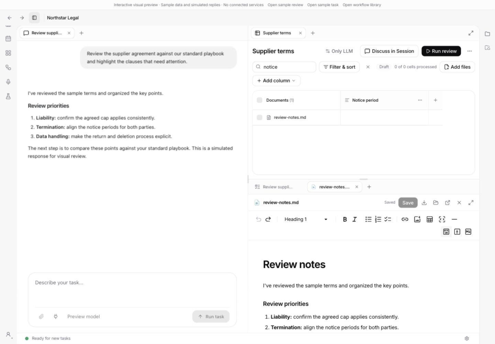
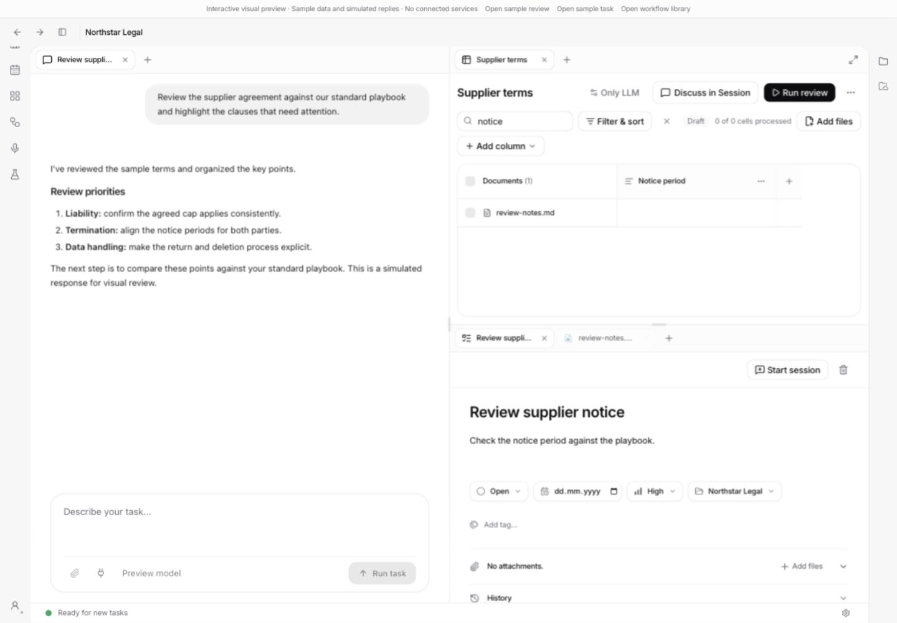

# Unified workspace tabs

The split-view workspace now treats chats, documents, browser pages, tasks, individual tabular reviews and workflow editors as peers. Open several chats in a project, put a review above its source document, or move a chat to the right. Every tab uses the same four-edge split targets, centre grouping and context menu. The limit remains six visible panes.

Project Files and Memory Drive remain file sidebars. The [workspace refinement](workspace-refinement.md) makes project overviews, task lists and calendars workspace tabs too, while global destinations remain separate. That follow-up also changes window handoff and removes whole-workspace maximize; the verification below records the earlier implementation.

## Latest follow-up

The subsequent review rounds are recorded in [workspace UI polish and CI investigation](workspace-polish.md), [adversarial findings and fixes](adversarial-followup.md), and [Files, window preferences and reactive drag feedback](files-window-ux.md). These contain the current screenshots, reproduction steps, validation results and remaining verification limits; the sections below retain their original historical validation.

Current tab strips make space while dragging and show an opaque floating tab. Project blocks also move with an opaque surface. Files dragged within an explorer move into folders, with split targets near the outer edges; files dragged from the right sidebar retain ordinary open/split behaviour. The window button offers an empty workspace or a copy of the existing layout, with a remembered preference that can be changed from settings or the button's context menu. The latest review also covers shared-queue recovery, document control scope, file selection, write locking and the bundled-server schema fix for the earlier CI failure.

## Behaviour worth reviewing

- The layout belongs to the project, independently of the selected chat. Old project and chat document layouts migrate when opened. Detached windows keep their own layout.
- Moving, grouping or switching tabs retains mounted content: chat drafts, editor undo history and review filters remain in place. Visiting an overview or the workflow library hides the same workspace rather than rebuilding it.
- Each chat has its own permissions, questions and todos. Window-wide composer/voice events and unqualified agent controls go to the focused view.
- Closing a tab closes its view. It does not delete a chat or cancel a running task/review. Closing the last chat leaves other tabs visible. Empty panes collapse using the existing split-tree rules.
- A review source opens in an existing document/browser pane or in an adjacent pane. Explicit drops always take precedence. At six panes, ordinary opens group into a pane instead of creating a seventh.
- The pane's `+` menu opens a new chat, file or browser tab in that pane. The workspace title names the project; individual tab titles identify its contents.
- Native Electron browser views have independent bounds and navigation targets. Background windows cannot steal their bounds. Switching the native host waits for the receiving pane's geometry.
- Fullscreen still supports the whole workspace and individual documents. The project banner is hidden while the workspace is expanded.

Workflow editors retain their existing service bindings while open, so saving continues to use the workflow API. They are intentionally omitted from persisted layouts: reopening an app must not restore an editor without its in-memory draft and service context. Saved chats, tasks, reviews and original local files restore their layout; browser tabs restore only when their native session still exists.

## Verification

Checked on macOS with Node 24, pnpm and the repository's pinned Electron runtime:

| Command | Result |
| --- | --- |
| `pnpm --filter @legalwork/app test` | 928 passed, 0 failed |
| `pnpm --filter @legalwork/desktop test` | 195 passed, 1 skipped, 0 failed |
| `pnpm --filter @legalwork/app typecheck` | Passed |
| `pnpm --filter @legalwork/desktop typecheck:electron` | Passed |
| `pnpm --filter @legalwork/desktop check:electron` | Passed; 110 bridge methods covered |
| `pnpm --filter @legalwork/app test:i18n` | Passed; 5,487 keys complete in English and German |
| `node scripts/i18n-audit.mjs --ci` | Passed |
| `pnpm build:ui` | Passed with bundle-size warnings |
| `pnpm --filter @legalwork/desktop test:browser-panel` | Passed using the pinned Electron executable directly |

The new store cases cover mixed tab types, the six-pane limit, migration, default source placement, hidden dirty-file close guards, chat deletion, cross-project browser isolation and restoration. Existing exhaustive geometry cases still run, including 9,373 pane removals. Native tests cover separate navigation/bounds, hidden-pane late updates and window handoff; the Electron harness exercises two real WebContentsViews.

Interactive checks used the isolated development fixture at `/session-preview.html?unified=1`, with synthetic data and no connected services:

1. Open two chats, edit a composer and move the chat by drag-and-drop; the draft remains.
2. Open the workflow library and return through a workflow editor; the chat draft remains. Edit and save the workflow, close it and reopen it.
3. Group a review with a task, switch between them and split the review again; its search filter remains.
4. Open a review source beside the review, edit Markdown, regroup it and switch tabs. Undo remains available and restores the original text.
5. Close the last chat while a task is open; the task remains and the chat does not reopen automatically.
6. Create a chat from a pane's `+` menu; it groups into that pane.
7. Reload the fixture to restore mixed pane geometry. Expand and restore the workspace; the project banner hides and returns.
8. Drop a Project Files PDF onto the review: it becomes a second review source. Drop it onto the chat composer: it becomes a file reference. Neither drop is intercepted as a generic viewer open.
9. Edit a workflow, switch to another project, and return directly through the original project's chat. The workflow draft remains editable and saves without revisiting the library.
10. Drag a tab within its existing strip; the insertion marker and resulting order agree. Native subset-order tests also check that browser tabs in other panes keep their positions and stale orders are rejected atomically.

The review follow-up fixes file-drop interception, rebinds workflow services from the current project rather than a cached library element, and restores same-strip tab ordering. Moving a browser tab also updates Electron's selected tab so a later native state event does not restore the previous selection. Redundant navigation when opening a work item was removed. The final code passed the full app suite, both type checks and the UI build. Manual browser-tab dragging in Electron remains unverified; native ordering and real-view lifecycle were tested separately.

The fixture checks UI state and local interactions, not live agent execution, connected-storage writes or production review runs. The native harness tests view lifecycle without remote websites. Existing DOCX autosave and cross-window file-ownership tests remain in the app suite; this change does not replace their save protocol.

## Screenshots

Chat, tabular review and its source document:

Switching the lower pane to a task:

Both screenshots contain only synthetic fixture content.
