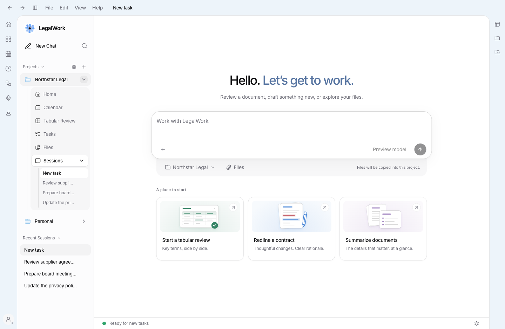
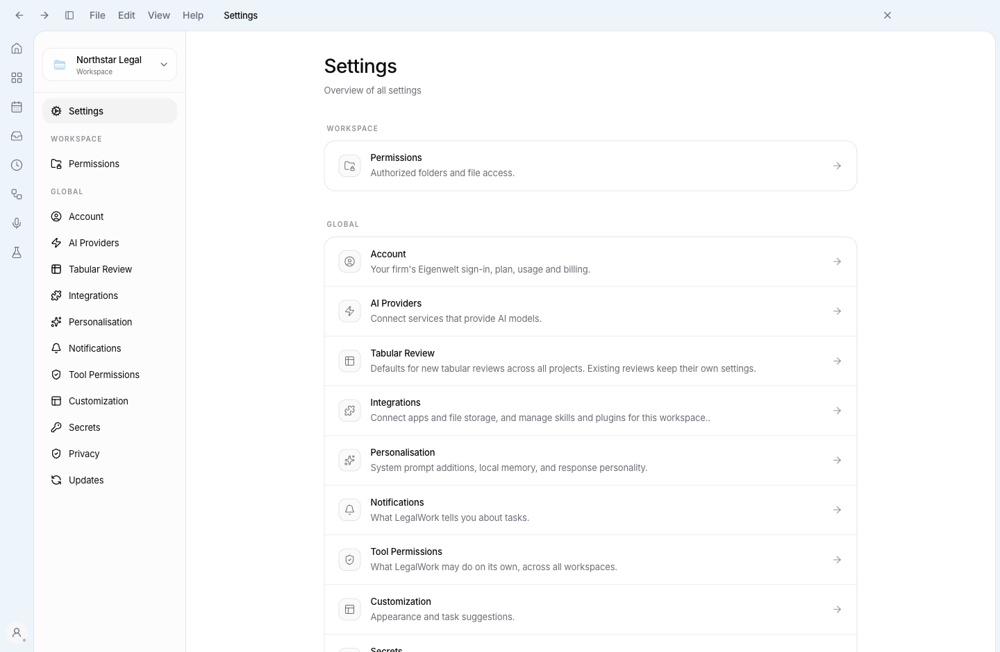
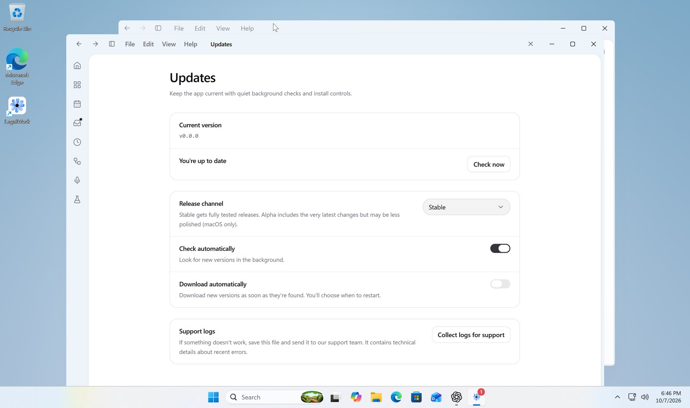

# Windows window frame and title bar

The Windows light theme uses a pale blue outer frame (`#edf4fa`). Native minimize, maximize and close controls share the 44px app navigation bar with back, forward, the sidebar toggle and File/Edit/View/Help. Menus reuse the installed Electron menu roles and accelerators. macOS and Linux keep their existing frame behavior.

The native control area follows Electron's title-bar geometry at different zoom levels and display scales. Fullscreen releases that area. Native caption colors follow light, dark and Blackout in the main window and additional app windows.

## Renderer screenshots

These screenshots show the real Home and Settings components with Windows platform styles in a browser on macOS. They verify the renderer layout and color. Native Windows caption controls and native popup menus are not present in these browser screenshots.





## Validation

- `pnpm --filter @legalwork/app test`: 906 tests passed.
- `pnpm --filter @legalwork/app exec bun test tests/theme.test.ts tests/theme-contrast.test.ts tests/sidebar-primitives.test.ts`: 19 tests passed.
- `pnpm --filter @legalwork/desktop exec node --test electron/app-menu.test.mjs electron/window-chrome.test.mjs electron/sandbox-preloads.test.mjs`: 8 tests passed.
- `pnpm --filter @legalwork/app typecheck`: passed.
- `pnpm --filter @legalwork/desktop typecheck:electron`: passed.
- `pnpm --filter @legalwork/desktop check:electron`: passed.
- `pnpm --filter @legalwork/app build`: passed, with the existing large-chunk warning.
- Playwright: Home and Settings show the blue Windows frame, menus do not overlap the title at 1440px and 800px widths, the sidebar toggle collapses the sidebar, File dispatches the native-menu IPC command with its anchor, dark remains graphite, macOS remains grey, and fullscreen uses the full title-bar width.

## Native Windows verification

The PR code was launched as LegalWork - Dev in a running Windows 11 ARM64 VM using Electron 43.7.5 x64 and the live Vite development server. The pale blue frame, unified native caption controls, native File popup, maximize/restore and sidebar toggle were exercised. Home and Settings both displayed the unified bar. The screenshot below was captured directly from the VM.



The remaining manual checks include Snap Layout selection, menu accelerators, display scaling, app zoom, fullscreen, and native theme changes with another app window open. No native video was recorded. To run locally in PowerShell, from this branch:

```powershell
pnpm install --frozen-lockfile
$env:LEGALWORK_DEV_MODE = "1"
pnpm --filter @legalwork/desktop dev:electron
```

1. In the light theme, confirm the top bar and both outer icon rails are pale blue. Check Home, a chat, Settings and a chat opened in a new window.
2. Confirm there is one title/navigation row. Use back, forward, the sidebar toggle and each application menu. Check Copy/Paste, Ctrl+B and menu keyboard activation with Tab followed by Enter or ArrowDown.
3. Drag the free title-bar area, minimize/restore, maximize/restore, hover maximize for Snap Layouts, and close. Repeat at 100% and 125% display scaling and after changing app zoom.
4. Enter and exit fullscreen through View. Confirm the title bar keeps its height and releases the native-control area. Switch among Light, Dark, Blackout and System, including with an additional app window open.
