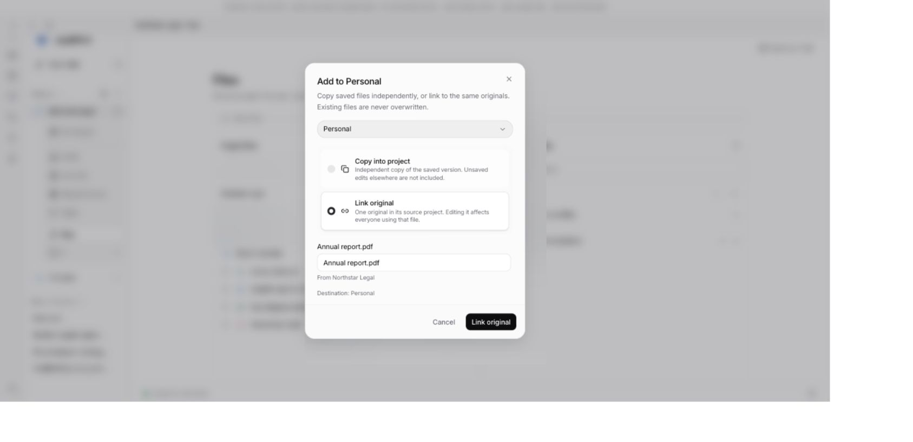
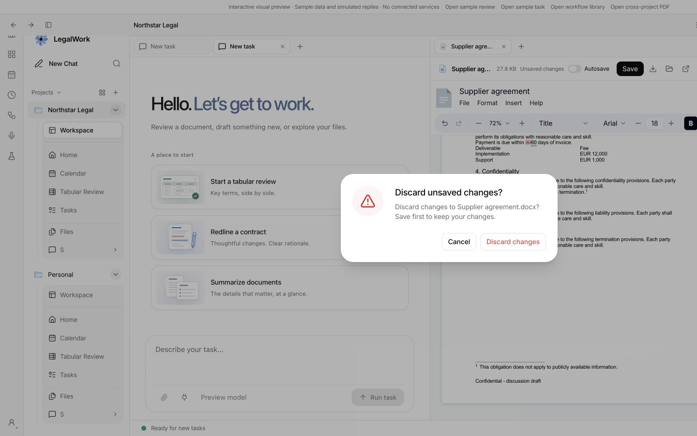
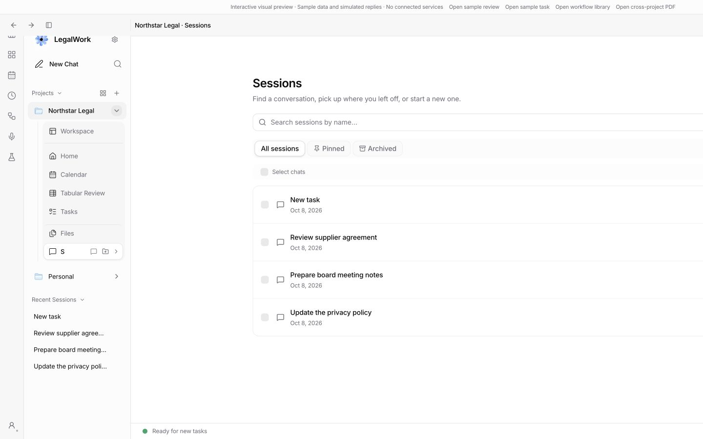

# Workspace UI polish and PR check investigation

Review date: 2026-10-08. Branch: `feat/split-view-autosave`, starting at `5fc7de9d`. Target: `dev` (`2928745b`). This report and its evidence ship with the follow-up corrections.

This records the initial UI round. The subsequent review-list verification and additional fixes are in [adversarial-followup.md](adversarial-followup.md). Final UI behaviour, including separator-only inactive tabs and reactive drag gaps, is recorded in [files-window-ux.md](files-window-ux.md). Validation below belongs to this initial round.

## Changes

- Project Files: moved the upload action from the header to a full-width footer below the file list. It retains the current folder as its destination and the existing local-desktop availability rules.
- Workspace tabs: added a subtle border and muted background to inactive tabs; the selected tab keeps the existing raised background.
- Copy/Link: labelled radio cards now make the choice explicit. The selected card uses the same raised background as tabs. A shared `choice` button variant also fixes inverted selection styling in session filters, plugin scope, engine/update-channel choices, top-up amount presets and the review layout toggle. The latter changes only affect presentation and accessibility state.
- Cross-project PDF refresh: unchanged binary contents reuse the previous buffer, and the preview URL depends on bytes/type rather than the entire query result. Two-second read-only refreshes therefore retain the iframe URL while actual saved-content changes still refresh it.
- Unsaved document confirmation: replaced the native confirmation with the existing app ConfirmModal, including English/German strings. Deferred actions revalidate the live document registration before discarding; nested guards share consent only during that action. Cancel preserves the draft. Native browser synchronization replays the latest state, and batch file imports await the decision before advancing. Workflow reload uses an app dialog too.

## GitHub failure

In [PR #213](https://github.com/eigenweltlabs/legalwork/pull/213), both `legalwork-tests (macos-14)` and `legalwork-tests (ubuntu-latest)` failed in the server unit-test step of [run 37789691399](https://github.com/eigenweltlabs/legalwork/actions/runs/37789691399). The same test failed on both platforms:

`runtime code reaches @legalwork/types only through files the build bundles`

`src/project-file-links.ts` and `src/routes/files.ts` imported runtime schemas directly from `@legalwork/types`, which the packaged server does not ship as a workspace package. The fix routes these imports through `src/project-file-schema.ts` and explicitly bundles that entry point in the server build. The packaging guard and server build pass locally. DCO, DOCX/i18n audits and the inspected packaging checks were already passing; the failed checks were the server tests. No new remote CI result is claimed before a push.

## Astra adversarial review

An independent GPT-6 Astra agent reviewed the branch against `dev`, prioritizing correctness, security, reliability, contracts and UI flows. Its blocking finding was at `apps/server/src/routes/sessions.ts:83`: a completed assistant response carrying `MessageAbortedError` was thrown as if delivery were unknown. The queue then blocked Resume/Edit for a prompt the engine had already accepted.

Fixed by treating a terminal assistant result as confirmed delivery, completing that queue ID, and pausing follow-ups on assistant errors. Transport failures retain the uncertain-delivery path. The API regression test covers Stop, Resume, a second queued item and an acknowledgement retry without resending the first prompt.

The reviewer also caught two integration gaps while the custom-dialog fix was in progress: native browser synchronization needed replay, and multi-file imports needed to await consent. Both are fixed and tested. Its final follow-up reported no further high-confidence regressions; 116 relevant app tests passed in that independent check.

## Validation

| Check | Result |
| --- | --- |
| `pnpm --filter @legalwork/app test` | 1,082 passed, 0 failed |
| `pnpm --filter @legalwork/app typecheck` | Passed, including the final selection-style changes |
| `pnpm --filter legalwork-server typecheck` | Passed |
| `pnpm --filter @legalwork/app build` | Passed; existing large-chunk warnings remain |
| `pnpm --filter legalwork-server build` | Passed, including the new bundled schema entry point |
| `pnpm --filter @legalwork/app test:i18n` | Passed; 5,738 keys in English and German |
| `node scripts/i18n-audit.mjs --ci` | Passed |
| From `apps/server`: `pnpm exec bun test src/packaged-imports.test.ts src/session-message-queue.test.ts src/session-read-model.e2e.test.ts src/project-files.e2e.test.ts` | 27 passed |
| From `apps/server`: `pnpm exec bun test src/project-file-links.test.ts src/project-file-sync.test.ts` | 20 passed |
| `git diff --check` | Passed |

The full local server run had 1,568 passes, 16 skips and 5 failures. A focused rerun passed the calendar HTTP test, leaving four skill-loading tests that expect empty stderr but receive warnings about pre-existing invalid skill descriptions under the local user's home directory. Those test files are unchanged against `dev`. This is separate from the packaging failure in GitHub. Test servers require local port bindings, so socket-based tests were run outside the restrictive sandbox.

## Browser evidence and limits

The local `session-preview.html?unified=1` harness uses synthetic fixtures and no connected services.

- Copy/Link selection and successful linking to the synthetic Personal project were checked. Selected cards have an explicit radio marker and raised background.
- An original PDF from Northstar Legal was opened read-only in Personal. Its iframe URL remained identical for 31 seconds, spanning repeated two-second refreshes. The in-app test browser did not render its native PDF viewer, so visual PDF rendering in Electron remains a manual verification step.
- Typed a synthetic DOCX change, clicked Close, and verified the app alert dialog. Cancel retained the open document and text; confirming Discard closed it.
- Switched the session filter to Pinned and verified the selected state. Inactive workspace tabs are visible in the dialog screenshot.
- The upload footer is desktop-only. Its layout and existing import wiring were checked in code; a native OS file-picker/upload was not exercised in this browser harness.

