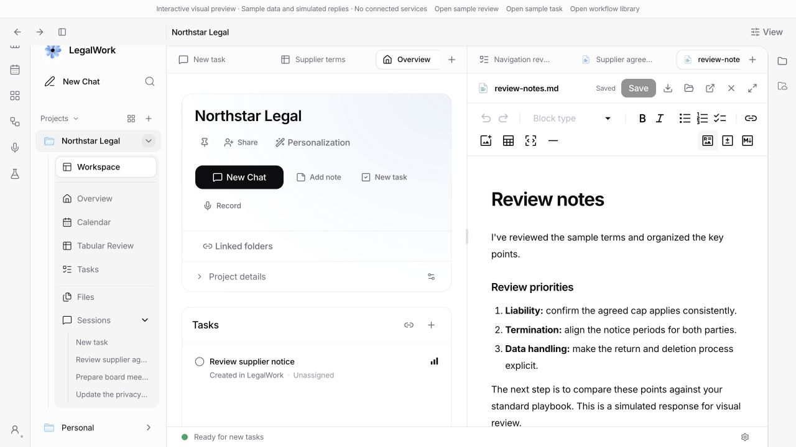
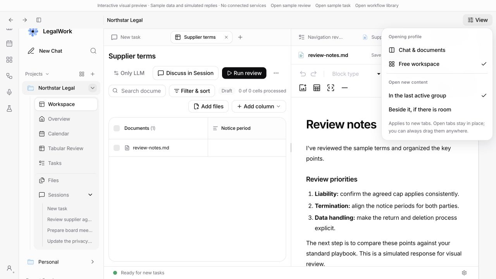
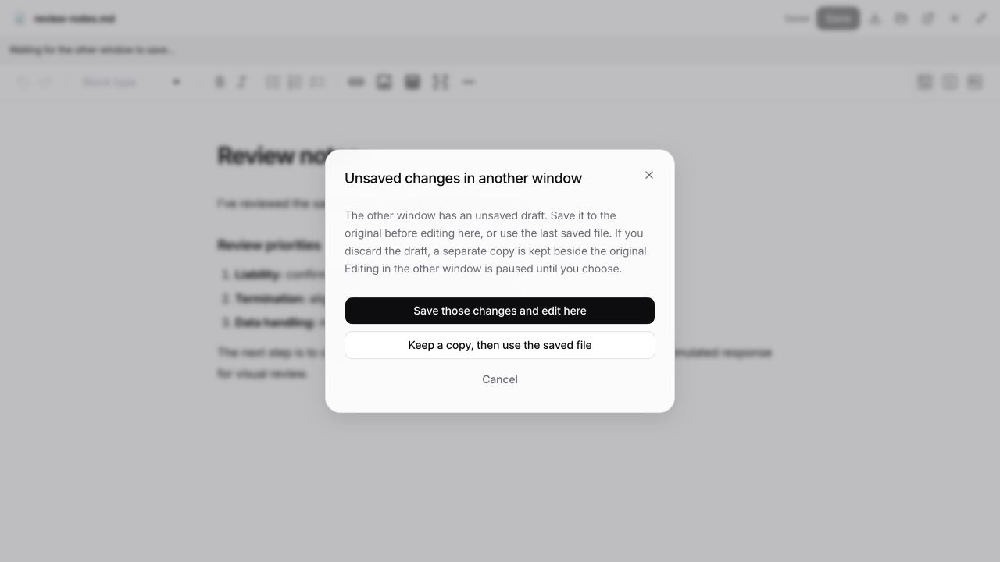
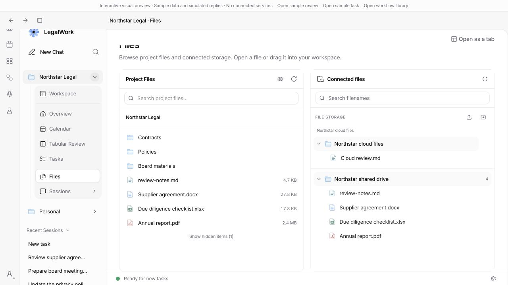
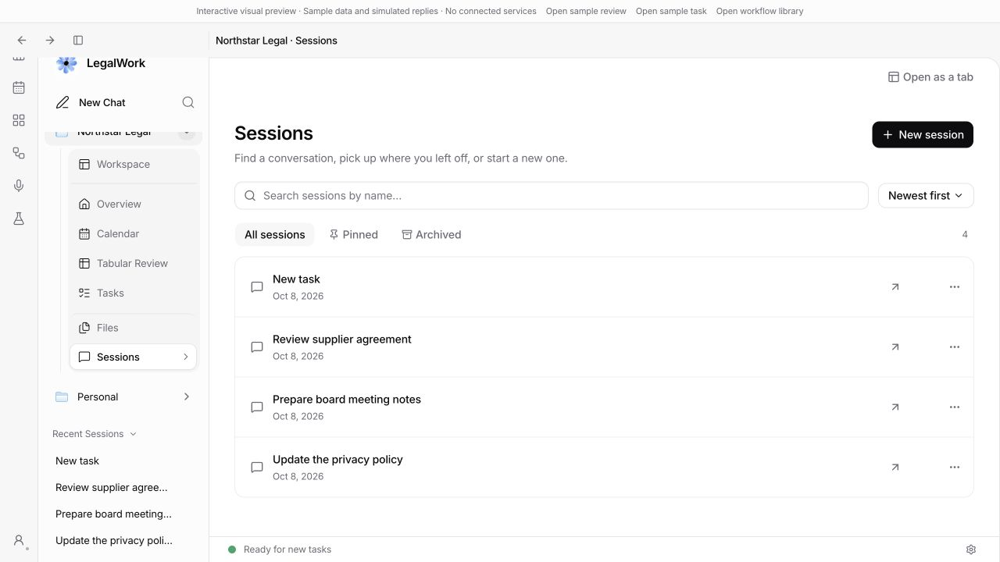
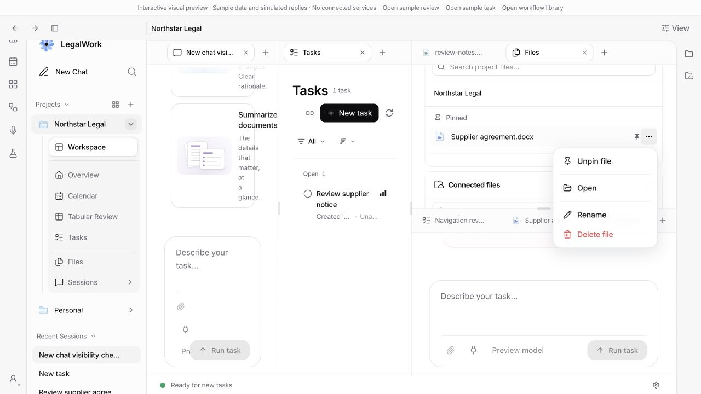
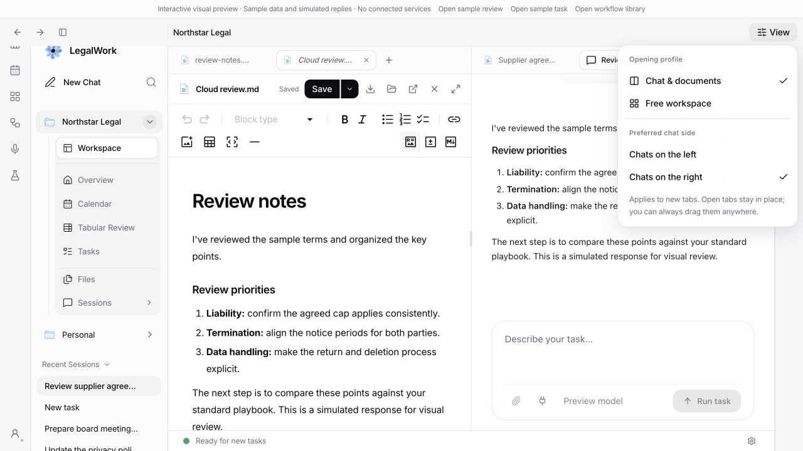

# Workspace navigation and window coordination

Project Overview, Calendar, Tasks, Tabular Review, Files and Sessions are separate project destinations by default. A permanent **Workspace** sidebar entry returns to the retained chats, files and layout. Visiting an overview preserves mounted editors, drafts, undo history and scroll state. An overview can be deliberately opened as a singleton work tab through **Open as a tab**. Individual documents still maximize; the redundant whole-workspace maximize button is removed.

Workspace has a separated sidebar row with the usual active-page styling. Its header return action appears only when the sidebar is hidden; **Open as a tab** sits at the top right inside the project view, below the window header. Files and Sessions open their own project pages. The Sessions label navigates; its separate arrow expands or collapses the sidebar list. The right-hand file rail remains available for quick access. Overview uses the same Pin action as the project list, with title and actions stacked in narrow panes. Narrow week/month calendars expose horizontal scrolling without changing the selected calendar mode.

The pane's `+` menu creates a chat, opens files or a browser. Project task selection and creation stay in the overview's list/detail layout (detail with a back button on narrow windows). **Open in workspace** explicitly promotes a task to a work tab. In Tabular Review, **Open as a tab** opens the currently selected review, or the review list when no review is selected. Pending task edits and unsubmitted notes prevent promotion until saved or cleared. Global task and workflow creation remain in their global areas. Sidebar chats can still be dragged into tab groups or any split edge, with the six-pane limit.

Task notes, failed text edits and in-flight writes survive closing an inline detail, changing filters and leaving the project or global Tasks view. Drafts remain in memory for the current window and warn before closing it; they are not disk recovery drafts. Background refreshes preserve local edits, and returning during a note submission or upload cannot submit it twice. A global task request no longer changes a hidden project task selection. Document/source links in a standalone review explicitly target its project workspace.

## Opening profiles and previews

The header's **View** menu offers:

- **Chat & documents**, the default: chats prefer one side and other content the opposite side. The preferred chat side is configurable.
- **Free workspace**: new content uses the last active group, or a group to its right when requested.

Explicit destinations and already-open tabs take precedence. A profile change never rearranges existing tabs; manual dragging can mix any content. Automatic splits require at least 800 CSS pixels in the actual work area, create at most two columns and respect the six-pane cap. At capacity, a click opens a tab instead of silently failing. Resize measurements do not write the persisted layout.

One clean file/task preview per group is reused during browsing. Editing, double-clicking the tab, **Keep open**, or dragging pins it. Before replacing a preview, the store also checks registered dirty state, independently of input events. Opening choices and preview slots persist with the project layout; detached windows retain their own state.

Drop previews cover the full pane content, including the DOCX toolbar. The editor host has its own stacking context below the drag shield and preview, so editor z-index values cannot cover the drop surface; editor internals remain unchanged.

## Windows and editing

The header opens a second workspace window, including when a document is focused. A tab's context menu opens only that content. The new window receives navigation and pane geometry, with fresh native browser instances; composer buffers and editor histories are not copied. Connected-storage tabs retain their source identity and permissions rather than reopening the temporary checkout as a normal editable file.

Native browser tabs, selection, events and pane bounds belong to their app window. Copying a workspace reads that window's live browser state first, excluding closed or stale persisted tabs and taking the current URL. Copying a copy does not adopt browsers from other windows. Closing a window or all its browser tabs leaves the other windows intact. Browser cookies and proxy configuration remain shared.

`Edit here` freezes the current document owner while it checks pending writes. If the document is dirty, the requesting window offers:

- Save those changes to the original, then edit here.
- Keep the unsaved draft as an ordinary sibling file, then open the saved original.
- Cancel and return editing to the original window.

The owner checks the draft revision before applying the choice. A failed save or copy prevents release. A timed-out or closed requester cannot silently discard the draft. The general recovery/version UI remains unchanged; its redesign is deferred.

The screenshot contains only synthetic preview content.

## Shared message queue

Queued messages belong to the server and are polled by each window. Unsent composer buffers remain window-local. Pause, order, attachments and queued edits persist across renderer/server restarts. Editing a queued message takes a renewable lease and pauses delivery; another window cannot remove or overwrite that reserved item.

One server dispatcher sends messages in order. Submission IDs make acknowledgement retries idempotent. An interrupted or uncertain send pauses delivery for review instead of silently retrying. Queue files are written atomically with private filesystem permissions. This assumes the app's existing single-backend runtime; it does not coordinate independently launched servers writing the same queue directory. Updated client and server must ship together.

## Validation

| Command | Result |
| --- | --- |
| `pnpm --filter @legalwork/app test` | 968 passed, 0 failed |
| `pnpm --filter legalwork-server exec bun test src/session-message-queue.test.ts src/session-read-model.e2e.test.ts src/artifact-files.e2e.test.ts` | 27 passed, 0 failed |
| `pnpm --filter @legalwork/desktop test` | 197 passed, 1 skipped, 0 failed |
| `pnpm --filter @legalwork/desktop test:browser-panel` | Passed with isolated native Electron views |
| `pnpm --filter @legalwork/app typecheck` | Passed |
| `pnpm --filter legalwork-server typecheck` | Passed |
| `pnpm --filter @legalwork/desktop typecheck:electron` | Passed |
| `pnpm --filter @legalwork/desktop check:electron` | Passed, 110 bridge methods |
| `pnpm --filter @legalwork/app test:i18n` | 5,557 keys complete in English and German |
| `node scripts/i18n-audit.mjs --ci` | Passed |
| `pnpm build:ui` | Passed, existing bundle-size warnings |

Interactive checks used `/session-preview.html?unified=1` with synthetic documents and no connected services:

1. Open project Tasks and create a task: the list and detail stay outside the work tabs. Type an unsubmitted note, visit Calendar and return: the note survives. **Open in workspace** refuses while the note is pending; clearing it allows promotion.
2. Edit a Markdown preview, visit Calendar, return through Workspace and use Undo. Verify the draft, tabs and editor history survive. A clean preview is replaced by another file; a double-click pins it. Test the View profiles and retained selection, plus narrow task navigation at a 900-pixel window. Global workflow creation remains in its library.
3. Drag a sidebar chat to a split edge and verify the existing pane stays in place.
4. In two browser windows, open the same Markdown file. Check Cancel, Save, and Keep a copy during dirty handoff; verify the first window pauses while the choice is open and only one editor remains writable.
5. Repeat Keep a copy with the pinned DOCX editor and `apps/app/scripts/fixtures/legal-review.docx`: the receiving window opens the unchanged original, without the unsaved test prefix. Check individual document maximize/restore.
6. In an isolated Electron profile, open a task and DOCX in separate panes. Use the header's new-window button and verify both panes and active tabs transfer. Use the DOCX tab's context menu and verify the next window contains only that document, initially read-only.

Opening-policy tests cover both preferred chat sides, unmeasured/narrow work areas, existing and explicit destinations, free-mode reuse, native browsers, the six-pane fallback, dirty preview protection, pinning and persistence. Review navigation was also checked through Calendar and back before explicit promotion to the workspace.

Two Astra adversarial reviews covered the opening-policy code and the UI/user journeys. Follow-up browser checks verified narrow Overview layout, Pin labels, Files selection, the sidebar-hidden Workspace return, review source opening, and an unsent task note surviving detail close/reopen and a real project switch. Twelve added draft tests cover failed writes, background reconciliation, overlapping requests, note/upload duplication, hidden save completion, scope isolation and StrictMode lifetime handling. A title with surrounding whitespace was checked through blur and subsequent workspace promotion.

Browser-window regression checks cover three independent owners, event routing, foreign-tab rejection, close-all isolation, window destruction and stale-copy filtering. In the running Electron app, a temporary `example.com` tab was copied into a second and then a third window: each showed exactly one browser. Closing that tab and immediately copying again produced a fourth window without it. Test windows and the temporary browser were then closed, leaving the original app window intact.

Queue integration tests use a real local HTTP server and a mock agent transport, covering shared reads, authentication, read-only servers, stale edits, archive restoration before dispatch, deletion, attachment persistence, lost acknowledgements and interrupted sends. No live model run or connected-storage publishing was performed for this change.

## Project file and session browsers

The Files page puts project files and connected storage in two responsive panels, stacked when the pane is narrow. Project search uses the existing server content-search API, including partial-result and failure states. Connected filename search and file opening reuse the existing storage browsers; files retain their source identity and editing permissions. Folder navigation, hidden files, refresh, context menus and file dragging remain available.

The Sessions page searches conversation names and offers pinned/archived filters, recency sorting, branch and group labels, running status and the existing rename/archive/delete actions. Clicking a row opens its chat; rows can also be dragged into the workspace. These are client views over the existing project session data, not a second chat store.

Overview, Calendar, Tasks, Tabular Review, Files and Sessions can all be dragged from the project sidebar into tab groups or split edges. Page drags are project-scoped. Existing pages move as singletons, preserving the usual source-pane collapse and six-pane limit. Dragging a page over a standalone project view reveals the retained workspace. The pane's plus menu remains focused on creating work rather than duplicating navigation pages.

Verification used synthetic content: review list → Supplier terms → Open as a tab selected the review detail; Files search found the expected document; connected folders expanded; Sessions search and pinning filtered correctly; the expansion arrow left the Sessions page open; dragging Tasks created a split, and dragging it again moved its single tab while the empty source collapsed. Files was also dragged into an existing group. At a 483-pixel pane width, the Files page stacked its panels and had no horizontal overflow. Added tests cover all six project routes, malformed/foreign drag payloads, singleton movement and restoration of Files/Sessions tabs.

## File actions, pinning and unused chats (2026-10-08)

- Local, connected-storage and LegalMemory files can be pinned. Pins appear above their respective file browsers and update across app windows. Pin identity includes the project and source. Successful rename/delete operations update or remove matching pins, including descendants of renamed/deleted folders. A disconnected storage pin remains removable.
- The visible ellipsis menu and right-click menu share the same actions. Local search results now expose these actions too; their rename destination uses the result's actual parent folder. Connected storage continues to expose write actions only when the source is writable. LegalMemory retains its read-only actions.
- Selected project navigation rows retain their selected background under hover and mouse-down. Global pages are derived from the committed route, eliminating the separate page flags that exposed the workspace during navigation.
- Newly created empty chats remain openable tabs but stay out of sidebar, recent-session and project-session lists. Non-whitespace input, an attachment, queued input or run/message activity retains the chat. Retention is monotonic: clearing a composer after sending, or an empty composer in another window, cannot hide it. Only visibility metadata is shared; unsent text remains independent between windows. Existing sessions are not classified by title or retroactively hidden, and no server sessions are deleted.

Validation:

- `pnpm --filter @legalwork/app test`: **978 passed**, 145 files, including 10 new pin/visibility tests. The temporary-server tests ran with localhost binding available.
- `pnpm --filter @legalwork/app typecheck`: passed.
- `pnpm --filter @legalwork/app test:i18n`: **5,561** complete English/German keys.
- `node scripts/i18n-audit.mjs --ci`: passed.
- `pnpm build:ui`: passed with existing bundle-size warnings.
- Browser: pin/unpin synchronization across two windows; local pinned-file rename and rename-back; file actions from search; writable connected-file menus; unused new chats excluded, an unsent draft included, and another empty chat still excluded. The same shared synthetic chat became listed in both windows after typing in one, while the other composer stayed blank.
- Electron: global Workflows → Projects → Evaluations → Tasks → Workspace navigation; project Files selection under the pointer also checked in the browser (`rgb(255, 255, 255)` while hovered).

Reproduce the shared-chat case by opening `session-preview.html?unified=1&empty-chat=<fresh-test-id>` in two windows on the same origin. Both seed the same empty synthetic chat. Enter text in one: both session lists gain the chat, but the other composer remains empty. The preview uses synthetic data and simulated responses only.

## Preferred sides after manual moves (2026-10-08)

Chat & documents now chooses new destinations from the split geometry. Chats use the preferred outer column; content uses the remaining columns. The active group wins only within its appropriate region. Manually placed tabs and already-open items stay where they were put. Full-width groups above/below existing columns remain available for explicit placement. A mixed single column can acquire a separate side when the workspace becomes wide enough; automatic splitting still respects the six-pane limit.

Tabular Review uses the row-based `TableProperties` icon consistently in navigation, tabs, review lists, settings and sync options, distinguishing it from Workspace and Open as a tab.

Validation:

- `pnpm --filter @legalwork/app test`: **987 passed**, 145 files. Nine added regressions cover both preferred sides, mixed panes, browsers, stacked/resized columns, extra columns, narrow-to-wide layouts, preference changes, full-width groups, the six-pane limit and side collapse/recreation.
- App typecheck and `pnpm build:ui`: passed; existing bundle-size warnings remain.
- Synthetic browser check: drag `review-notes.md` into the left chat group, then open a new connected file through Files; the new file appears on the content side. Switch to Chats on the right: a newly opened chat appears on the right and a newly opened document on the left, despite mixed tabs. Existing placements remain intact.

